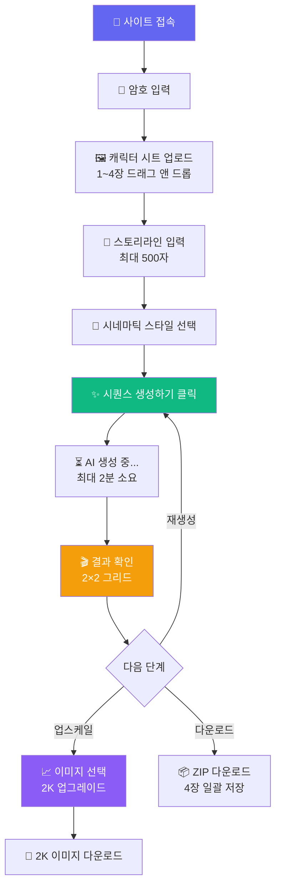
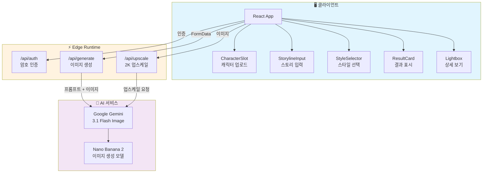
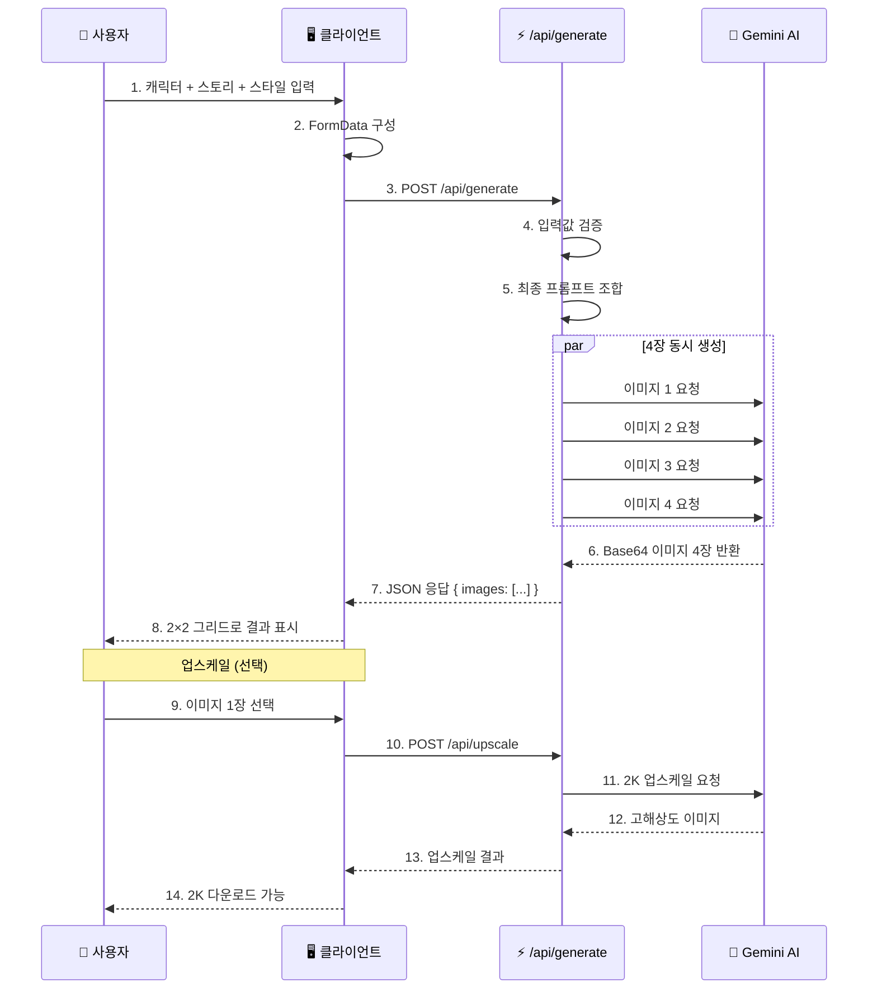

# 🎬 awesome-cut - AI 시네마틱 시퀀스 생성기

<div align="center">

[](https://awesome-cut.pages.dev/)
[](https://nextjs.org/)
[](https://react.dev/)
[](https://www.typescriptlang.org/)
[](https://tailwindcss.com/)
[](https://pages.cloudflare.com/)

**캐릭터 시트와 스토리라인으로 3×3 시네마틱 시퀀스를 만들어보세요!** ✨

[🎯 주요 기능](#-주요-기능) | [🎮 사용 방법](#-사용-방법) | [💻 로컬 실행](#-로컬에서-실행하기) | [🚀 배포하기](#-배포하기)

> 🇺🇸 [English README](./README_EN.md)

</div>

---

## 🎯 프로젝트 소개

**awesome-cut**은 AI 이미지 생성 모델 **Nano Banana 2** (Gemini 3.1 Flash Image)를 활용하여, 캐릭터 시트와 스토리라인을 바탕으로 **3×3 시네마틱 시퀀스 이미지**를 자동 생성하는 웹 앱입니다.

웹툰 작가, 영상 기획자, 게임 개발자 등 스토리보드가 필요한 모든 크리에이터를 위해 만들어졌습니다! 🎥✨

### ✨ 주요 기능

- 🖼️ **캐릭터 시트 업로드** - 최대 4장, 드래그 앤 드롭으로 간편하게
- 📝 **스토리라인 프롬프트** - 최대 500자로 원하는 장면을 설명
- 🎨 **6가지 시네마틱 스타일** - 실사, 애니메이션, 웹툰, 수채화, 3D CGI + 커스텀
- 🚀 **4장 동시 생성** - 1K 해상도 이미지를 한 번에 4장씩
- 📈 **2K 업스케일** - 마음에 드는 이미지 1장을 고해상도로
- 📦 **ZIP 일괄 다운로드** - 생성된 이미지를 한 번에 저장
- 🔐 **암호 보호** - 안전한 접근 제어
- 🎦 **라이트박스 뷰어** - 키보드 화살표로 편리하게 탐색

---

## 📸 스크린샷

<div align="center">

| 메인 화면 | 생성 결과 |
|:---:|:---:|
|  |  |

<!-- 스크린샷이 없으면 docs/ 폴더에 추가해주세요 -->

</div>

---

## 🎮 사용 방법



### 📝 단계별 가이드

#### 1️⃣ 캐릭터 시트 업로드
| 항목 | 설명 |
|:---:|:---|
| 📁 지원 형식 | JPG, PNG, WebP |
| 📊 최대 장수 | 4장 (최소 1장 필수) |
| 🖱️ 업로드 방법 | 드래그 앤 드롭 또는 클릭 |

#### 2️⃣ 스토리라인 입력
- 원하는 장면을 자유롭게 설명합니다
- 예: *"게임 기획자 남자 주인공과 경찰관 여자 주인공이 이세계로 소환되면서 시작되는 설레는 로맨스"*

#### 3️⃣ 스타일 선택

| 스타일 | 설명 |
|:---:|:---|
| 🎬 실사 시네마틱 | 영화 같은 실사 촬영 느낌 (기본값) |
| 🎨 애니메이션 시네마틱 | 애니메이션 영화 스타일 |
| 📖 웹툰 스타일 | 한국 웹툰 그림체 |
| 🌈 수채화 일러스트 | 감성적인 수채화 느낌 |
| 🎭 3D CGI 렌더링 | 3D 그래픽 렌더링 스타일 |
| ✨ 커스텀 | 원하는 스타일을 직접 입력 |

#### 4️⃣ 결과 확인 & 활용
- 4장의 1K 이미지가 2×2 그리드로 표시됩니다
- 이미지를 클릭하면 **라이트박스**에서 크게 볼 수 있습니다
- 마음에 드는 이미지 1장을 **2K로 업스케일** 할 수 있습니다
- **ZIP 다운로드**로 4장을 한 번에 저장할 수 있습니다

---

## 🏗️ 기술 스택

<div align="center">

| 카테고리 | 기술 | 용도 |
|:---:|:---:|:---|
| **프레임워크** | Next.js (App Router) | 풀스택 웹 애플리케이션 |
| **라이브러리** | React 19 | UI 컴포넌트 |
| **언어** | TypeScript 5 | 타입 안정성 |
| **스타일링** | Tailwind CSS v4 | 유틸리티 기반 CSS |
| **AI 모델** | Nano Banana 2 | Gemini 3.1 Flash Image 기반 이미지 생성 |
| **AI SDK** | @google/genai | Google AI 모델 API 클라이언트 |
| **압축** | JSZip | 이미지 ZIP 일괄 다운로드 |
| **배포** | Cloudflare Pages | Edge Runtime 기반 글로벌 배포 |

</div>

### 🎨 아키텍처



---

## 📁 프로젝트 구조

```
awesome-cut/
├── 📂 src/
│   ├── 📂 app/                      # Next.js App Router
│   │   ├── 📄 layout.tsx            # 🏠 루트 레이아웃
│   │   ├── 📄 page.tsx              # 🎬 메인 페이지 (싱글페이지 앱)
│   │   ├── 📄 globals.css           # 🎨 전역 스타일
│   │   └── 📂 api/                  # ⚡ API 라우트 (Edge)
│   │       ├── 📂 auth/             # 🔐 암호 인증
│   │       │   └── 📄 route.ts
│   │       ├── 📂 generate/         # 🚀 이미지 생성 (4장 병렬)
│   │       │   └── 📄 route.ts
│   │       └── 📂 upscale/          # 📈 2K 업스케일
│   │           └── 📄 route.ts
├── 📂 docs/
│   └── 📄 prd.md                    # 📋 제품 요구사항 문서
├── 📄 .env.local.example            # 🔧 환경 변수 템플릿
├── 📄 package.json
├── 📄 next.config.ts
├── 📄 tsconfig.json
└── 📄 postcss.config.mjs
```

---

## 🔄 이미지 생성 워크플로우



---

## 💻 로컬에서 실행하기

### 📋 사전 준비물

1. **Node.js 20+** - [다운로드](https://nodejs.org/)
2. **Google AI Studio 계정** - API 키 발급
   - [Google AI Studio](https://aistudio.google.com/)에서 무료 발급

### 🔧 환경 변수 설정

`.env.local` 파일 생성:

```bash
# 🤖 Gemini AI (필수)
GEMINI_API_KEY=your-api-key-here

# 🔐 앱 접근 암호 (필수)
APP_PASSWORD=your-password-here
```

### 🚀 실행 방법

```bash
# 1️⃣ 프로젝트 클론
git clone https://github.com/izowooi/crispy-web.git
cd crispy-web/awesome-cut

# 2️⃣ 의존성 설치
npm install

# 3️⃣ 환경 변수 설정
cp .env.local.example .env.local
# .env.local 파일을 편집하여 API 키와 암호를 입력하세요

# 4️⃣ 개발 서버 실행
npm run dev
```

브라우저에서 http://localhost:3000 접속! 🎉

### ⚙️ 사용 가능한 명령어

| 명령어 | 설명 |
|-------|------|
| `npm run dev` | 🔧 개발 서버 실행 (포트 3000) |
| `npm run build` | 📦 프로덕션 빌드 생성 |
| `npm run start` | ▶️ 빌드된 앱 실행 |
| `npm run lint` | 🔍 ESLint 코드 검사 |

---

## 🚀 배포하기

### ☁️ Cloudflare Pages 배포

1. [Cloudflare Dashboard](https://dash.cloudflare.com/)에 로그인
2. "Workers & Pages" → "Create Application" → "Pages"
3. GitHub 저장소 연결
4. 설정:
   - **Root directory**: `awesome-cut`
   - **Build command**: `npx @cloudflare/next-on-pages`
   - **Build output directory**: `.vercel/output/static`
5. 환경 변수 설정:
   - `GEMINI_API_KEY`: Google AI Studio API 키
   - `APP_PASSWORD`: 앱 접근 암호
6. "Save and Deploy" 클릭!

---

## 💾 프롬프트 구성 방식

내부적으로 아래와 같이 최종 프롬프트를 조합합니다:

```
"{스토리라인}" 을(를) 담은 3by3 {스타일} 시퀀스를 이미지로 만들어줘.
캐릭터 정보는 첨부된 캐릭터 시트를 참고해.
이미지는 가로(landscape) 모드로 출력해.
```

### ⚠️ 제약 사항

| 항목 | 제한 |
|:---:|:---:|
| 🖼️ 출력 방향 | 가로(landscape) 모드 전용 |
| 📐 기본 해상도 | 1K 고정 |
| 📈 업스케일 | 2K, 1회 1장 한정 |
| 👥 최대 캐릭터 | 4명 |
| 🎬 시퀀스 레이아웃 | 3×3 고정 |
| 📝 스토리라인 | 최대 500자 |

---

## 🤝 기여하기

버그 리포트나 기능 제안은 언제나 환영합니다!

1. 이 저장소를 Fork 하세요
2. 새로운 브랜치를 만드세요 (`git checkout -b feature/amazing-feature`)
3. 변경사항을 커밋하세요 (`git commit -m 'Add amazing feature'`)
4. 브랜치에 Push 하세요 (`git push origin feature/amazing-feature`)
5. Pull Request를 열어주세요

---

## 📄 라이선스

이 프로젝트는 MIT 라이선스를 따릅니다.
자유롭게 사용하셔도 됩니다.

---

## 👨‍💻 만든 사람

**izowooi**

궁금한 점이나 제안사항이 있으시면 Issue를 남겨주세요!

---

<div align="center">

**⭐ 이 프로젝트가 마음에 드셨다면 Star를 눌러주세요! ⭐**

Made with ❤️ using Next.js, Tailwind CSS & Gemini AI

[🎬 지금 사용하기](https://awesome-cut.pages.dev/)

</div>
