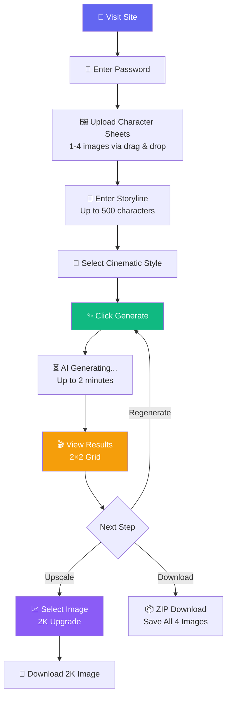
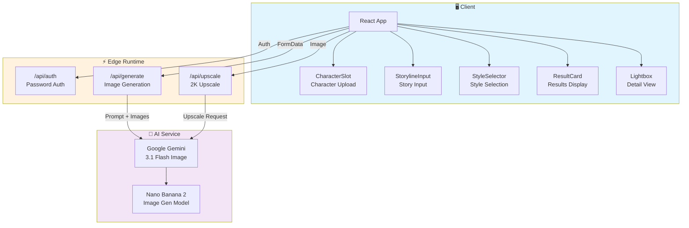
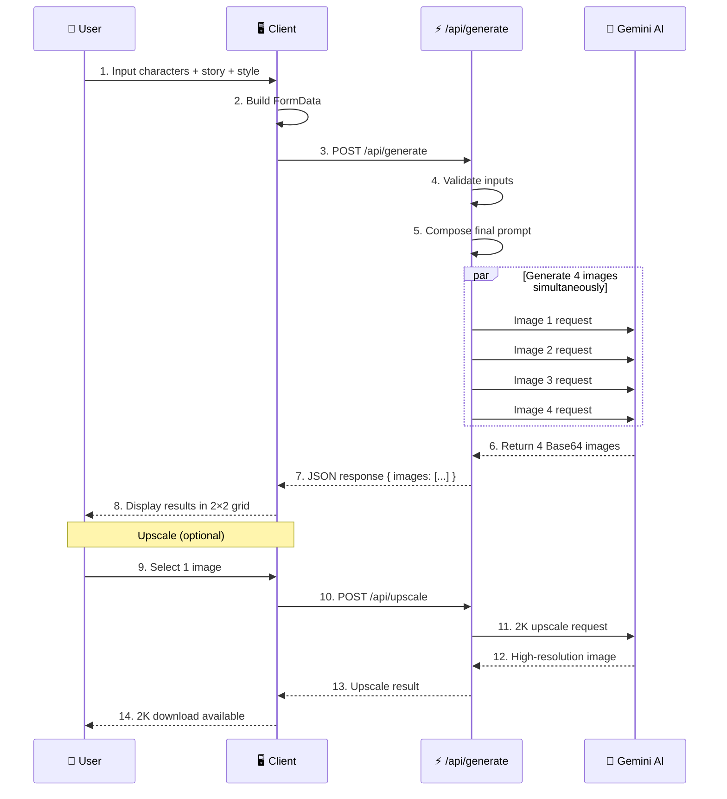

# 🎬 awesome-cut - AI Cinematic Sequence Generator

<div align="center">

[](https://awesome-cut.pages.dev/)
[](https://nextjs.org/)
[](https://react.dev/)
[](https://www.typescriptlang.org/)
[](https://tailwindcss.com/)
[](https://pages.cloudflare.com/)

**Generate 3×3 cinematic sequences from character sheets and storylines!** ✨

[🎯 Features](#-features) | [🎮 How to Use](#-how-to-use) | [💻 Run Locally](#-running-locally) | [🚀 Deploy](#-deployment)

> 🇰🇷 [한국어 README](./README.md)

</div>

---

## 🎯 About

**awesome-cut** is a web application that uses the **Nano Banana 2** AI model (Gemini 3.1 Flash Image) to automatically generate **3×3 cinematic sequence images** from character sheets and storylines.

Built for webtoon artists, film planners, game developers, and all creators who need storyboards! 🎥✨

### ✨ Features

- 🖼️ **Character Sheet Upload** - Up to 4 images via drag & drop
- 📝 **Storyline Prompt** - Describe your desired scene in up to 500 characters
- 🎨 **6 Cinematic Styles** - Realistic, Animation, Webtoon, Watercolor, 3D CGI + Custom
- 🚀 **4 Simultaneous Generations** - 1K resolution images, 4 at a time
- 📈 **2K Upscale** - Upgrade your favorite image to high resolution
- 📦 **ZIP Batch Download** - Save all generated images at once
- 🔐 **Password Protection** - Secure access control
- 🎦 **Lightbox Viewer** - Navigate conveniently with keyboard arrows

---

## 📸 Screenshots

<div align="center">

| Main Screen | Generation Results |
|:---:|:---:|
|  |  |

<!-- Add screenshots to the docs/ folder if missing -->

</div>

---

## 🎮 How to Use



### 📝 Step-by-Step Guide

#### 1️⃣ Upload Character Sheets
| Item | Description |
|:---:|:---|
| 📁 Supported Formats | JPG, PNG, WebP |
| 📊 Max Images | 4 (at least 1 required) |
| 🖱️ Upload Method | Drag & drop or click |

#### 2️⃣ Enter Storyline
- Freely describe the scenes you want
- Example: *"A game designer protagonist and a police officer heroine get summoned to another world, sparking an exciting romance"*

#### 3️⃣ Select Style

| Style | Description |
|:---:|:---|
| 🎬 Realistic Cinematic | Movie-like realistic feel (default) |
| 🎨 Animated Cinematic | Animation movie style |
| 📖 Webtoon Style | Korean webtoon art style |
| 🌈 Watercolor Illustration | Artistic watercolor feel |
| 🎭 3D CGI Rendering | 3D graphics rendering style |
| ✨ Custom | Enter your own style description |

#### 4️⃣ View Results & Use
- 4 images at 1K resolution displayed in a 2×2 grid
- Click an image to view it in the **Lightbox**
- **Upscale** your favorite image to **2K**
- **ZIP download** to save all 4 images at once

---

## 🏗️ Tech Stack

<div align="center">

| Category | Technology | Purpose |
|:---:|:---:|:---|
| **Framework** | Next.js (App Router) | Full-stack web application |
| **Library** | React 19 | UI components |
| **Language** | TypeScript 5 | Type safety |
| **Styling** | Tailwind CSS v4 | Utility-first CSS |
| **AI Model** | Nano Banana 2 | Image generation via Gemini 3.1 Flash Image |
| **AI SDK** | @google/genai | Google AI model API client |
| **Compression** | JSZip | ZIP batch download |
| **Deployment** | Cloudflare Pages | Edge Runtime global deployment |

</div>

### 🎨 Architecture



---

## 📁 Project Structure

```
awesome-cut/
├── 📂 src/
│   ├── 📂 app/                      # Next.js App Router
│   │   ├── 📄 layout.tsx            # 🏠 Root layout
│   │   ├── 📄 page.tsx              # 🎬 Main page (single-page app)
│   │   ├── 📄 globals.css           # 🎨 Global styles
│   │   └── 📂 api/                  # ⚡ API Routes (Edge)
│   │       ├── 📂 auth/             # 🔐 Password authentication
│   │       │   └── 📄 route.ts
│   │       ├── 📂 generate/         # 🚀 Image generation (4 parallel)
│   │       │   └── 📄 route.ts
│   │       └── 📂 upscale/          # 📈 2K upscale
│   │           └── 📄 route.ts
├── 📂 docs/
│   └── 📄 prd.md                    # 📋 Product requirements document
├── 📄 .env.local.example            # 🔧 Environment variable template
├── 📄 package.json
├── 📄 next.config.ts
├── 📄 tsconfig.json
└── 📄 postcss.config.mjs
```

---

## 🔄 Image Generation Workflow



---

## 💻 Running Locally

### 📋 Prerequisites

1. **Node.js 20+** - [Download](https://nodejs.org/)
2. **Google AI Studio Account** - For API key
   - Get a free key at [Google AI Studio](https://aistudio.google.com/)

### 🔧 Environment Variables

Create a `.env.local` file:

```bash
# 🤖 Gemini AI (required)
GEMINI_API_KEY=your-api-key-here

# 🔐 App access password (required)
APP_PASSWORD=your-password-here
```

### 🚀 Getting Started

```bash
# 1️⃣ Clone the project
git clone https://github.com/izowooi/crispy-web.git
cd crispy-web/awesome-cut

# 2️⃣ Install dependencies
npm install

# 3️⃣ Set up environment variables
cp .env.local.example .env.local
# Edit .env.local with your API key and password

# 4️⃣ Start dev server
npm run dev
```

Open http://localhost:3000 in your browser! 🎉

### ⚙️ Available Commands

| Command | Description |
|---------|-------------|
| `npm run dev` | 🔧 Start development server (port 3000) |
| `npm run build` | 📦 Create production build |
| `npm run start` | ▶️ Run built app |
| `npm run lint` | 🔍 ESLint code check |

---

## 🚀 Deployment

### ☁️ Cloudflare Pages

1. Log in to [Cloudflare Dashboard](https://dash.cloudflare.com/)
2. "Workers & Pages" → "Create Application" → "Pages"
3. Connect GitHub repository
4. Settings:
   - **Root directory**: `awesome-cut`
   - **Build command**: `npx @cloudflare/next-on-pages`
   - **Build output directory**: `.vercel/output/static`
5. Set environment variables:
   - `GEMINI_API_KEY`: Google AI Studio API key
   - `APP_PASSWORD`: App access password
6. Click "Save and Deploy"!

---

## 💾 Prompt Composition

Internally, the final prompt is composed as follows:

```
Create a 3by3 {style} sequence image about "{storyline}".
Refer to the attached character sheets for character information.
Output the image in landscape mode.
```

### ⚠️ Constraints

| Item | Limit |
|:---:|:---:|
| 🖼️ Output Orientation | Landscape mode only |
| 📐 Default Resolution | 1K fixed |
| 📈 Upscale | 2K, limited to 1 image per session |
| 👥 Max Characters | 4 |
| 🎬 Sequence Layout | 3×3 fixed |
| 📝 Storyline | Max 500 characters |

---

## 🤝 Contributing

Bug reports and feature suggestions are always welcome!

1. Fork this repository
2. Create a new branch (`git checkout -b feature/amazing-feature`)
3. Commit your changes (`git commit -m 'Add amazing feature'`)
4. Push to the branch (`git push origin feature/amazing-feature`)
5. Open a Pull Request

---

## 📄 License

This project is licensed under the MIT License.
Feel free to use it freely.

---

## 👨‍💻 Creator

**izowooi**

Have questions or suggestions? Please open an Issue!

---

<div align="center">

**⭐ If you like this project, please give it a Star! ⭐**

Made with ❤️ using Next.js, Tailwind CSS & Gemini AI

[🎬 Try it now](https://awesome-cut.pages.dev/)

</div>
