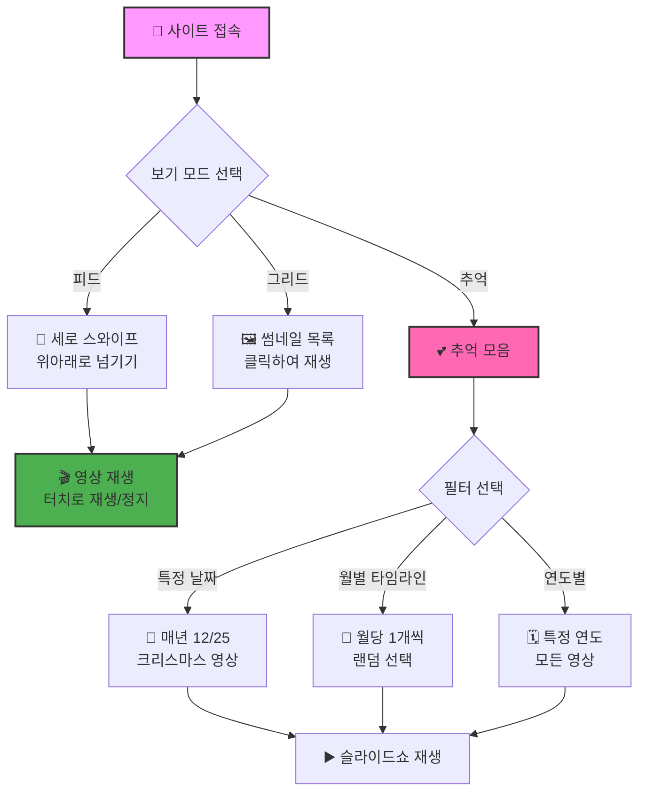
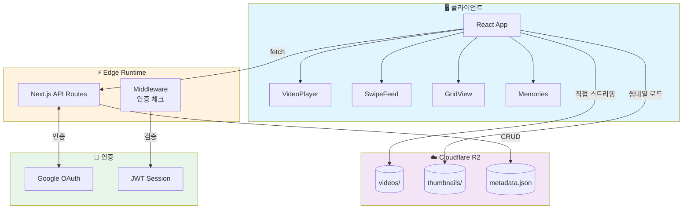
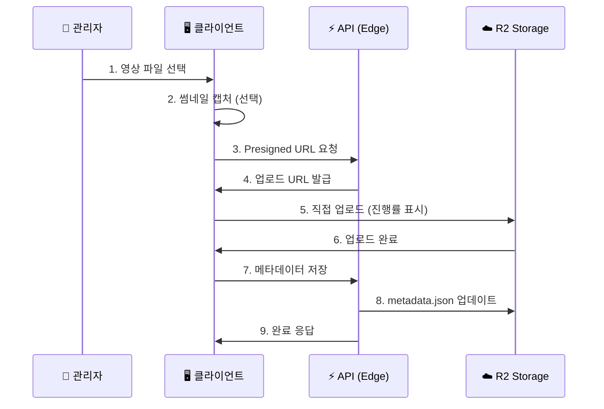

# 🎬 ClipPlay - 가족 비디오 스트리밍

<div align="center">

[](https://clipplay.pages.dev/)
[](https://nextjs.org/)
[](https://react.dev/)
[](https://www.typescriptlang.org/)
[](https://cloudflare.com/)

**가족의 소중한 순간을 TikTok 스타일로 감상하세요!** ✨

[🎯 주요 기능](#-주요-기능) | [🏗️ 기술 스택](#%EF%B8%8F-기술-스택) | [💻 로컬 실행](#-로컬에서-실행하기) | [📱 사용법](#-사용-방법)

</div>

---

## 🎯 프로젝트 소개

ClipPlay는 **가족 동영상을 위한 프라이빗 비디오 스트리밍 플랫폼**입니다.

세로 영상에 최적화된 TikTok 스타일의 풀스크린 피드로 소중한 추억을 감상하고, 특별한 날짜의 영상을 모아보는 "추억 모음" 기능으로 과거의 순간들을 다시 만나보세요! 📹✨

### ✨ 주요 기능

- 📱 **세로 스와이프 피드** - TikTok처럼 위아래로 스와이프하며 영상 감상
- 🖼️ **그리드 뷰** - 썸네일로 영상 목록을 한눈에 확인
- 💕 **추억 모음** - 특정 날짜/월/연도별로 영상 필터링
- 🔐 **Google OAuth 관리자** - 허용된 사용자만 업로드 가능
- 📤 **대용량 업로드** - 200MB까지 직접 R2 업로드 (진행률 표시)
- 🎨 **다크/라이트 테마** - 눈이 편한 테마 선택
- 📲 **PWA 지원** - 홈 화면에 앱처럼 설치 가능
- 🔄 **실시간 새로고침** - 캐시 우회 강제 새로고침

---

## 🎮 사용 방법



### 📝 화면별 가이드

#### 1️⃣ 피드 뷰 (메인)
| 동작 | 설명 |
|:---:|:---|
| ⬆️ 위로 스와이프 | 다음 영상 |
| ⬇️ 아래로 스와이프 | 이전 영상 |
| 👆 화면 터치 | 재생/정지 |
| 🔊 스피커 아이콘 | 음소거 토글 |
| 🔄 새로고침 버튼 | 최신 목록 불러오기 |

#### 2️⃣ 그리드 뷰
- 🔍 **검색**: 제목/설명으로 영상 검색
- 📷 **썸네일**: 클릭하면 해당 영상 재생
- 📊 **정보 표시**: 제목, 이모지, 재생시간

#### 3️⃣ 추억 모음
| 모드 | 설명 | 예시 |
|:---:|:---|:---|
| 📅 특정 날짜 | 매년 같은 날 촬영된 영상 | 크리스마스, 생일 |
| 📆 월별 타임라인 | 월당 1개씩 랜덤 선택 | 1년 요약 |
| 🗓️ 연도별 | 특정 연도의 모든 영상 | 2023년 추억 |

---

## 🏗️ 기술 스택

<div align="center">

| 카테고리 | 기술 |
|---------|------|
| **프레임워크** | Next.js 16.0.10 (App Router) |
| **라이브러리** | React 19.2.1 |
| **언어** | TypeScript 5 |
| **스타일링** | Tailwind CSS 4.0 |
| **인증** | Google OAuth 2.0 + JWT (jose) |
| **스토리지** | Cloudflare R2 (S3 호환) |
| **배포** | Cloudflare Pages (Edge Runtime) |
| **테스트** | Vitest + Testing Library |

</div>

### 🎨 아키텍처



---

## 📁 프로젝트 구조

```
clipplay/
├── 📂 src/
│   ├── 📂 app/                    # Next.js App Router
│   │   ├── 📄 page.tsx            # 🏠 메인 (피드/그리드)
│   │   ├── 📂 memories/           # 💕 추억 모음
│   │   │   ├── 📄 page.tsx        # 필터 선택
│   │   │   └── 📂 play/           # 슬라이드쇼
│   │   ├── 📂 clip/[id]/          # 🎬 개별 영상 페이지
│   │   ├── 📂 admin/              # 🔐 관리자 영역
│   │   │   ├── 📄 page.tsx        # 대시보드
│   │   │   ├── 📂 login/          # Google 로그인
│   │   │   ├── 📂 upload/         # 업로드 페이지
│   │   │   └── 📂 clips/          # 영상 관리
│   │   └── 📂 api/                # ⚡ API 라우트 (Edge)
│   │       ├── 📂 auth/           # 인증 API
│   │       └── 📂 admin/          # 관리 API
│   ├── 📂 components/             # 🧩 React 컴포넌트
│   │   ├── 📂 player/             # 비디오 플레이어
│   │   ├── 📂 clip/               # 클립 관련 UI
│   │   └── 📂 ui/                 # 공통 UI
│   ├── 📂 hooks/                  # 🪝 커스텀 훅
│   ├── 📂 context/                # 🌐 React Context
│   ├── 📂 lib/                    # 🔧 유틸리티
│   │   ├── 📂 auth/               # 인증 로직
│   │   ├── 📂 r2/                 # R2 스토리지
│   │   └── 📂 clips/              # 클립 필터링
│   └── 📂 types/                  # 📝 TypeScript 타입
├── 📂 public/                     # 정적 파일
│   ├── 📄 manifest.json           # PWA 매니페스트
│   └── 📄 sw.js                   # Service Worker
└── 📄 package.json
```

---

## 🔐 관리자 기능

### 📤 영상 업로드 워크플로우



### ✅ 업로드 제한사항

| 항목 | 제한 |
|:---:|:---:|
| 📁 파일 크기 | 최대 200MB |
| 🎥 파일 형식 | video/* (MP4 권장) |
| 🖼️ 썸네일 | 자동 캡처 또는 직접 업로드 |
| 📅 촬영일 | 파일 수정일 자동 감지 |

---

## 💾 데이터 모델

### 📹 Clip (영상)

```typescript
interface Clip {
  id: string;              // 고유 ID
  title: string;           // 제목
  description?: string;    // 설명 (선택)
  emoji: string;           // 대표 이모지 🎬
  fileKey: string;         // videos/xxx.mp4
  fileSize: number;        // 파일 크기 (bytes)
  duration: number;        // 재생 시간 (초)
  thumbnailKey?: string;   // thumbnails/xxx.jpg
  filmingDate?: string;    // 촬영일 (YYYY-MM-DD)
  createdAt: string;       // 생성일시
  updatedAt: string;       // 수정일시
}
```

---

## 💻 로컬에서 실행하기

### 📋 사전 준비물

1. **Node.js 20+** - [다운로드](https://nodejs.org/)
2. **Cloudflare 계정** - R2 버킷 필요
3. **Google Cloud Console** - OAuth 설정

### 🔧 환경 변수 설정

`.env.local` 파일 생성:

```bash
# 🌐 공개 URL
NEXT_PUBLIC_R2_PUBLIC_URL=https://your-bucket.r2.dev
NEXT_PUBLIC_BASE_URL=http://localhost:3000

# 🔐 Google OAuth
NEXT_PUBLIC_GOOGLE_CLIENT_ID=your-client-id.apps.googleusercontent.com
GOOGLE_CLIENT_SECRET=your-client-secret

# 🔑 세션
JWT_SECRET=your-super-secret-key-min-32-chars

# ☁️ Cloudflare R2
R2_ACCOUNT_ID=your-account-id
R2_ACCESS_KEY_ID=your-access-key
R2_SECRET_ACCESS_KEY=your-secret-key
R2_BUCKET_NAME=your-bucket-name
```

### 🚀 실행 방법

```bash
# 1️⃣ 프로젝트 클론
git clone <repository-url>
cd clipplay

# 2️⃣ 의존성 설치
npm install

# 3️⃣ 개발 서버 실행
npm run dev
```

브라우저에서 http://localhost:3000 접속! 🎉

### ⚙️ 사용 가능한 명령어

| 명령어 | 설명 |
|-------|------|
| `npm run dev` | 🔧 개발 서버 실행 (포트 3000) |
| `npm run build` | 📦 프로덕션 빌드 생성 |
| `npm run start` | ▶️ 빌드된 앱 실행 |
| `npm run lint` | 🔍 ESLint 코드 검사 |
| `npm run test` | 🧪 Vitest 테스트 실행 |
| `npm run test:ui` | 📊 테스트 UI 대시보드 |

---

## 🌍 배포하기

### ☁️ Cloudflare Pages 배포

```bash
# 빌드 명령어
npx @cloudflare/next-on-pages

# 출력 디렉토리
.vercel/output/static
```

### 🔒 R2 CORS 설정

Cloudflare Dashboard → R2 → 버킷 → Settings → CORS:

```json
[
  {
    "AllowedOrigins": [
      "http://localhost:3000",
      "https://clipplay.pages.dev"
    ],
    "AllowedMethods": ["GET", "PUT", "HEAD"],
    "AllowedHeaders": ["Content-Type"],
    "MaxAgeSeconds": 3600
  }
]
```

---

## 🔒 보안

| 항목 | 구현 |
|:---:|:---|
| 🔐 **세션** | JWT (HS256, 7일 만료) |
| 🍪 **쿠키** | HttpOnly, Secure, SameSite |
| 👤 **권한** | 이메일 화이트리스트 |
| 📤 **업로드** | Presigned URL (1시간 만료) |
| 🔑 **API 키** | 서버 사이드만 접근 가능 |

---

## 🎯 향후 개선 사항

- [ ] 🎵 배경음악/음소거 기억
- [ ] 📊 시청 통계 대시보드
- [ ] 🏷️ 태그 시스템
- [ ] 👨‍👩‍👧‍👦 가족 구성원별 필터
- [ ] 📱 네이티브 앱 (React Native)
- [ ] 🌍 다국어 지원

---

## 📄 라이선스

이 프로젝트는 MIT 라이선스를 따릅니다.

---

## 👨‍💻 만든 사람

**izowooi**

궁금한 점이나 제안사항이 있으시면 Issue를 남겨주세요! 💬

---

<div align="center">

**⭐ 이 프로젝트가 마음에 드셨다면 Star를 눌러주세요! ⭐**

Made with ❤️ for Family Memories

[🎬 지금 시작하기](https://clipplay.pages.dev/)

</div>
