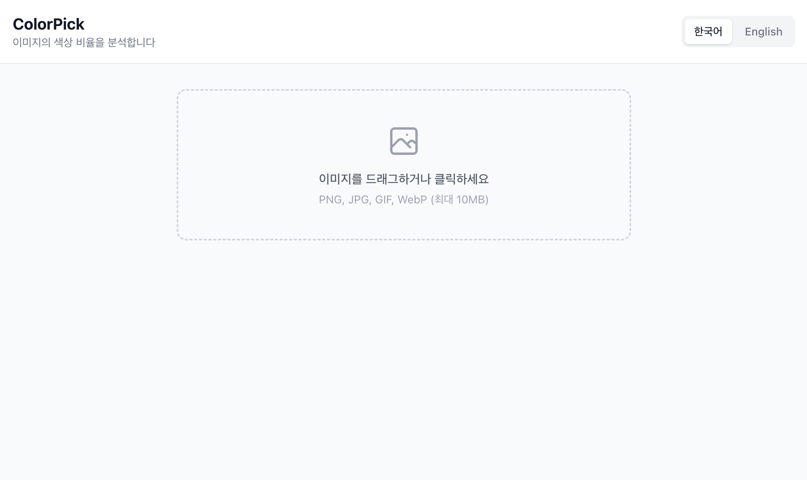
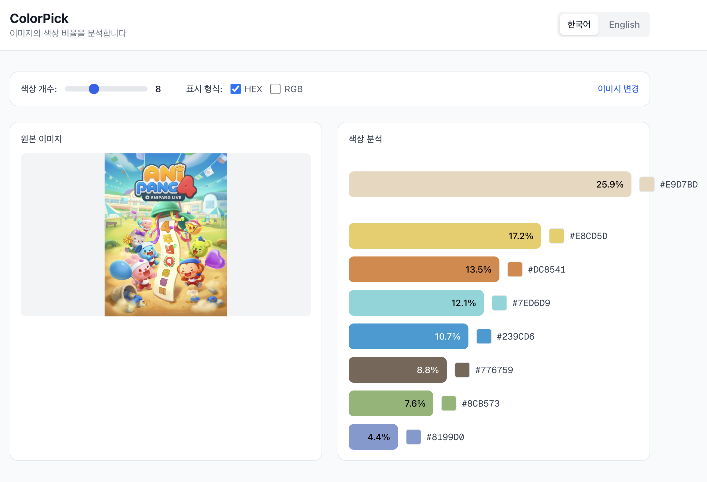
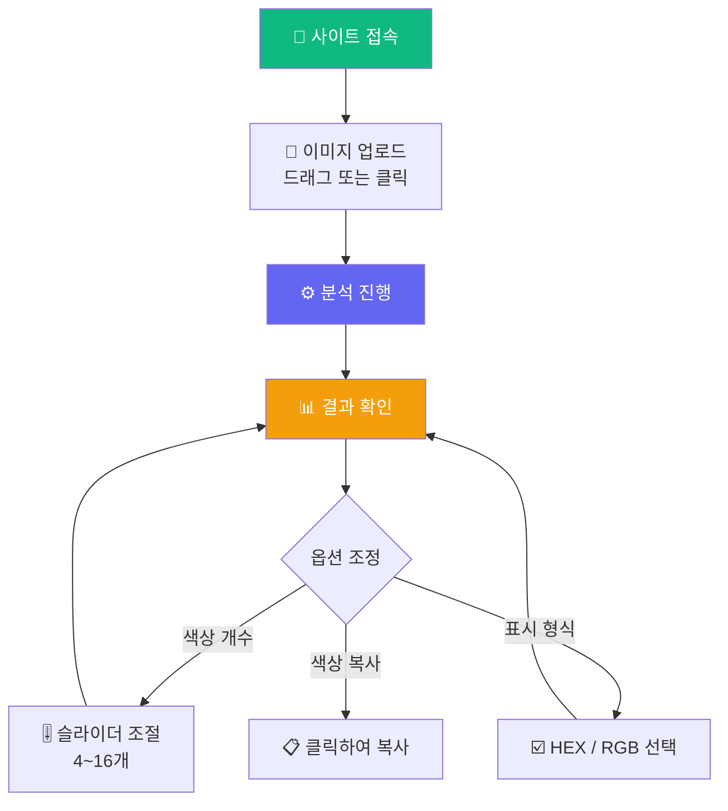
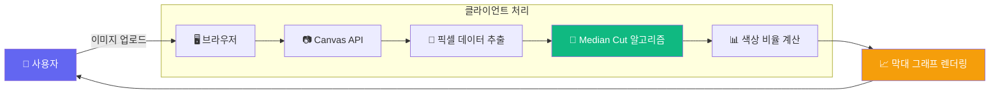
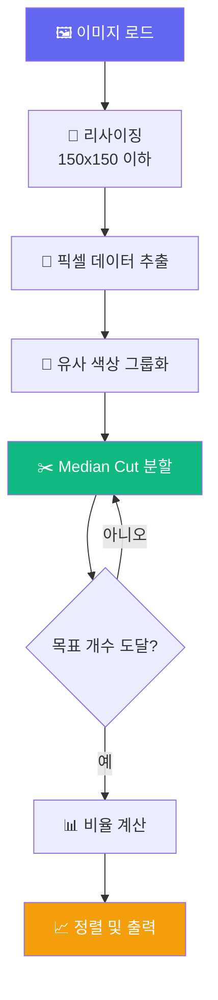

# 🎨 ColorPick - 이미지 색상 분석기

<div align="center">

[](https://colorpick.pages.dev/)
[](https://nextjs.org/)
[](https://react.dev/)
[](https://www.typescriptlang.org/)
[](https://tailwindcss.com/)
[](https://pages.cloudflare.com/)

**이미지의 색상 비율을 분석하고 시각화하세요!** ✨

[🎯 사용 방법](#-사용-방법) | [💻 로컬 실행](#-로컬에서-실행하기) | [🚀 배포하기](#-배포하기)

</div>

---

## 🎯 프로젝트 소개

**ColorPick**은 이미지를 업로드하면 주요 색상을 추출하고 비율을 시각화하는 웹 애플리케이션입니다.

디자이너, 개발자, 아티스트 누구나 이미지의 색상 팔레트를 쉽게 분석할 수 있습니다! 🖼️

### ✨ 주요 기능

- 🖼️ **드래그 앤 드롭** - 이미지를 끌어다 놓기만 하면 분석 시작
- 🎨 **색상 추출** - Median Cut 알고리즘으로 정확한 색상 추출
- 📊 **막대 그래프** - 색상 비율을 직관적인 막대 그래프로 시각화
- 🎚️ **개수 조절** - 4~16개 범위에서 추출할 색상 개수 조절
- 📋 **클립보드 복사** - 색상 코드 클릭 시 바로 복사
- 🌐 **다국어 지원** - 한국어/영어 전환 가능
- ⚡ **100% 클라이언트** - 서버 없이 브라우저에서 모든 처리

---

## 📸 스크린샷

<div align="center">

| 업로드 화면 | 분석 결과 |
|:---:|:---:|
|  |  |

</div>

---

## 🎮 사용 방법



### 📝 단계별 가이드

1. **이미지 업로드**
   - 파일 선택 버튼 클릭 또는 드래그 앤 드롭
   - 지원 형식: PNG, JPG, GIF, WebP (최대 10MB)

2. **분석 결과 확인**
   - 원본 이미지와 색상 막대 그래프가 나란히 표시
   - 각 색상의 비율(%)이 막대에 표시됨

3. **옵션 조정**
   - 🎚️ 슬라이더로 추출할 색상 개수 변경 (4~16개)
   - ☑️ HEX / RGB 체크박스로 표시 형식 선택

4. **색상 코드 복사**
   - 색상 막대를 클릭하면 클립보드에 복사
   - "복사됨!" 메시지로 확인

---

## 🏗️ 기술 스택

<div align="center">

| 카테고리 | 기술 | 용도 |
|:---:|:---:|:---|
| **프레임워크** | Next.js 16.1 | App Router 기반 정적 사이트 |
| **라이브러리** | React 19 | UI 컴포넌트 |
| **언어** | TypeScript 5 | 타입 안정성 |
| **스타일링** | Tailwind CSS 4 | 유틸리티 기반 CSS |
| **색상 추출** | Canvas API | 이미지 픽셀 분석 |
| **알고리즘** | Median Cut | 색상 양자화 |
| **배포** | Cloudflare Pages | 정적 사이트 호스팅 |

</div>

### 🎨 아키텍처



### 🔒 프라이버시 보장

```
✅ 이미지가 서버로 전송되지 않음
✅ 모든 분석이 브라우저에서 처리
✅ 데이터베이스 저장 없음
✅ 완전한 클라이언트 사이드 앱
```

---

## 📁 프로젝트 구조

```
colorpick/
├── app/                        # Next.js App Router
│   ├── page.tsx               # 🏠 메인 페이지
│   ├── layout.tsx             # 루트 레이아웃
│   └── globals.css            # 전역 스타일
├── components/                 # React 컴포넌트
│   ├── ImageUploader.tsx      # 📁 이미지 업로드 (드래그앤드롭)
│   ├── ColorBar.tsx           # 📊 색상 막대 그래프
│   └── LanguageToggle.tsx     # 🌐 언어 전환 버튼
├── lib/                        # 유틸리티
│   ├── colorExtractor.ts      # 🎨 색상 추출 알고리즘
│   └── i18n.ts                # 🌍 다국어 설정
├── locales/                    # 번역 파일
│   ├── ko.json                # 한국어
│   └── en.json                # 영어
├── docs/                       # 문서
│   └── prd.txt                # 요구사항 명세서
└── package.json
```

---

## 💻 로컬에서 실행하기

### 📋 사전 준비물

1. **Node.js** (버전 20 이상)
   - [Node.js 공식 사이트](https://nodejs.org/)에서 LTS 버전 다운로드
   - 설치 확인:
     ```bash
     node --version
     npm --version
     ```

### 🚀 실행 방법

```bash
# 1️⃣ 프로젝트 다운로드
git clone https://github.com/izowooi/crispy-web.git

# 2️⃣ colorpick 폴더로 이동
cd crispy-web/colorpick

# 3️⃣ 패키지 설치 (처음 한 번만)
npm install

# 4️⃣ 개발 서버 실행
npm run dev
```

### 🌐 브라우저에서 확인

```
http://localhost:3000
```

### ⚙️ 사용 가능한 명령어

| 명령어 | 설명 |
|-------|------|
| `npm run dev` | 개발 서버 실행 (포트 3000) |
| `npm run build` | 프로덕션 빌드 생성 |
| `npm run start` | 빌드된 앱 실행 |
| `npm run lint` | 코드 검사 |

---

## 🚀 배포하기

### Cloudflare Pages 배포

1. [Cloudflare Dashboard](https://dash.cloudflare.com/)에 로그인
2. "Workers & Pages" → "Create Application" → "Pages"
3. GitHub 저장소 연결
4. 설정:
   - **Framework preset**: Next.js (Static HTML Export)
   - **Root directory**: `colorpick`
   - **Build command**: `npx next build`
   - **Build output directory**: `out`
5. "Save and Deploy" 클릭!

### next.config.ts 설정

```typescript
const nextConfig: NextConfig = {
  output: 'export',  // 정적 HTML 내보내기
};
```

---

## 🎨 색상 추출 알고리즘

### Median Cut 알고리즘

ColorPick은 **Median Cut** 알고리즘을 사용하여 이미지에서 주요 색상을 추출합니다.



| 단계 | 설명 |
|:---:|:---|
| 1️⃣ | Canvas에 이미지 로드 (성능을 위해 150x150으로 리사이징) |
| 2️⃣ | `getImageData()`로 픽셀 RGB 값 추출 |
| 3️⃣ | 유사한 색상을 그룹화하여 노이즈 감소 |
| 4️⃣ | RGB 공간에서 가장 넓은 범위를 가진 축으로 분할 |
| 5️⃣ | 목표 색상 개수에 도달할 때까지 반복 |
| 6️⃣ | 각 그룹의 평균 색상과 비율 계산 |

---

## 🤝 기여하기

버그 리포트나 기능 제안은 언제나 환영합니다!

1. 이 저장소를 Fork 하세요
2. 새로운 브랜치를 만드세요 (`git checkout -b feature/amazing-feature`)
3. 변경사항을 커밋하세요 (`git commit -m 'Add amazing feature'`)
4. 브랜치에 Push 하세요 (`git push origin feature/amazing-feature`)
5. Pull Request를 열어주세요

---

## 📄 라이선스

이 프로젝트는 MIT 라이선스를 따릅니다.
자유롭게 사용하셔도 됩니다.

---

## 👨‍💻 만든 사람

**izowooi**

궁금한 점이나 제안사항이 있으시면 Issue를 남겨주세요!

---

<div align="center">

**⭐ 이 프로젝트가 마음에 드셨다면 Star를 눌러주세요! ⭐**

Made with ❤️ using Next.js & TypeScript

[🎨 지금 사용하기](https://colorpick.pages.dev/)

</div>
