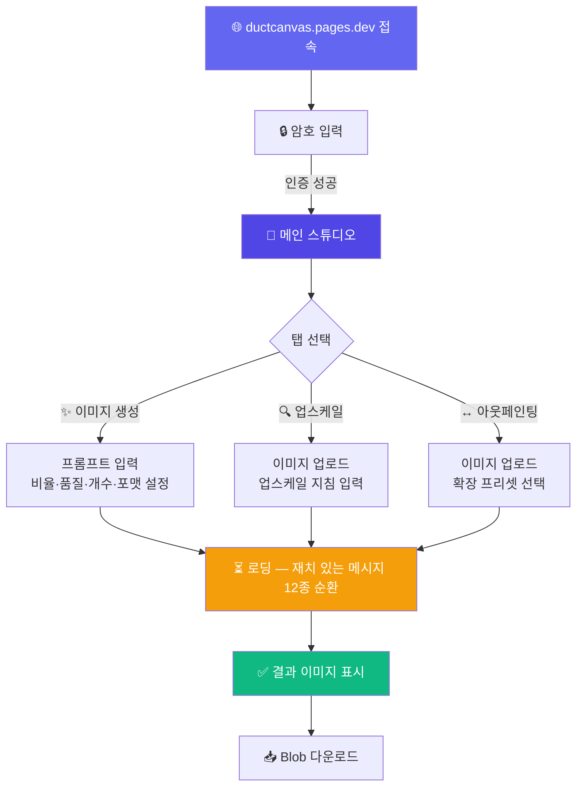

# 🩹 DuctCanvas - GPT Image 2 AI 이미지 편집 스튜디오

<div align="center">

> 🇺🇸 [English README](./README_EN.md)

[](https://ductcanvas.pages.dev)
[](https://nextjs.org)
[](https://react.dev)
[](https://tailwindcss.com)
[](https://pages.cloudflare.com)
[](https://replicate.com/openai/gpt-image-2)

**텍스트 한 줄로 이미지 생성, 업스케일, 아웃페인팅까지 — GPT Image 2의 모든 기능을 하나의 UI에서.** ✨

[🎯 주요 기능](#-프로젝트-소개) | [💻 로컬 실행](#-로컬에서-실행하기) | [🚀 배포하기](#-배포하기)

</div>

---

## 🎯 프로젝트 소개

**DuctCanvas**는 OpenAI의 최신 이미지 생성 모델 **GPT Image 2**를 Replicate API를 통해 호출하는 웹 스튜디오입니다. 복잡한 API 연동 없이 누구나 세 가지 AI 이미지 작업을 즉시 사용할 수 있습니다. 암호 게이트로 접근을 제한하고, 라이트/다크 모드를 지원하며, 로딩 중에는 재치 있는 메시지가 지루함을 달래줍니다.

### ✨ 주요 기능

- ✨ **이미지 생성** — 프롬프트로 이미지 최대 4장 동시 생성 (비율·품질·포맷 설정 가능)
- 🔍 **업스케일** — 이미지를 업로드하면 AI가 최고 해상도로 향상 (전후 비교 제공)
- ↔️ **아웃페인팅** — 4가지 프리셋으로 이미지 캔버스를 가로·세로 자유롭게 확장
- 🎭 **12가지 로딩 메시지** — 2.5초마다 페이드인 애니메이션으로 교체되는 재치 있는 문구
- 🔒 **암호 게이트** — `ACCESS_PASSWORD`로 서비스 접근 제어
- 🌙 **라이트/다크 모드** — 시스템 설정 감지, 수동 토글, `localStorage` 유지
- 📥 **Blob 다운로드** — CORS 우회로 결과 이미지를 안정적으로 저장

---

## 📸 스크린샷

<!-- TODO: docs/screenshots/ 폴더에 스크린샷을 추가하고 아래 테이블을 채워주세요 -->

| 이미지 생성 | 업스케일 | 아웃페인팅 |
|------------|---------|-----------|
| 프롬프트 입력 후 생성 버튼 | 원본/결과 비교 | 4가지 확장 프리셋 |

---

## 🎮 사용 방법



### 📝 단계별 가이드

| 단계 | 설명 |
|------|------|
| 1️⃣ | **접속 & 인증** — 암호를 입력하면 `sessionStorage`에 인증 상태가 저장되어 재방문 시 바로 이용 가능 |
| 2️⃣ | **탭 선택** — 이미지 생성 / 업스케일 / 아웃페인팅 중 원하는 작업 선택 |
| 3️⃣ | **이미지 생성** — 프롬프트 작성 후 비율·품질·개수·포맷 설정, Cmd/Ctrl+Enter로도 생성 가능 |
| 4️⃣ | **업스케일** — 이미지를 드래그하거나 클릭하여 업로드, 원하는 스타일 지침 입력 |
| 5️⃣ | **아웃페인팅** — 이미지 업로드 후 가로/세로 확장 프리셋 4가지 중 선택, 추가 지침 입력 가능 |
| 6️⃣ | **결과** — 완성된 이미지를 호버하면 다운로드 버튼 표시 |

---

## 🏗️ 기술 스택

<div align="center">

| 카테고리 | 기술 | 용도 |
|---------|------|------|
| **프레임워크** | Next.js 15.5.2 (App Router) | SSR + Edge API 라우트 |
| **UI** | React 19.2 + Tailwind CSS v4 | 반응형 UI, CSS 변수 다크 테마 |
| **AI 모델** | GPT Image 2 (OpenAI) via Replicate | 이미지 생성·편집 |
| **런타임** | Cloudflare Workers (Edge) | `runtime = 'edge'` API 라우트 |
| **배포** | Cloudflare Pages + `@cloudflare/next-on-pages@1` | 글로벌 엣지 배포 |
| **SDK** | `replicate@^1.4` | Replicate API 클라이언트 |
| **언어** | TypeScript 5 | 정적 타입 |

</div>

### 🎨 아키텍처

```mermaid
graph LR
    subgraph Client[🌐 브라우저]
        UI[React UI<br/>GenerateTab / UpscaleTab / OutpaintTab]
        PG[PasswordGate]
    end

    subgraph CF[☁️ Cloudflare Pages Edge]
        Static[정적 페이지 /]
        APIAuth[/api/auth POST]
        APIGen[/api/generate POST]
        APIUp[/api/upscale POST]
        APIOpt[/api/outpaint POST]
    end

    subgraph Replicate[🤖 Replicate]
        GPT[openai/gpt-image-2]
    end

    UI -->|암호 검증| APIAuth
    APIAuth -->|ok| PG
    PG -->|sessionStorage 저장| UI
    UI -->|프롬프트 + 설정| APIGen
    UI -->|이미지 + 프롬프트| APIUp
    UI -->|이미지 + 방향| APIOpt
    APIGen & APIUp & APIOpt -->|replicate.run| GPT
    GPT -->|FileOutput → String URL| APIGen & APIUp & APIOpt
    APIGen & APIUp & APIOpt -->|이미지 URL 배열| UI

    style UI fill:#6366f1,color:#fff
    style GPT fill:#000,color:#fff
    style APIGen fill:#f38020,color:#fff
    style APIUp fill:#f38020,color:#fff
    style APIOpt fill:#f38020,color:#fff
```

---

## 📁 프로젝트 구조

```
ductcanvas/
├── 📄 next.config.ts               # Next.js 설정 (replicate.delivery 이미지 허용)
├── 🔧 wrangler.jsonc               # Cloudflare Pages 설정 (.vercel/output/static)
├── 📦 package.json                 # Next 15.5.2 + @cloudflare/next-on-pages@1
├── 🔑 .env.local.example           # 환경 변수 예시
├── 📁 src/
│   ├── 📁 app/
│   │   ├── 🎨 globals.css          # Tailwind v4 + 라이트/다크 CSS 변수 + 로딩 애니메이션
│   │   ├── 📐 layout.tsx           # 루트 레이아웃 + 테마 초기화 스크립트
│   │   ├── 🏠 page.tsx             # PasswordGate + 탭 네비게이션 호스트
│   │   └── 📁 api/
│   │       ├── 📍 auth/route.ts    # POST: 암호 검증 (edge runtime)
│   │       ├── 📍 generate/route.ts # POST: 이미지 생성
│   │       ├── 📍 upscale/route.ts  # POST: 이미지 업스케일
│   │       └── 📍 outpaint/route.ts # POST: 아웃페인팅
│   └── 📁 components/
│       ├── ✨ GenerateTab.tsx       # 이미지 생성 탭 (로딩 메시지 + blob 다운로드)
│       ├── 🔍 UpscaleTab.tsx       # 업스케일 탭 (전후 비교)
│       ├── ↔️ OutpaintTab.tsx      # 아웃페인팅 탭 (4가지 프리셋)
│       ├── 🔒 PasswordGate.tsx     # 암호 입력 게이트
│       └── 🌙 ThemeToggle.tsx      # ☀️/🌙 테마 토글
└── 📁 docs/
    └── 📄 llms-gpt-image2.txt      # GPT Image 2 모델 레퍼런스
```

---

## 💻 로컬에서 실행하기

### 📋 사전 준비물

- **Node.js** 20 이상
- **npm**
- **Replicate API 토큰** — [replicate.com/account/api-tokens](https://replicate.com/account/api-tokens)
- (선택) Cloudflare Wrangler 계정 — 배포 시 필요

### 🔧 환경 변수 설정

프로젝트 루트에 `.env.local` 파일을 생성하세요:

```bash
# Replicate API 토큰 (https://replicate.com/account/api-tokens)
REPLICATE_API_TOKEN=r8_xxxxxxxxxxxxxxxxxxxxxxxxxxxxxxxx

# 접근 암호 (첫 화면에서 입력)
ACCESS_PASSWORD=your_password_here
```

> ⚠️ `REPLICATE_API_TOKEN`은 서버 사이드에서만 사용되며 클라이언트 번들에 노출되지 않습니다. Cloudflare Pages 대시보드의 환경 변수에도 동일하게 설정하세요.

### 🚀 실행 방법

```bash
git clone https://github.com/izowooi/crispy-web.git
cd crispy-web/ductcanvas
npm install
npm run dev
# → http://localhost:3000
```

### ⚙️ 사용 가능한 명령어

| 명령어 | 설명 |
|--------|------|
| `npm run dev` | HMR 포함 Next.js 개발 서버 |
| `npm run build` | 프로덕션 빌드 (`.next/`) |
| `npm run start` | 프로덕션 빌드 로컬 서빙 |
| `npm run pages:build` | Cloudflare Pages 엣지 번들 생성 (`.vercel/output/static/`) |
| `npm run preview` | 빌드 후 `wrangler pages dev`로 로컬 미리보기 |
| `npm run deploy` | Cloudflare Pages 배포 (Wrangler 필요) |

---

## 🚀 배포하기

### Cloudflare Pages

이 프로젝트는 `@cloudflare/next-on-pages@1` 어댑터로 **Cloudflare Workers Edge Runtime** 위에서 동작합니다.

#### 대시보드 설정 (Git 연동 프로젝트)

| 설정 | 값 |
|------|-----|
| 빌드 명령어 | `npx @cloudflare/next-on-pages@1` |
| 빌드 출력 디렉토리 | `.vercel/output/static` |
| 루트 디렉토리 | `ductcanvas` (모노레포 사용 시) |
| Node.js 버전 | `20` 이상 |

#### 프로덕션 환경 변수

| 키 | 값 | 노출 |
|----|-----|------|
| `REPLICATE_API_TOKEN` | Replicate 토큰 | 서버 전용 |
| `ACCESS_PASSWORD` | 접근 암호 | 서버 전용 |

#### CLI 배포

```bash
npm run deploy
```

> ℹ️ `npx wrangler login` 후 프로젝트 이름(`ductcanvas`)이 존재하거나 생성 가능해야 합니다.

---

## 🤖 AI 모델 — GPT Image 2

[**openai/gpt-image-2**](https://replicate.com/openai/gpt-image-2)는 OpenAI의 최신 이미지 생성·편집 모델입니다.

| 파라미터 | 값 |
|---------|-----|
| `prompt` | 생성하거나 편집할 이미지 설명 |
| `aspect_ratio` | `1:1` (정방형), `3:2` (가로), `2:3` (세로) |
| `quality` | `low`, `medium`, `high`, `auto` |
| `number_of_images` | 1–4장 동시 생성 |
| `output_format` | `webp` (기본), `png`, `jpeg` |
| `input_images` | 참조 이미지 (업스케일·아웃페인팅 시 전달) |

> ℹ️ Replicate SDK v1.x는 `FileOutput` 객체를 반환합니다. 이 프로젝트는 `String(item)`으로 명시 변환하여 JSON 직렬화 문제를 해결합니다.

---

## 🎯 향후 개선 사항

- [ ] 업스케일·아웃페인팅 탭에도 로딩 애니메이션 적용
- [ ] 생성 히스토리 로컬 저장 (최근 10개)
- [ ] 이미지 편집 탭 추가 (마스크 기반 인페인팅)
- [ ] 프롬프트 번역 헬퍼 (한국어 → 영어)
- [ ] 다운로드 시 원본 포맷 유지

---

## 🤝 기여하기

1. 이 저장소를 Fork 하세요.
2. 기능 브랜치를 생성하세요: `git checkout -b feat/your-feature`
3. 변경 사항을 커밋하세요: `git commit -m "feat: add your feature"`
4. 브랜치를 Push 하세요: `git push origin feat/your-feature`
5. Pull Request를 열어주세요.

---

## 📄 라이선스

MIT License

---

## 👨‍💻 만든 사람

**izowooi**

버그 리포트와 제안은 [Issues](https://github.com/izowooi/crispy-web/issues)로 남겨주세요.

---

<div align="center">

**⭐ 이 프로젝트가 마음에 드셨다면 Star를 눌러주세요! ⭐**

Made with ❤️ using Next.js · Cloudflare Pages · GPT Image 2

[🩹 지금 사용하기](https://ductcanvas.pages.dev)

</div>
