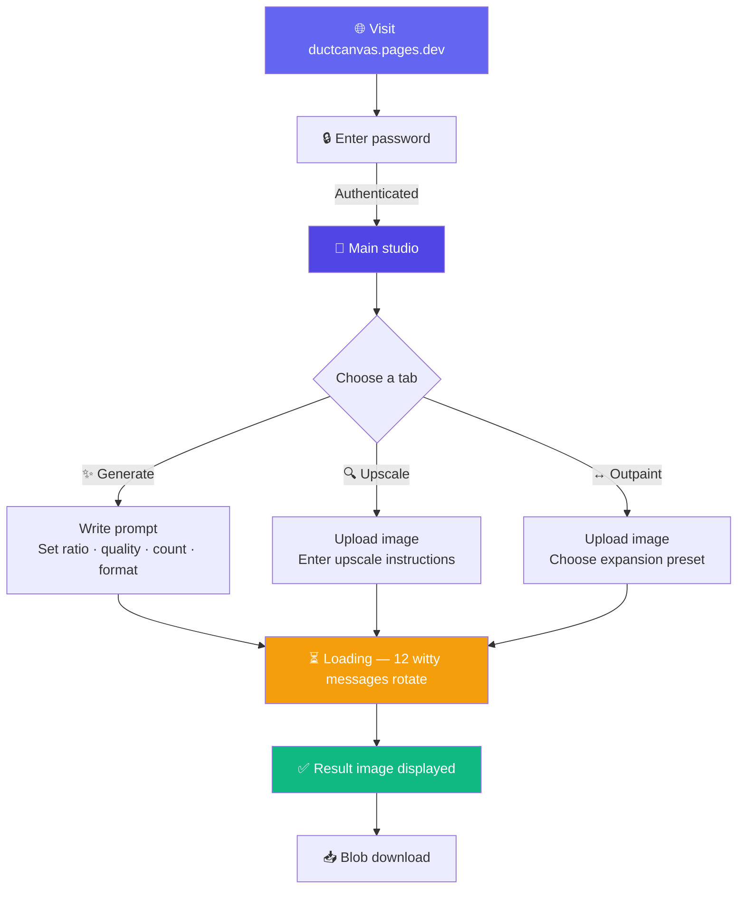

# 🩹 DuctCanvas - GPT Image 2 AI Image Editing Studio

<div align="center">

> 🇰🇷 [한국어 README](./README.md)

[](https://ductcanvas.pages.dev)
[](https://nextjs.org)
[](https://react.dev)
[](https://tailwindcss.com)
[](https://pages.cloudflare.com)
[](https://replicate.com/openai/gpt-image-2)

**Generate, upscale, and outpaint images from a single prompt — every GPT Image 2 capability behind one friendly UI.** ✨

[🎯 Features](#-project-overview) | [💻 Local Setup](#-running-locally) | [🚀 Deployment](#-deployment)

</div>

---

## 🎯 Project Overview

**DuctCanvas** is a web studio that calls OpenAI's latest image generation model, **GPT Image 2**, via the Replicate API — no API plumbing required. Three AI image workflows are available immediately: generate images from text, upscale existing images to maximum resolution, and expand a canvas in any direction with outpainting. A password gate keeps the service private, light/dark mode is fully supported, and witty loading messages make the wait more bearable.

### ✨ Key Features

- ✨ **Image Generation** — generate up to 4 images from a prompt with configurable aspect ratio, quality, count, and format
- 🔍 **Upscale** — upload any image and have AI enhance it to maximum resolution with before/after comparison
- ↔️ **Outpaint** — expand an image canvas horizontally or vertically using 4 direction presets
- 🎭 **12 loading messages** — witty copy with emoji that cycles every 2.5 s with a fade-in animation
- 🔒 **Password gate** — `ACCESS_PASSWORD` restricts access to the service
- 🌙 **Light / dark mode** — detects system preference, manual toggle, persisted via `localStorage`
- 📥 **Blob download** — bypasses CORS to reliably save result images locally

---

## 📸 Screenshots

<!-- TODO: add screenshots under docs/screenshots/ and replace the table below -->

| Image Generation | Upscale | Outpaint |
|-----------------|---------|---------|
| Enter prompt and generate | Before / after comparison | 4 expansion direction presets |

---

## 🎮 How It Works



### 📝 Step-by-step

| Step | Description |
|------|-------------|
| 1️⃣ | **Visit & authenticate** — the password gate stores auth in `sessionStorage` for seamless return visits. |
| 2️⃣ | **Choose a tab** — Image Generation, Upscale, or Outpaint. |
| 3️⃣ | **Generate** — write a prompt, configure aspect ratio / quality / count / format, then press the button or Cmd/Ctrl+Enter. |
| 4️⃣ | **Upscale** — drag-and-drop or click to upload an image, optionally add style instructions. |
| 5️⃣ | **Outpaint** — upload an image, pick one of 4 direction presets, and optionally describe the expansion style. |
| 6️⃣ | **Download** — hover the result image to reveal the download button (blob-based, CORS-safe). |

---

## 🏗️ Tech Stack

<div align="center">

| Category | Tech | Purpose |
|----------|------|---------|
| **Framework** | Next.js 15.5.2 (App Router) | SSR + Edge API routes |
| **UI** | React 19.2 + Tailwind CSS v4 | Responsive UI, CSS-variable dark theme |
| **AI model** | GPT Image 2 (OpenAI) via Replicate | Image generation and editing |
| **Runtime** | Cloudflare Workers (Edge) | `runtime = 'edge'` API routes |
| **Deploy** | Cloudflare Pages + `@cloudflare/next-on-pages@1` | Global edge deployment |
| **SDK** | `replicate@^1.4` | Replicate API client |
| **Language** | TypeScript 5 | Static typing |

</div>

### 🎨 Architecture

```mermaid
graph LR
    subgraph Client[🌐 Browser]
        UI[React UI<br/>GenerateTab / UpscaleTab / OutpaintTab]
        PG[PasswordGate]
    end

    subgraph CF[☁️ Cloudflare Pages Edge]
        Static[Static page /]
        APIAuth[/api/auth POST]
        APIGen[/api/generate POST]
        APIUp[/api/upscale POST]
        APIOpt[/api/outpaint POST]
    end

    subgraph Replicate[🤖 Replicate]
        GPT[openai/gpt-image-2]
    end

    UI -->|password check| APIAuth
    APIAuth -->|ok| PG
    PG -->|store in sessionStorage| UI
    UI -->|prompt + settings| APIGen
    UI -->|image + prompt| APIUp
    UI -->|image + direction| APIOpt
    APIGen & APIUp & APIOpt -->|replicate.run| GPT
    GPT -->|FileOutput → String URL| APIGen & APIUp & APIOpt
    APIGen & APIUp & APIOpt -->|image URL array| UI

    style UI fill:#6366f1,color:#fff
    style GPT fill:#000,color:#fff
    style APIGen fill:#f38020,color:#fff
    style APIUp fill:#f38020,color:#fff
    style APIOpt fill:#f38020,color:#fff
```

---

## 📁 Project Structure

```
ductcanvas/
├── 📄 next.config.ts               # Next.js config (allow replicate.delivery images)
├── 🔧 wrangler.jsonc               # Cloudflare Pages config (.vercel/output/static)
├── 📦 package.json                 # Next 15.5.2 + @cloudflare/next-on-pages@1
├── 🔑 .env.local.example           # Environment variable template
├── 📁 src/
│   ├── 📁 app/
│   │   ├── 🎨 globals.css          # Tailwind v4 + light/dark CSS vars + loading animation
│   │   ├── 📐 layout.tsx           # Root layout + theme init script
│   │   ├── 🏠 page.tsx             # PasswordGate + tab navigation host
│   │   └── 📁 api/
│   │       ├── 📍 auth/route.ts    # POST: password validation (edge runtime)
│   │       ├── 📍 generate/route.ts # POST: image generation
│   │       ├── 📍 upscale/route.ts  # POST: image upscaling
│   │       └── 📍 outpaint/route.ts # POST: canvas outpainting
│   └── 📁 components/
│       ├── ✨ GenerateTab.tsx       # Generate tab (loading messages + blob download)
│       ├── 🔍 UpscaleTab.tsx       # Upscale tab (before/after comparison)
│       ├── ↔️ OutpaintTab.tsx      # Outpaint tab (4 direction presets)
│       ├── 🔒 PasswordGate.tsx     # Password entry gate
│       └── 🌙 ThemeToggle.tsx      # ☀️/🌙 theme toggle
└── 📁 docs/
    └── 📄 llms-gpt-image2.txt      # GPT Image 2 model reference
```

---

## 💻 Running Locally

### 📋 Prerequisites

- **Node.js** 20 or later
- **npm**
- **Replicate API token** — [replicate.com/account/api-tokens](https://replicate.com/account/api-tokens)
- (Optional) **Cloudflare Wrangler account** for deployment

### 🔧 Environment Variables

Create `.env.local` at the project root:

```bash
# Replicate API token (https://replicate.com/account/api-tokens)
REPLICATE_API_TOKEN=r8_xxxxxxxxxxxxxxxxxxxxxxxxxxxxxxxx

# Service access password (shown on the first screen)
ACCESS_PASSWORD=your_password_here
```

> ⚠️ `REPLICATE_API_TOKEN` is used **server-side only** and never leaks to the client bundle. Mirror this key in the Cloudflare Pages dashboard environment variables.

### 🚀 Get Started

```bash
git clone https://github.com/izowooi/crispy-web.git
cd crispy-web/ductcanvas
npm install
npm run dev
# → http://localhost:3000
```

### ⚙️ Available Scripts

| Command | Description |
|---------|-------------|
| `npm run dev` | Next.js dev server with HMR |
| `npm run build` | Production build (`.next/`) |
| `npm run start` | Serve production build locally |
| `npm run pages:build` | Cloudflare Pages edge bundle (`.vercel/output/static/`) |
| `npm run preview` | Build then preview via `wrangler pages dev` |
| `npm run deploy` | Deploy to Cloudflare Pages (requires Wrangler) |

---

## 🚀 Deployment

### Cloudflare Pages

This project runs on **Cloudflare Workers Edge Runtime** via the `@cloudflare/next-on-pages@1` adapter. All API routes export `export const runtime = 'edge'` — required by the adapter.

#### Dashboard settings (Git-connected projects)

| Setting | Value |
|---------|-------|
| Build command | `npx @cloudflare/next-on-pages@1` |
| Build output directory | `.vercel/output/static` |
| Root directory | `ductcanvas` (if using a monorepo) |
| Node.js version | `20` or later |

#### Production environment variables

| Key | Value | Exposure |
|-----|-------|----------|
| `REPLICATE_API_TOKEN` | Replicate token | Server only |
| `ACCESS_PASSWORD` | Gate password | Server only |

#### Manual deployment (CLI)

```bash
npm run deploy
```

> ℹ️ Requires `npx wrangler login` and the project name (`ductcanvas`) to exist or be creatable.

---

## 🤖 AI Model — GPT Image 2

[**openai/gpt-image-2**](https://replicate.com/openai/gpt-image-2) is OpenAI's state-of-the-art image generation and editing model.

| Parameter | Value |
|-----------|-------|
| `prompt` | Description of the image to generate or how to edit the input |
| `aspect_ratio` | `1:1` (square), `3:2` (landscape), `2:3` (portrait) |
| `quality` | `low`, `medium`, `high`, `auto` |
| `number_of_images` | 1–4 images per call |
| `output_format` | `webp` (default), `png`, `jpeg` |
| `input_images` | Reference image(s) — used by upscale and outpaint |

> ℹ️ Replicate SDK v1.x returns `FileOutput` objects from `replicate.run()`. This project explicitly converts them with `String(item)` to prevent JSON serialization issues.

---

## 🎯 Roadmap

- [ ] Apply loading animation to Upscale and Outpaint tabs
- [ ] Save recent generations locally (last 10)
- [ ] Add inpainting tab (mask-based editing)
- [ ] Korean → English prompt translation helper
- [ ] Preserve source format on download

---

## 🤝 Contributing

1. Fork this repository.
2. Create a feature branch: `git checkout -b feat/your-feature`
3. Commit your changes: `git commit -m "feat: add your feature"`
4. Push the branch: `git push origin feat/your-feature`
5. Open a Pull Request.

---

## 📄 License

MIT License

---

## 👨‍💻 Author

**izowooi**

Bug reports and suggestions are welcome via [Issues](https://github.com/izowooi/crispy-web/issues).

---

<div align="center">

**⭐ If you like this project, please give it a Star! ⭐**

Made with ❤️ using Next.js · Cloudflare Pages · GPT Image 2

[🩹 Try it now](https://ductcanvas.pages.dev)

</div>
