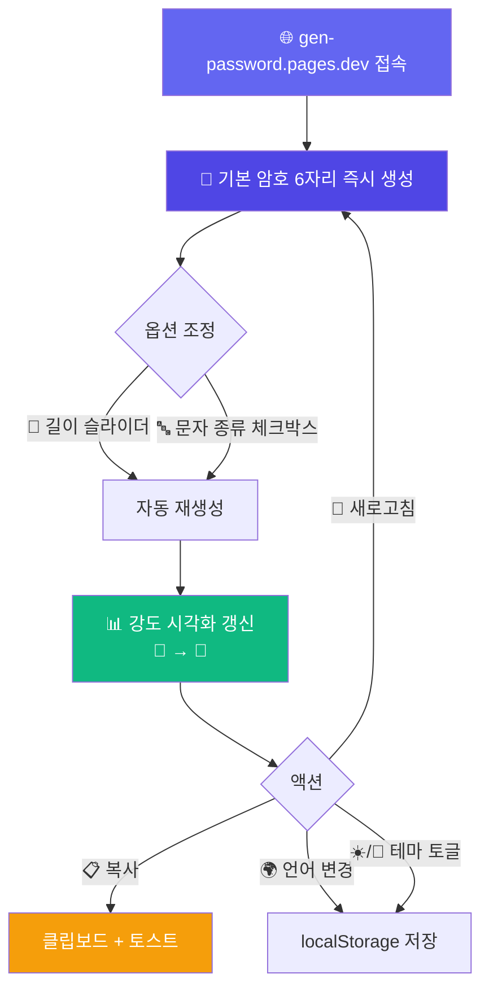
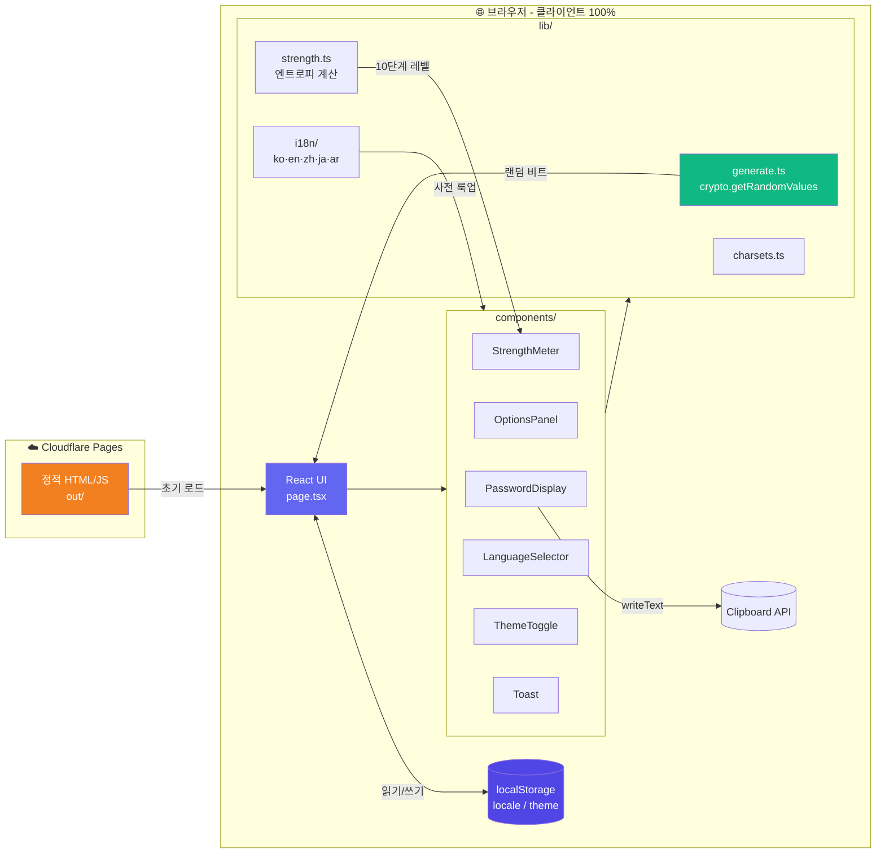

# 🔐 GenPassword - 10단계 강도 시각화 암호 생성기

<div align="center">

> 🇺🇸 [English README](./README_EN.md)

[](https://gen-password.pages.dev)
[](https://nextjs.org)
[](https://react.dev)
[](https://tailwindcss.com)
[](https://pages.cloudflare.com)
[](https://developer.mozilla.org/en-US/docs/Web/API/Crypto/getRandomValues)

**옵션 한 번 바꿀 때마다 즉시 새 암호, 10단계 인물 일러스트로 강도가 한눈에.** ✨

[🎯 주요 기능](#-프로젝트-소개) | [💻 로컬 실행](#-로컬에서-실행하기) | [🚀 배포하기](#-배포하기)

</div>

---

## 🎯 프로젝트 소개

**GenPassword**는 브라우저의 `Web Crypto API`만으로 강력한 랜덤 암호를 만드는 클라이언트 사이드 웹앱입니다. 서버로 암호가 새어나갈 일이 없고, 옵션을 바꾸는 즉시 새 암호가 튀어나오며, 암호 강도는 **10단계 인물 일러스트(🥲 → 🤴)** 로 직관적으로 표시됩니다. 한국어·영어·중국어·일본어·아랍어 5개 언어와 다크 모드를 지원합니다.

### ✨ 주요 기능

- 🎲 **암호학적 랜덤** — `crypto.getRandomValues()` 기반, 모듈러 바이어스 회피를 위한 rejection sampling
- 📏 **유연한 옵션** — 길이 4–64, 대문자·소문자·숫자·특수문자 4종 조합
- 📊 **10단계 강도 시각화** — 엔트로피(bit) 계산 기반, 🥲 빈털 → 🤴 군사급으로 표현
- ⚡ **즉시 재생성** — 슬라이더·체크박스 변경 시 자동으로 새 암호 생성
- 📋 **원클릭 복사** — `navigator.clipboard` + 토스트 알림
- 🌍 **5개 언어** — 한국어 / English / 简体中文 / 日本語 / العربية (아랍어 RTL 텍스트 지원)
- 🌙 **다크 모드** — OS 감지 + 수동 토글, `localStorage` 유지
- 🔒 **서버 0개** — 암호는 브라우저에서만 생성, 어디에도 저장·전송하지 않음

---

## 📸 스크린샷

<!-- TODO: docs/screenshots/ 폴더에 스크린샷을 추가하고 아래 테이블을 채워주세요 -->

| 메인 화면 | 강도 시각화 | 다크 모드 |
|----------|-----------|----------|
| 옵션 패널 + 즉시 생성 | 10단계 인물 일러스트 | ☀️/🌙 토글 |

---

## 🎮 사용 방법



### 📝 단계별 가이드

| 단계 | 설명 |
|------|------|
| 1️⃣ | **접속** — 페이지 로드 즉시 기본 옵션(길이 6, 소문자+숫자)으로 암호가 표시됨 |
| 2️⃣ | **길이 조정** — 슬라이더 또는 숫자 입력으로 4–64 사이 선택, 변경 즉시 재생성 |
| 3️⃣ | **문자 조합** — 대문자/소문자/숫자/특수문자 체크박스 (최소 1개는 필수) |
| 4️⃣ | **강도 확인** — 10칸 바와 인물 이모지로 엔트로피 단계 한눈에 파악 |
| 5️⃣ | **복사** — 복사 버튼 클릭, 1.5초간 "복사됨!" 표시 + 토스트 |
| 6️⃣ | **새로고침** — 동일 옵션으로 새 암호 생성 (🔄 버튼) |
| 7️⃣ | **언어/테마** — 우측 상단 드롭다운과 토글로 변경, 다음 방문 시에도 유지 |

---

## 🏗️ 기술 스택

<div align="center">

| 카테고리 | 기술 | 용도 |
|---------|------|------|
| **프레임워크** | Next.js 16.2.6 (App Router) | 정적 export 빌드 |
| **UI** | React 19.2 + Tailwind CSS v4 | 반응형 UI + 다크 모드 |
| **랜덤** | Web Crypto API | `crypto.getRandomValues()` |
| **클립보드** | Web Clipboard API | `navigator.clipboard` |
| **i18n** | 자체 구현 (사전 객체) | 라이브러리 0개, 5개 언어 |
| **강도 계산** | 자체 구현 | `entropy = length × log₂(charsetSize)` |
| **배포** | Cloudflare Pages (정적) | `output: 'export'` |
| **언어** | TypeScript 5 | strict 모드 |

</div>

### 🎨 아키텍처



---

## 📁 프로젝트 구조

```
gen-password/
├── 📄 next.config.ts               # Next.js 설정 (output: 'export')
├── 🔧 wrangler.jsonc               # Cloudflare Pages 설정 (out/)
├── 📦 package.json                 # Next 16.2.6 + React 19.2 + Tailwind v4
├── 📁 docs/
│   └── 📋 prd.md                   # 제품 요구 명세서
├── 📁 public/
│   └── 📁 strength/                # level-1.svg ~ level-10.svg (일러스트 교체 슬롯)
└── 📁 src/
    ├── 📁 app/
    │   ├── 🎨 globals.css          # Tailwind v4 import
    │   ├── 📐 layout.tsx           # 루트 레이아웃 + lang/dir 동적 설정
    │   └── 🏠 page.tsx             # 'use client' 메인 페이지
    ├── 📁 components/
    │   ├── 🔐 PasswordDisplay.tsx  # 암호 표시 + 복사 + 새로고침
    │   ├── ⚙️ OptionsPanel.tsx     # 길이 슬라이더 + 체크박스 4개
    │   ├── 📊 StrengthMeter.tsx    # 10칸 바 + 이모지/SVG fallback
    │   ├── 🌍 LanguageSelector.tsx # 5개 언어 드롭다운
    │   ├── 🌙 ThemeToggle.tsx      # ☀️/🌙 테마 토글
    │   └── 🍞 Toast.tsx            # 자체 구현 토스트
    └── 📁 lib/
        ├── 🎲 generate.ts          # 암호 생성 (unbiased random + shuffle)
        ├── 🔤 charsets.ts          # 문자종 정의 + 조합 빌드
        ├── 📐 strength.ts          # 엔트로피 계산
        ├── 📊 strengthLevels.ts    # 단계별 색상/이모지/레이블
        └── 📁 i18n/
            ├── index.ts            # getDictionary / isRtl
            ├── types.ts            # Locale 타입
            ├── ko.ts · en.ts · zh.ts · ja.ts · ar.ts
```

---

## 💻 로컬에서 실행하기

### 📋 사전 준비물

- **Node.js** 20 이상
- **npm**
- (선택) Cloudflare Wrangler — CLI 배포 시

> 🎉 **API 키 불필요** — 모든 암호 생성은 브라우저 내에서 이루어집니다.

### 🔧 환경 변수 설정

이 프로젝트는 환경 변수를 **사용하지 않습니다**. 외부 API 호출도, 빌드 시 비밀값도 없습니다.

### 🚀 실행 방법

```bash
git clone https://github.com/izowooi/crispy-web.git
cd crispy-web/gen-password
npm install
npm run dev
# → http://localhost:3000
```

### ⚙️ 사용 가능한 명령어

| 명령어 | 설명 |
|--------|------|
| `npm run dev` | HMR 포함 Next.js 개발 서버 |
| `npm run build` | 프로덕션 정적 빌드 (`out/`) |
| `npm run start` | 프로덕션 빌드 로컬 서빙 |
| `npm run lint` | ESLint 검사 |
| `npm run preview` | 빌드 후 `wrangler pages dev`로 로컬 미리보기 |
| `npm run deploy` | Cloudflare Pages 배포 (Wrangler 필요) |

---

## 🚀 배포하기

### Cloudflare Pages (Git 연동, 권장)

`next.config.ts`의 `output: "export"` 설정으로 100% 정적 사이트가 만들어집니다. Cloudflare Pages 콘솔에서 **Next.js (Static)** 프리셋을 선택하면 자동으로 인식됩니다.

#### 대시보드 설정

| 설정 | 값 |
|------|-----|
| 프레임워크 프리셋 | **Next.js** |
| 빌드 명령어 | `npm run build` |
| 빌드 출력 디렉토리 | `out` |
| 루트 디렉토리 | `gen-password` (모노레포 사용 시) |
| Node.js 버전 | `20` 이상 |
| 환경 변수 | (없음) |

#### CLI 배포

```bash
npm run deploy
```

> ℹ️ `npx wrangler login` 후 프로젝트 이름(`gen-password`)이 존재하거나 생성 가능해야 합니다.

---

## 🔐 보안 설계

이 앱은 **암호 생성기**이므로 보안 디테일이 곧 제품의 가치입니다.

### 안전한 난수

- `crypto.getRandomValues()`를 사용 — `Math.random()`은 **사용하지 않음** (예측 가능)
- **모듈러 바이어스 회피**: `Uint32Array` 한 칸을 뽑은 뒤 `(2^32 - 2^32 mod n)` 미만일 때만 채택하는 rejection sampling
- 셔플도 동일한 unbiased 인덱스로 Fisher-Yates 적용

### 강도 계산 (엔트로피)

```
entropy(bits) = length × log₂(charsetSize)
charsetSize = (대문자 26 + 소문자 26 + 숫자 10 + 특수문자 26 중 활성화된 합)
```

| 단계 | 엔트로피 | 이모지 |
|------|----------|--------|
| 1 | < 28 bit | 🥲 매우 약함 |
| 2 | 28–35 | 😪 약함 |
| 3 | 36–59 | 🙂 보통 약함 |
| 4 | 60–79 | 😊 보통 |
| 5 | 80–99 | 😎 양호 |
| 6 | 100–119 | 🧑‍🎓 강함 |
| 7 | 120–139 | 🧑‍💼 매우 강함 |
| 8 | 140–159 | 🧑‍⚖️ 우수 |
| 9 | 160–199 | 🤵 탁월 |
| 10 | ≥ 200 | 🤴 군사급 |

> 임계값은 `src/lib/strength.ts`에 상수 배열로 분리되어 있어 일러스트 교체 시 시각적 균형에 맞춰 조정할 수 있습니다.

### 프라이버시

- 암호는 서버로 전송되지 **않습니다** (서버 자체가 없음, 정적 사이트)
- 암호는 `localStorage` / `sessionStorage` / 쿠키에 저장되지 **않습니다**
- 어깨너머 위험을 피하기 위해 **이력(history) 기능 없음**

---

## 🎯 향후 개선 사항

- [ ] 일러스트 교체 (`public/strength/level-N.svg` 디자이너 작업)
- [ ] 패스프레이즈 모드 (단어 조합 기반)
- [ ] "혼동 문자 제외" 옵션 (`0/O`, `1/l/I` 등)
- [ ] PWA 지원 (오프라인 동작)
- [ ] 키보드 단축키 (Space로 새로고침, Cmd/Ctrl+C로 복사)

---

## 🤝 기여하기

1. 이 저장소를 Fork 하세요.
2. 기능 브랜치를 생성하세요: `git checkout -b feat/your-feature`
3. 변경 사항을 커밋하세요: `git commit -m "feat: add your feature"`
4. 브랜치를 Push 하세요: `git push origin feat/your-feature`
5. Pull Request를 열어주세요.

---

## 📄 라이선스

MIT License

---

## 👨‍💻 만든 사람

**izowooi**

버그 리포트와 제안은 [Issues](https://github.com/izowooi/crispy-web/issues)로 남겨주세요.

---

<div align="center">

**⭐ 이 프로젝트가 마음에 드셨다면 Star를 눌러주세요! ⭐**

Made with ❤️ using Next.js · React · Tailwind CSS · Web Crypto API

[🔐 지금 사용하기](https://gen-password.pages.dev)

</div>
