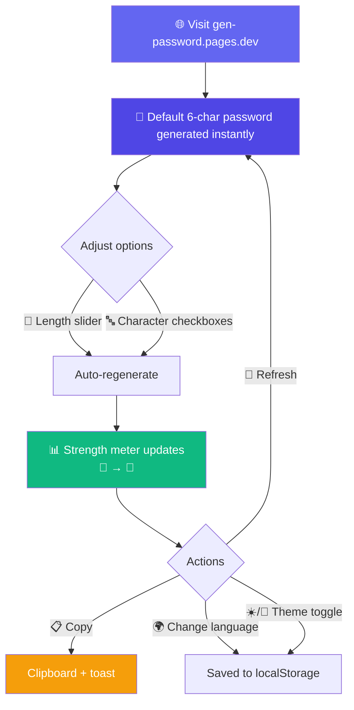
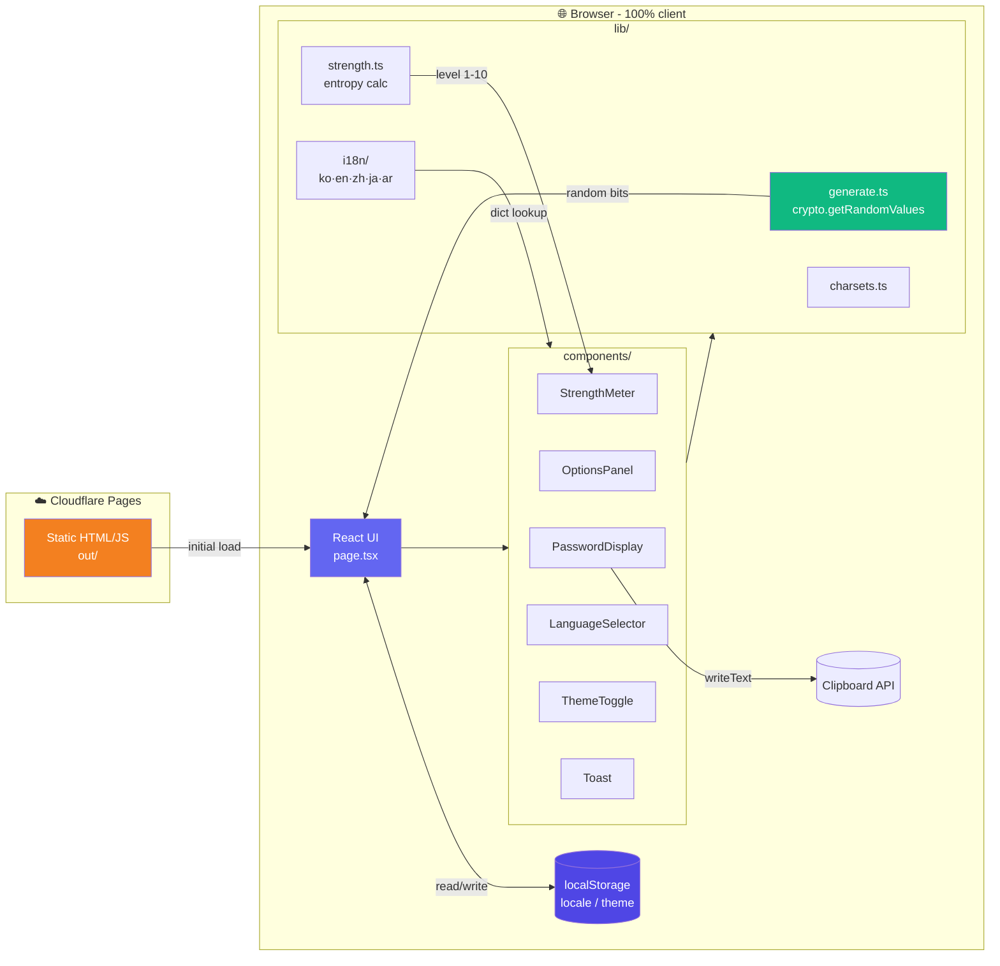

# 🔐 GenPassword - Password Generator with 10-Level Strength Visualization

<div align="center">

> 🇰🇷 [한국어 README](./README.md)

[](https://gen-password.pages.dev)
[](https://nextjs.org)
[](https://react.dev)
[](https://tailwindcss.com)
[](https://pages.cloudflare.com)
[](https://developer.mozilla.org/en-US/docs/Web/API/Crypto/getRandomValues)

**Tweak an option, get a fresh password instantly — with a 10-level character illustration telling you how strong it is.** ✨

[🎯 Features](#-about) | [💻 Run Locally](#-run-locally) | [🚀 Deploy](#-deploy)

</div>

---

## 🎯 About

**GenPassword** is a 100% client-side web app that produces strong random passwords using the browser's `Web Crypto API`. No password ever leaves your machine, every option change regenerates instantly, and the strength is shown as a **10-level character illustration (🥲 → 🤴)**. Ships with 5 languages and dark mode.

### ✨ Features

- 🎲 **Cryptographically secure randomness** — `crypto.getRandomValues()` with rejection sampling to avoid modulo bias
- 📏 **Flexible options** — Length 4–64, mix of uppercase/lowercase/digits/symbols
- 📊 **10-level strength visualization** — Entropy-based, from 🥲 broke to 🤴 military-grade
- ⚡ **Live regeneration** — Slider/checkbox changes trigger an instant new password
- 📋 **One-click copy** — `navigator.clipboard` + toast notification
- 🌍 **5 languages** — Korean / English / Simplified Chinese / Japanese / Arabic (with RTL text)
- 🌙 **Dark mode** — OS detection + manual toggle, persisted via `localStorage`
- 🔒 **Zero servers** — Generation happens only in the browser; nothing stored, nothing sent

---

## 📸 Screenshots

<!-- TODO: add screenshots under docs/screenshots/ and fill the table below -->

| Main Screen | Strength Meter | Dark Mode |
|-------------|---------------|-----------|
| Options panel + live generation | 10-level character art | ☀️/🌙 toggle |

---

## 🎮 How It Works



### 📝 Step-by-Step

| Step | Description |
|------|-------------|
| 1️⃣ | **Open** — The page loads with a default password (length 6, lowercase + digits) |
| 2️⃣ | **Set length** — Use the slider or numeric input to pick a length 4–64; regenerates on change |
| 3️⃣ | **Pick character sets** — Toggle uppercase/lowercase/digits/symbols (at least one required) |
| 4️⃣ | **Check strength** — 10-segment bar + character emoji shows the entropy band at a glance |
| 5️⃣ | **Copy** — Click copy; button briefly reads "Copied!" with a toast |
| 6️⃣ | **Refresh** — Generate a new password with the same options (🔄 button) |
| 7️⃣ | **Language/theme** — Top-right dropdown and toggle; preferences persist across visits |

---

## 🏗️ Tech Stack

<div align="center">

| Category | Tech | Purpose |
|----------|------|---------|
| **Framework** | Next.js 16.2.6 (App Router) | Static export build |
| **UI** | React 19.2 + Tailwind CSS v4 | Responsive UI + dark mode |
| **Randomness** | Web Crypto API | `crypto.getRandomValues()` |
| **Clipboard** | Web Clipboard API | `navigator.clipboard` |
| **i18n** | Custom (dictionary objects) | No libraries, 5 locales |
| **Strength** | Custom | `entropy = length × log₂(charsetSize)` |
| **Deployment** | Cloudflare Pages (static) | `output: 'export'` |
| **Language** | TypeScript 5 | strict mode |

</div>

### 🎨 Architecture



---

## 📁 Project Structure

```
gen-password/
├── 📄 next.config.ts               # Next.js config (output: 'export')
├── 🔧 wrangler.jsonc               # Cloudflare Pages config (out/)
├── 📦 package.json                 # Next 16.2.6 + React 19.2 + Tailwind v4
├── 📁 docs/
│   └── 📋 prd.md                   # Product requirements doc
├── 📁 public/
│   └── 📁 strength/                # level-1.svg ~ level-10.svg (illustration slots)
└── 📁 src/
    ├── 📁 app/
    │   ├── 🎨 globals.css          # Tailwind v4 import
    │   ├── 📐 layout.tsx           # Root layout + dynamic lang/dir
    │   └── 🏠 page.tsx             # 'use client' main page
    ├── 📁 components/
    │   ├── 🔐 PasswordDisplay.tsx  # Password + copy + refresh
    │   ├── ⚙️ OptionsPanel.tsx     # Length slider + 4 checkboxes
    │   ├── 📊 StrengthMeter.tsx    # 10-segment bar + emoji/SVG fallback
    │   ├── 🌍 LanguageSelector.tsx # 5-language dropdown
    │   ├── 🌙 ThemeToggle.tsx      # ☀️/🌙 theme toggle
    │   └── 🍞 Toast.tsx            # Self-contained toast
    └── 📁 lib/
        ├── 🎲 generate.ts          # Password generation (unbiased random + shuffle)
        ├── 🔤 charsets.ts          # Charset definitions + builder
        ├── 📐 strength.ts          # Entropy calculation
        ├── 📊 strengthLevels.ts    # Per-level colors/emoji/labels
        └── 📁 i18n/
            ├── index.ts            # getDictionary / isRtl
            ├── types.ts            # Locale type
            ├── ko.ts · en.ts · zh.ts · ja.ts · ar.ts
```

---

## 💻 Run Locally

### 📋 Prerequisites

- **Node.js** 20+
- **npm**
- (Optional) Cloudflare Wrangler — for CLI deployment

> 🎉 **No API keys required** — All generation happens in the browser.

### 🔧 Environment Variables

This project **uses none**. No external API calls, no build-time secrets.

### 🚀 Run

```bash
git clone https://github.com/izowooi/crispy-web.git
cd crispy-web/gen-password
npm install
npm run dev
# → http://localhost:3000
```

### ⚙️ Available Commands

| Command | Description |
|---------|-------------|
| `npm run dev` | Next.js dev server with HMR |
| `npm run build` | Production static build (`out/`) |
| `npm run start` | Serve the production build locally |
| `npm run lint` | Run ESLint |
| `npm run preview` | Build, then preview via `wrangler pages dev` |
| `npm run deploy` | Deploy to Cloudflare Pages (Wrangler required) |

---

## 🚀 Deploy

### Cloudflare Pages (Git-integrated, recommended)

`output: "export"` in `next.config.ts` produces a fully static site. Select the **Next.js (Static)** preset in the Cloudflare Pages console and it will auto-detect everything.

#### Dashboard Settings

| Setting | Value |
|---------|-------|
| Framework preset | **Next.js** |
| Build command | `npm run build` |
| Build output directory | `out` |
| Root directory | `gen-password` (for monorepos) |
| Node.js version | `20`+ |
| Environment variables | (none) |

#### CLI Deploy

```bash
npm run deploy
```

> ℹ️ Run `npx wrangler login` first; the project name (`gen-password`) must exist or be creatable.

---

## 🔐 Security Design

Since this is a **password generator**, the security details *are* the product.

### Safe Randomness

- Uses `crypto.getRandomValues()` — `Math.random()` is **never** used (predictable)
- **Modulo bias avoided** with rejection sampling: draw one `Uint32`, accept only when below `(2^32 - 2^32 mod n)`
- Shuffle is Fisher–Yates with the same unbiased indexing

### Strength Calculation (Entropy)

```
entropy(bits) = length × log₂(charsetSize)
charsetSize = (uppercase 26 + lowercase 26 + digits 10 + symbols 26, summed across enabled sets)
```

| Level | Entropy | Emoji |
|-------|---------|-------|
| 1 | < 28 bit | 🥲 Very weak |
| 2 | 28–35 | 😪 Weak |
| 3 | 36–59 | 🙂 Below average |
| 4 | 60–79 | 😊 Average |
| 5 | 80–99 | 😎 Fair |
| 6 | 100–119 | 🧑‍🎓 Strong |
| 7 | 120–139 | 🧑‍💼 Very strong |
| 8 | 140–159 | 🧑‍⚖️ Excellent |
| 9 | 160–199 | 🤵 Outstanding |
| 10 | ≥ 200 | 🤴 Military-grade |

> Thresholds live in `src/lib/strength.ts` as a constant array so you can fine-tune the visual balance when swapping illustrations.

### Privacy

- Passwords are **never** sent to a server (there is no server — fully static)
- Passwords are **never** written to `localStorage` / `sessionStorage` / cookies
- **No history feature** — shoulder-surfing risk avoided by design

---

## 🎯 Roadmap

- [ ] Replace placeholder SVGs under `public/strength/`
- [ ] Passphrase mode (word-based)
- [ ] "Exclude confusing characters" option (`0/O`, `1/l/I`, ...)
- [ ] PWA support (offline)
- [ ] Keyboard shortcuts (Space to refresh, Cmd/Ctrl+C to copy)

---

## 🤝 Contributing

1. Fork the repo.
2. Create a feature branch: `git checkout -b feat/your-feature`
3. Commit your changes: `git commit -m "feat: add your feature"`
4. Push the branch: `git push origin feat/your-feature`
5. Open a Pull Request.

---

## 📄 License

MIT License

---

## 👨‍💻 Author

**izowooi**

Report bugs or suggest features via [Issues](https://github.com/izowooi/crispy-web/issues).

---

<div align="center">

**⭐ If you like this project, please give it a Star! ⭐**

Made with ❤️ using Next.js · React · Tailwind CSS · Web Crypto API

[🔐 Try it now](https://gen-password.pages.dev)

</div>
