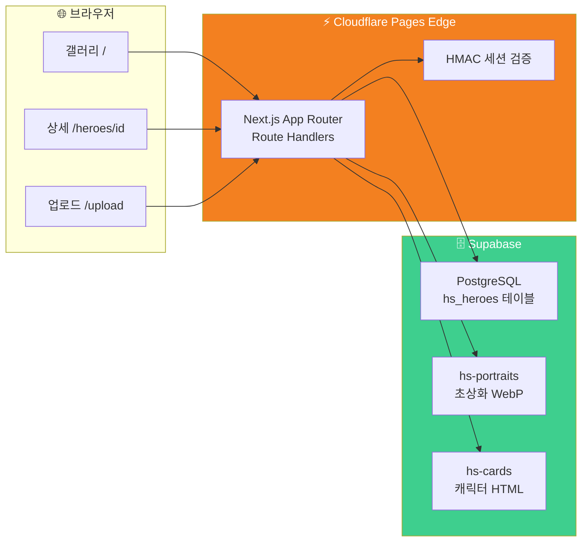

# 🏰 Hero Showcase - 판타지 영웅 카드 갤러리

<div align="center">

[](https://heroarchive.pages.dev)
[](https://nextjs.org)
[](https://supabase.com)
[](https://pages.cloudflare.com)
[](https://www.typescriptlang.org)
[](https://tailwindcss.com)

**판타지 캐릭터 카드 HTML을 업로드하면 자동으로 갤러리가 완성됩니다** ✨

> 🇺🇸 [English README](./README_EN.md)

[🎯 주요 기능](#-주요-기능) | [🎮 사용 방법](#-사용-방법) | [💻 로컬 실행](#-로컬에서-실행하기) | [🚀 배포하기](#-배포하기)

</div>

---

## 🎯 프로젝트 소개

**Hero Showcase**는 AI가 생성한 판타지 캐릭터 카드 HTML 파일을 업로드하면, 메타데이터를 자동 추출해 아름다운 갤러리로 구성해주는 웹 앱입니다.

캐릭터 카드 HTML 안에 담긴 `CHARACTER_DATA`(이름, 직업, 레어리티, 스탯 등)를 파싱해 DB에 저장하고, 갤러리에서 초상화와 함께 카드를 탐색할 수 있습니다. 상세 페이지에서는 원본 HTML 카드를 그대로 렌더링하여 캐릭터의 모든 정보를 확인할 수 있습니다.

### ✨ 주요 기능

- 🖼️ **반응형 갤러리** — 랜덤 배치 / 가나다 정렬 토글, 모바일~데스크톱 대응
- 📤 **드래그앤드롭 업로드** — HTML 파일 하나로 이름·직업·레어리티·초상화 자동 추출
- 🔗 **Short URL** — 새로 등록하는 영웅은 `/heroes/xY3` 형태의 짧은 URL 자동 부여
- 🎴 **상세 카드 뷰어** — 원본 HTML 카드를 그대로 렌더링, ← → 키보드 네비게이션
- 🌗 **다크/라이트 모드** — 갤러리와 카드 뷰어 모두 테마 동기화
- 🔗 **공유 버튼** — Web Share API / 클립보드 복사 자동 선택
- 🗑️ **관리자 기능** — Google OAuth 로그인 후 카드 삭제 가능

---

## 📸 스크린샷

<!-- TODO: docs/screenshots/ 폴더에 스크린샷 추가 후 아래 테이블 업데이트 -->

| 갤러리 페이지 | 상세 카드 뷰어 | 업로드 폼 |
|:---:|:---:|:---:|
| *(갤러리 스크린샷)* | *(카드 뷰어 스크린샷)* | *(업로드 폼 스크린샷)* |

---

## 🎮 사용 방법

```mermaid
graph TD
    A[🧙 캐릭터 카드 HTML 준비] --> B[/upload 접속]
    B --> C[HTML 파일 드래그앤드롭]
    C --> D{CHARACTER_DATA 파싱}
    D -->|성공| E[미리보기 확인\n이름·직업·레어리티]
    D -->|실패| F[❌ 오류 메시지]
    E --> G{커스텀 초상화?}
    G -->|있음| H[Advanced 옵션에서 이미지 업로드]
    G -->|없음| I[HTML 내 이미지 자동 사용]
    H --> J[등록하기 클릭]
    I --> J
    J --> K[Supabase Storage 업로드]
    K --> L[DB 메타데이터 저장]
    L --> M[🎉 /heroes/xY3 Short URL로 이동]
    M --> N[갤러리에서 공유하기 🔗]

    style A fill:#6366f1,color:#fff
    style M fill:#10b981,color:#fff
    style F fill:#ef4444,color:#fff
```

### 📝 단계별 가이드

| 단계 | 설명 |
|------|------|
| 1️⃣ HTML 파일 준비 | `CHARACTER_DATA` JSON이 포함된 캐릭터 카드 HTML 파일 준비 |
| 2️⃣ 업로드 페이지 접속 | [heroarchive.pages.dev/upload](https://heroarchive.pages.dev/upload) 로 이동 |
| 3️⃣ 파일 드롭 | HTML 파일을 드래그하거나 클릭해서 선택 |
| 4️⃣ 미리보기 확인 | 이름, 칭호, 직업, 레어리티 자동 추출 확인 |
| 5️⃣ 등록하기 | 버튼 클릭 → `/heroes/xY3` 형태 Short URL로 이동 |
| 6️⃣ 공유 | 상세 페이지 우상단 공유 버튼 클릭 |

**상세 페이지 키보드 단축키:**

| 키 | 동작 |
|----|------|
| `←` | 이전 영웅 |
| `→` | 다음 영웅 |
| `ESC` | 갤러리 목록으로 |

---

## 🏗️ 기술 스택

<div align="center">

| 카테고리 | 기술 | 용도 |
|---------|------|------|
| Framework | Next.js 16.1.5 (App Router) | SSR/SSG, Route Handler |
| Language | TypeScript 5.x | 전체 코드베이스 |
| Styling | Tailwind CSS v4 | UI 스타일링 |
| Database | Supabase (PostgreSQL) | 영웅 메타데이터 저장 |
| Storage | Supabase Storage | HTML 카드·초상화 파일 저장 |
| Auth | Google OAuth + HMAC JWT | 관리자 인증 |
| Deployment | Cloudflare Pages + Workers | Edge Runtime 배포 |
| Adapter | @opennextjs/cloudflare | Next.js → Cloudflare 변환 |

</div>

### 🎨 아키텍처



---

## 📁 프로젝트 구조

```
hero-showcase/
├── 📁 app/
│   ├── 📄 page.tsx               # 갤러리 메인 페이지
│   ├── 📄 layout.tsx             # 공통 레이아웃 (헤더, 테마)
│   ├── 📁 heroes/[id]/
│   │   ├── 📄 route.ts           # 영웅 상세 (HTML 카드 서빙 + 네비게이션 주입)
│   │   └── 📁 delete/route.ts    # 영웅 삭제 (관리자 전용)
│   ├── 📁 upload/page.tsx        # 업로드 폼 페이지
│   └── 📁 auth/                  # Google OAuth 콜백·로그인·로그아웃
├── 📁 components/
│   ├── 📄 HeroGrid.tsx           # 갤러리 그리드 (랜덤/가나다 정렬)
│   ├── 📄 HeroMiniCard.tsx       # 갤러리 미니 카드
│   ├── 📄 UploadForm.tsx         # 업로드 폼 (드래그앤드롭, short ID 생성)
│   ├── 📄 FileDropZone.tsx       # 파일 드래그앤드롭 영역
│   ├── 📄 Header.tsx             # 상단 네비게이션
│   ├── 📄 AuthFooter.tsx         # 관리자 로그인 UI
│   └── 📄 ThemeProvider.tsx      # 다크/라이트 테마
├── 📁 lib/
│   ├── 📄 parseHtml.ts           # CHARACTER_DATA 파싱 (멀티라인 JSON 지원)
│   ├── 📄 imageUtils.ts          # WebP 변환 유틸리티
│   ├── 📄 session.ts             # HMAC JWT 세션 관리
│   ├── 📄 supabase.ts            # Supabase 클라이언트
│   └── 📄 types.ts               # TypeScript 인터페이스
├── 📁 docs/
│   ├── 📄 project-plan.md        # 프로젝트 기획서
│   └── 📁 skills/                # AI 캐릭터 생성 스킬 문서
├── 📄 AGENTS.md                  # Claude Code 에이전트 규칙
└── 📄 wrangler.toml              # Cloudflare Pages 설정
```

---

## 💻 로컬에서 실행하기

### 📋 사전 준비물

- Node.js 20.x 이상
- Supabase 프로젝트 (DB + Storage 버킷 생성 필요)
- Google OAuth 앱 (관리자 기능 사용 시)

### 🗄️ Supabase 설정

**테이블 생성 (Supabase Dashboard → SQL Editor):**

```sql
CREATE TABLE hs_heroes (
  id           UUID DEFAULT gen_random_uuid() PRIMARY KEY,
  short_id     TEXT UNIQUE,
  name         TEXT NOT NULL,
  title        TEXT,
  job          TEXT,
  rarity       TEXT DEFAULT 'common',
  portrait_url TEXT,
  card_url     TEXT NOT NULL,
  metadata     JSONB,
  created_at   TIMESTAMPTZ DEFAULT now()
);
```

**Storage 버킷:** Dashboard → Storage에서 `hs-portraits`, `hs-cards` 버킷을 Public으로 생성

### 🔧 환경 변수 설정

`.env.local` 파일을 생성하세요:

```bash
# Supabase
NEXT_PUBLIC_SUPABASE_URL=https://your-project-id.supabase.co
NEXT_PUBLIC_SUPABASE_ANON_KEY=eyJhbGciOiJIUzI1NiIsInR5cCI6IkpXVCJ9...

# Google OAuth (관리자 기능 - 선택사항)
GOOGLE_CLIENT_ID=your-client-id.apps.googleusercontent.com
GOOGLE_CLIENT_SECRET=your-google-client-secret
```

### 🚀 실행 방법

```bash
# 저장소 클론
git clone https://github.com/izowooi/crispy-web.git
cd crispy-web/hero-showcase

# 패키지 설치
npm install

# 개발 서버 실행
npm run dev
```

브라우저에서 [http://localhost:3000](http://localhost:3000)을 열어 확인하세요.

### ⚙️ 사용 가능한 명령어

| 명령어 | 설명 |
|--------|------|
| `npm run dev` | 개발 서버 실행 (localhost:3000) |
| `npm run build` | Next.js 프로덕션 빌드 |
| `npm run pages:build` | Cloudflare Pages 배포용 빌드 |
| `npm run preview` | Wrangler로 로컬 Pages 미리보기 |
| `npm run deploy` | Cloudflare Pages 배포 |

---

## 🚀 배포하기

### Cloudflare Pages 배포

```bash
# Cloudflare Pages 빌드 후 배포
npm run deploy
```

**GitHub 연동 자동 배포:**

1. [Cloudflare Dashboard](https://dash.cloudflare.com) → Pages → 새 프로젝트
2. GitHub 저장소 연결
3. 빌드 설정: 빌드 명령 `npm run pages:build`, 출력 디렉토리 `.pages-out`
4. 환경 변수 설정 (위 `.env.local` 항목과 동일)

---

## 🎲 CHARACTER_DATA 포맷

업로드할 HTML에 아래 형식의 `CHARACTER_DATA`가 포함되어야 합니다. 한 줄 또는 멀티라인 JSON 모두 지원합니다.

```javascript
const CHARACTER_DATA = {
  "id": "char_001",
  "name": "아엘린 스톤포지",
  "title": "잊혀진 불꽃의 대장장이",
  "race": "하이엘프",
  "age": "342세",
  "job": "대장장이",
  "rarity": "legendary",   // common | rare | hero | legendary | mythic
  "stats": { "STR": 7, "INT": 9, "DEX": 5, "CON": 8, "WIS": 8, "CHA": 4 },
  "skills": [{ "name": "미스릴 단조", "rank": "S", "percent": 95 }],
  "weapons": [{ "name": "여명의 미스릴 전쟁망치", "type": "main" }],
  "passives": [{ "name": "불꽃의 통찰", "description": "...", "color": "amber" }],
  "quote": "불꽃은 거짓을 태운다."
};
```

### 레어리티 배지 색상

| 레어리티 | 한글 | 색상 |
|---------|------|------|
| `common` | 커먼 | 회색 |
| `rare` | 레어 | 파란색 |
| `hero` | 영웅 | 보라색 |
| `legendary` | 전설 | 주황색 |
| `mythic` | 신화 | 빨간색 |

---

## 🎯 향후 개선 사항

- [ ] 레어리티·직업별 필터링
- [ ] 영웅 검색 기능
- [ ] 기존 영웅 short_id 일괄 배정 (backfill)
- [ ] OG 태그로 소셜 미리보기 지원
- [ ] 카드 즐겨찾기 기능

---

## 🤝 기여하기

```bash
git checkout -b feat/your-feature
git commit -m "feat: 새 기능 설명"
git push origin feat/your-feature
# GitHub에서 Pull Request 생성
```

---

## 📄 라이선스

MIT License

---

## 👨‍💻 만든 사람

**izowooi** — 버그 리포트나 기능 제안은 [Issues](https://github.com/izowooi/crispy-web/issues)에 남겨주세요.

---

<div align="center">

**⭐ 이 프로젝트가 마음에 드셨다면 Star를 눌러주세요! ⭐**

Made with ❤️ using Next.js + Supabase + Cloudflare Pages

[🏰 지금 사용하기](https://heroarchive.pages.dev)

</div>
