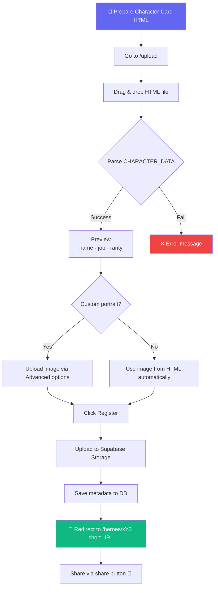
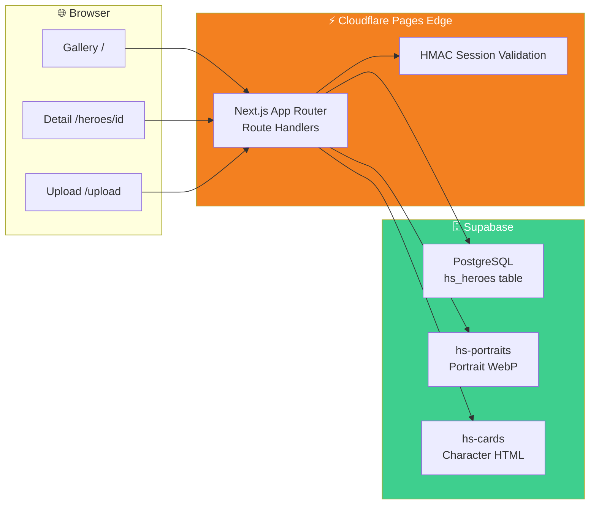

> 🇰🇷 [한국어 README](./README.md)

# 🏰 Hero Showcase - Fantasy Hero Card Gallery

<div align="center">

[](https://heroarchive.pages.dev)
[](https://nextjs.org)
[](https://supabase.com)
[](https://pages.cloudflare.com)
[](https://www.typescriptlang.org)
[](https://tailwindcss.com)

**Upload a fantasy character card HTML — your gallery builds itself automatically** ✨

[🎯 Features](#-features) | [🎮 How to Use](#-how-to-use) | [💻 Local Setup](#-local-setup) | [🚀 Deployment](#-deployment)

</div>

---

## 🎯 About the Project

**Hero Showcase** is a web app that automatically parses metadata from AI-generated fantasy character card HTML files and organizes them into a beautiful gallery.

It extracts `CHARACTER_DATA` (name, job, rarity, stats, etc.) embedded in the character card HTML, stores it in a database, and lets you browse cards with portraits in the gallery. The detail page renders the original HTML card as-is, giving you access to all character information.

### ✨ Features

- 🖼️ **Responsive Gallery** — Random shuffle / alphabetical sort toggle, fully responsive from mobile to desktop
- 📤 **Drag & Drop Upload** — One HTML file automatically extracts name, job, rarity, and portrait
- 🔗 **Short URLs** — New heroes get short 3-character URLs like `/heroes/xY3`
- 🎴 **Card Detail Viewer** — Renders the original HTML card with ← → keyboard navigation
- 🌗 **Dark / Light Mode** — Theme synced across gallery and card viewer
- 🔗 **Share Button** — Automatically uses Web Share API or clipboard copy
- 🗑️ **Admin Features** — Card deletion after Google OAuth login

---

## 📸 Screenshots

<!-- TODO: Add screenshots to docs/screenshots/ and update the table below -->

| Gallery | Card Viewer | Upload Form |
|:---:|:---:|:---:|
| *(gallery screenshot)* | *(card viewer screenshot)* | *(upload form screenshot)* |

---

## 🎮 How to Use



### 📝 Step-by-Step Guide

| Step | Description |
|------|-------------|
| 1️⃣ Prepare HTML | Get a character card HTML file containing `CHARACTER_DATA` JSON |
| 2️⃣ Go to Upload | Navigate to [heroarchive.pages.dev/upload](https://heroarchive.pages.dev/upload) |
| 3️⃣ Drop the File | Drag the HTML file or click to select |
| 4️⃣ Preview | Verify automatically extracted name, title, job, and rarity |
| 5️⃣ Register | Click the button → redirected to a short URL like `/heroes/xY3` |
| 6️⃣ Share | Click the share button in the top-right of the detail page |

**Keyboard Shortcuts (Detail Page):**

| Key | Action |
|-----|--------|
| `←` | Previous hero |
| `→` | Next hero |
| `ESC` | Back to gallery |

---

## 🏗️ Tech Stack

<div align="center">

| Category | Technology | Purpose |
|---------|------------|---------|
| Framework | Next.js 16.1.5 (App Router) | SSR/SSG, Route Handlers |
| Language | TypeScript 5.x | Entire codebase |
| Styling | Tailwind CSS v4 | UI styling |
| Database | Supabase (PostgreSQL) | Hero metadata storage |
| Storage | Supabase Storage | HTML cards & portrait files |
| Auth | Google OAuth + HMAC JWT | Admin authentication |
| Deployment | Cloudflare Pages + Workers | Edge Runtime deployment |
| Adapter | @opennextjs/cloudflare | Next.js → Cloudflare conversion |

</div>

### 🎨 Architecture



---

## 📁 Project Structure

```
hero-showcase/
├── 📁 app/
│   ├── 📄 page.tsx               # Gallery main page
│   ├── 📄 layout.tsx             # Shared layout (header, theme)
│   ├── 📁 heroes/[id]/
│   │   ├── 📄 route.ts           # Hero detail (HTML card serving + nav injection)
│   │   └── 📁 delete/route.ts    # Delete hero (admin only)
│   ├── 📁 upload/page.tsx        # Upload form page
│   └── 📁 auth/                  # Google OAuth callback · login · logout
├── 📁 components/
│   ├── 📄 HeroGrid.tsx           # Gallery grid (random/alphabetical sort)
│   ├── 📄 HeroMiniCard.tsx       # Gallery mini card component
│   ├── 📄 UploadForm.tsx         # Upload form (drag & drop, short ID generation)
│   ├── 📄 FileDropZone.tsx       # File drag & drop area
│   ├── 📄 Header.tsx             # Top navigation
│   ├── 📄 AuthFooter.tsx         # Admin login UI
│   └── 📄 ThemeProvider.tsx      # Dark/light theme context
├── 📁 lib/
│   ├── 📄 parseHtml.ts           # CHARACTER_DATA parser (multi-line JSON support)
│   ├── 📄 imageUtils.ts          # WebP conversion utilities
│   ├── 📄 session.ts             # HMAC JWT session management
│   ├── 📄 supabase.ts            # Supabase client
│   └── 📄 types.ts               # TypeScript interfaces (Hero, CharacterData)
├── 📁 docs/
│   ├── 📄 project-plan.md        # Project specification
│   └── 📁 skills/                # AI character creation skill docs
├── 📄 AGENTS.md                  # Claude Code agent rules
└── 📄 wrangler.toml              # Cloudflare Pages config
```

---

## 💻 Local Setup

### 📋 Prerequisites

- Node.js 20.x or higher
- Supabase project (with DB table and Storage buckets)
- Google OAuth app (for admin features)

### 🗄️ Supabase Setup

**Create the table (Supabase Dashboard → SQL Editor):**

```sql
CREATE TABLE hs_heroes (
  id           UUID DEFAULT gen_random_uuid() PRIMARY KEY,
  short_id     TEXT UNIQUE,
  name         TEXT NOT NULL,
  title        TEXT,
  job          TEXT,
  rarity       TEXT DEFAULT 'common',
  portrait_url TEXT,
  card_url     TEXT NOT NULL,
  metadata     JSONB,
  created_at   TIMESTAMPTZ DEFAULT now()
);
```

**Storage buckets:** Create `hs-portraits` and `hs-cards` as Public buckets in Dashboard → Storage.

### 🔧 Environment Variables

Create a `.env.local` file:

```bash
# Supabase
NEXT_PUBLIC_SUPABASE_URL=https://your-project-id.supabase.co
NEXT_PUBLIC_SUPABASE_ANON_KEY=eyJhbGciOiJIUzI1NiIsInR5cCI6IkpXVCJ9...

# Google OAuth (admin features - optional)
GOOGLE_CLIENT_ID=your-client-id.apps.googleusercontent.com
GOOGLE_CLIENT_SECRET=your-google-client-secret
```

### 🚀 Running Locally

```bash
# Clone the repository
git clone https://github.com/izowooi/crispy-web.git
cd crispy-web/hero-showcase

# Install dependencies
npm install

# Start the development server
npm run dev
```

Open [http://localhost:3000](http://localhost:3000) in your browser.

### ⚙️ Available Commands

| Command | Description |
|---------|-------------|
| `npm run dev` | Start dev server (localhost:3000) |
| `npm run build` | Next.js production build |
| `npm run pages:build` | Build for Cloudflare Pages deployment |
| `npm run preview` | Local Pages preview with Wrangler |
| `npm run deploy` | Deploy to Cloudflare Pages |

---

## 🚀 Deployment

### Cloudflare Pages

```bash
# Build and deploy to Cloudflare Pages
npm run deploy
```

**Auto-deploy via GitHub:**

1. [Cloudflare Dashboard](https://dash.cloudflare.com) → Pages → New project
2. Connect your GitHub repository
3. Build settings: Build command `npm run pages:build`, output directory `.pages-out`
4. Set environment variables (same as `.env.local` above)

---

## 🎲 CHARACTER_DATA Format

The uploaded HTML must contain `CHARACTER_DATA` in the following format. Both single-line and multi-line JSON are supported.

```javascript
const CHARACTER_DATA = {
  "id": "char_001",
  "name": "Aelin Stoneforge",
  "title": "The Forgotten Flame",
  "race": "High Elf",
  "age": "342",
  "job": "Blacksmith",
  "rarity": "legendary",   // common | rare | hero | legendary | mythic
  "stats": { "STR": 7, "INT": 9, "DEX": 5, "CON": 8, "WIS": 8, "CHA": 4 },
  "skills": [{ "name": "Mithril Forging", "rank": "S", "percent": 95 }],
  "weapons": [{ "name": "Dawn Mithril Warhammer", "type": "main" }],
  "passives": [{ "name": "Flame Insight", "description": "...", "color": "amber" }],
  "quote": "Fire burns away all lies."
};
```

### Rarity Badge Colors

| Rarity | Label | Color |
|--------|-------|-------|
| `common` | Common | Gray |
| `rare` | Rare | Blue |
| `hero` | Hero | Purple |
| `legendary` | Legendary | Orange |
| `mythic` | Mythic | Red |

---

## 🎯 Roadmap

- [ ] Rarity & job filtering
- [ ] Hero search
- [ ] Short ID backfill for existing heroes
- [ ] OG tags for social media previews
- [ ] Favorites feature

---

## 🤝 Contributing

```bash
git checkout -b feat/your-feature
git commit -m "feat: describe your change"
git push origin feat/your-feature
# Open a Pull Request on GitHub
```

---

## 📄 License

MIT License

---

## 👨‍💻 Author

**izowooi** — Feel free to open an [Issue](https://github.com/izowooi/crispy-web/issues) for bug reports or feature requests.

---

<div align="center">

**⭐ If you like this project, please give it a Star! ⭐**

Made with ❤️ using Next.js + Supabase + Cloudflare Pages

[🏰 Try it now](https://heroarchive.pages.dev)

</div>
