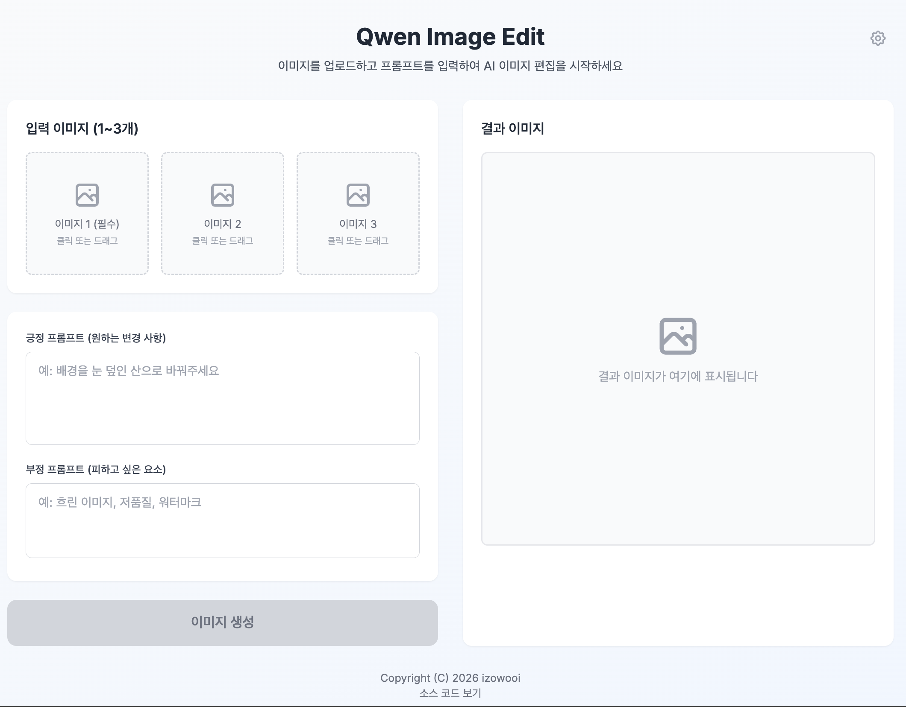
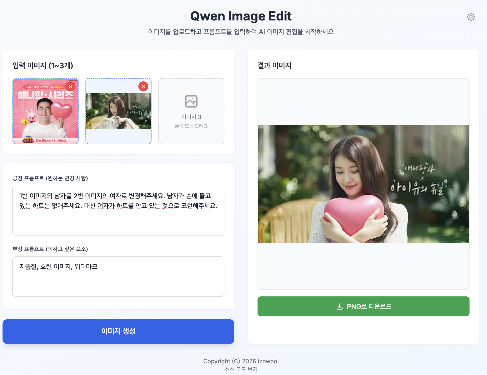
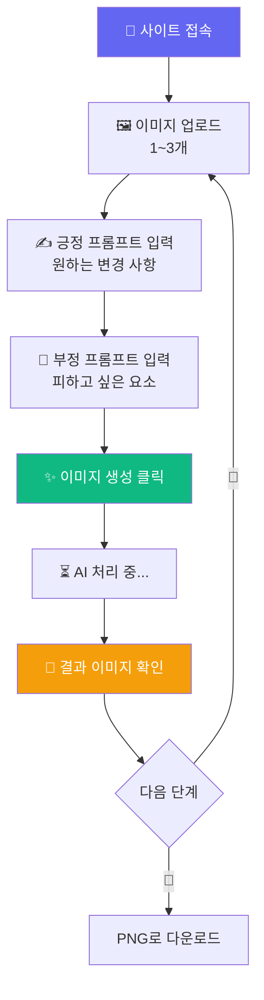
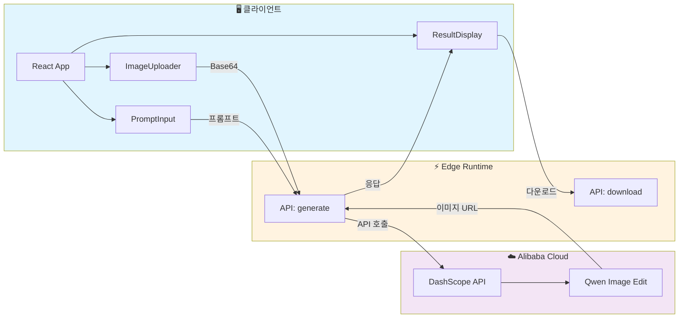

# 🎨 ImgBlend - AI 이미지 편집

<div align="center">

[](https://imgblend.pages.dev/)
[](https://nextjs.org/)
[](https://react.dev/)
[](https://www.typescriptlang.org/)
[](https://tailwindcss.com/)
[](https://pages.cloudflare.com/)

**Alibaba Qwen AI로 이미지를 편집하세요!** ✨

[🎯 사용 방법](#-사용-방법) | [🤖 Qwen 모델](#-qwen-image-edit-모델) | [💻 로컬 실행](#-로컬에서-실행하기) | [🚀 배포하기](#-배포하기)

</div>

---

## 🎯 프로젝트 소개

**ImgBlend**는 Alibaba Qwen Image Edit AI 모델을 활용한 이미지 편집 웹 애플리케이션입니다.

1~3개의 이미지와 프롬프트를 입력하면 AI가 이미지를 편집해줍니다. 객체 추가/제거, 스타일 변환, 배경 수정 등 다양한 편집이 가능합니다! 🖼️✨

### ✨ 주요 기능

- 🖼️ **다중 이미지 입력** - 1~3개 이미지를 조합하여 편집
- ✍️ **프롬프트 기반 편집** - 원하는 변경 사항을 텍스트로 설명
- 🚫 **네거티브 프롬프트** - 피하고 싶은 요소 지정 가능
- 📐 **자동 리사이즈** - 큰 이미지는 자동으로 최적화 (최대 1024px)
- 💾 **PNG 다운로드** - 생성된 이미지를 바로 저장
- 🔑 **사용자 API 키** - 자신의 DashScope API 키 사용 가능
- ⚡ **Edge Runtime** - Cloudflare Edge에서 빠른 응답

---

## 📸 스크린샷

<div align="center">

| 메인 화면 | 결과 화면 |
|:---:|:---:|
|  |  |

</div>

---

## 🎮 사용 방법



### 📝 단계별 가이드

1. **이미지 업로드** (1~3개)
   - 클릭 또는 드래그앤드롭으로 이미지 선택
   - 첫 번째 이미지는 필수, 나머지는 선택
   - 지원 형식: PNG, JPG, JPEG, WebP, BMP

2. **긍정 프롬프트 입력**
   - 원하는 변경 사항을 설명
   - 예: "배경을 눈 덮인 산으로 바꿔주세요"
   - 예: "사람의 옷을 빨간색으로 바꿔주세요"

3. **부정 프롬프트 입력** (선택)
   - 피하고 싶은 요소 지정
   - 예: "흐린 이미지, 저품질, 워터마크"

4. **이미지 생성**
   - 파란색 "이미지 생성" 버튼 클릭
   - AI가 처리하는 동안 잠시 대기

5. **결과 확인 및 다운로드**
   - 생성된 이미지 확인
   - "PNG로 다운로드" 버튼으로 저장

---

## 🤖 Qwen Image Edit 모델

ImgBlend는 **Alibaba Cloud의 Qwen Image Edit** 모델을 사용합니다.

### 🎯 모델 기능

| 기능 | 설명 |
|:---:|:---|
| ✏️ **텍스트 수정** | 이미지 내 텍스트를 정확하게 수정 |
| ➕ **객체 추가** | 원하는 객체를 이미지에 추가 |
| ➖ **객체 제거** | 불필요한 객체를 자연스럽게 제거 |
| 🧍 **포즈 조정** | 인물의 자세나 포즈 변경 |
| 🎨 **스타일 전환** | 이미지 스타일을 다른 스타일로 변환 |
| ✨ **디테일 향상** | 이미지 세부 사항 개선 |

### 📊 모델 종류

| 모델 | 입력 이미지 | 출력 이미지 |
|:---:|:---:|:---:|
| `qwen-image-edit` | 1~3개 | 1개 |
| `qwen-image-edit-plus` | 1~3개 | 1~6개 |
| `qwen-image-edit-max` | 1~3개 | 1~6개 |

> 💡 ImgBlend는 `qwen-image-edit` 모델을 사용합니다.

### 🌍 지원 언어

- ✅ 한국어 (Simplified Chinese/English 기반)
- ✅ 영어 (English)
- ✅ 중국어 (Simplified Chinese)

### 📚 공식 문서

- [Qwen-Image-Edit API 문서](https://www.alibabacloud.com/help/en/model-studio/qwen-image-edit-api)
- [Qwen-Image-Edit 사용 가이드](https://www.alibabacloud.com/help/en/model-studio/qwen-image-edit-guide)
- [GitHub - QwenLM/Qwen-Image](https://github.com/QwenLM/Qwen-Image)

---

## 🏗️ 기술 스택

<div align="center">

| 카테고리 | 기술 | 용도 |
|:---:|:---:|:---|
| **프레임워크** | Next.js 15.1 | App Router 기반 풀스택 애플리케이션 |
| **라이브러리** | React 18.2 | UI 컴포넌트 |
| **언어** | TypeScript 5 | 타입 안정성 |
| **스타일링** | Tailwind CSS 3.4 | 유틸리티 기반 CSS |
| **AI 모델** | Qwen Image Edit | Alibaba Cloud 이미지 편집 AI |
| **배포** | Cloudflare Pages | Edge Runtime 기반 글로벌 배포 |

</div>

### 🎨 아키텍처



### 🔒 보안 설계

```
✅ API 키 서버 사이드 보관
   → 환경변수로 Edge Runtime에서만 접근

✅ Edge Runtime 처리
   → API 키가 클라이언트에 노출되지 않음

✅ 사용자 키 선택적 사용
   → localStorage에 안전하게 저장
   → 서버로 전송 시 HTTPS로 암호화

✅ CORS 프록시
   → 다운로드 시 서버 프록시를 통해 CORS 우회
```

---

## 📁 프로젝트 구조

```
imgblend/
├── app/
│   ├── layout.tsx              # 루트 레이아웃
│   ├── page.tsx                # 🏠 메인 페이지
│   ├── globals.css             # 전역 스타일
│   └── api/
│       ├── generate/
│       │   └── route.ts        # 🤖 이미지 생성 API (Edge)
│       └── download/
│           └── route.ts        # 💾 다운로드 프록시 (Edge)
├── components/
│   ├── ImageUploader.tsx       # 🖼️ 이미지 업로드 컴포넌트
│   ├── PromptInput.tsx         # ✍️ 프롬프트 입력 컴포넌트
│   ├── ResultDisplay.tsx       # 🎉 결과 표시 컴포넌트
│   └── SettingsPanel.tsx       # ⚙️ 설정 패널 (API 키)
├── .env.local                  # 환경변수 (API 키)
├── wrangler.toml               # Cloudflare 설정
├── tailwind.config.ts          # Tailwind 설정
└── package.json                # 의존성 관리
```

---

## 💻 로컬에서 실행하기

### 📋 사전 준비물

1. **Node.js** (버전 20 이상)
   - [Node.js 공식 사이트](https://nodejs.org/)에서 LTS 버전 다운로드
   - 설치 확인:
     ```bash
     node --version
     npm --version
     ```

2. **DashScope API 키**
   - [Alibaba Cloud ModelStudio](https://modelstudio.console.alibabacloud.com/)에서 발급
   - Singapore 리전 사용

### 🚀 실행 방법

```bash
# 1️⃣ 프로젝트 다운로드
git clone https://github.com/izowooi/crispy-web.git

# 2️⃣ imgblend 폴더로 이동
cd crispy-web/imgblend

# 3️⃣ 패키지 설치
npm install

# 4️⃣ 환경변수 설정
# .env.local 파일에 API 키 입력
echo "DASHSCOPE_API_KEY=your-api-key-here" > .env.local

# 5️⃣ 개발 서버 실행
npm run dev
```

### 🌐 브라우저에서 확인

```
http://localhost:3000
```

### ⚙️ 사용 가능한 명령어

| 명령어 | 설명 |
|-------|------|
| `npm run dev` | 개발 서버 실행 (포트 3000) |
| `npm run build` | 프로덕션 빌드 생성 |
| `npm run start` | 빌드된 앱 실행 |
| `npm run lint` | 코드 검사 |
| `npm run pages:build` | Cloudflare Pages용 빌드 |
| `npm run pages:deploy` | Cloudflare Pages 배포 |

---

## 🚀 배포하기

### ☁️ Cloudflare Pages 배포

1. [Cloudflare Dashboard](https://dash.cloudflare.com/)에 로그인
2. "Workers & Pages" → "Create Application" → "Pages"
3. GitHub 저장소 연결
4. 설정:
   - **Root directory**: `imgblend`
   - **Build command**: `npm run pages:build`
   - **Build output directory**: `.vercel/output/static`
5. 환경 변수 설정:
   - `DASHSCOPE_API_KEY`: DashScope API 키
6. Functions → Compatibility flags에 `nodejs_compat` 추가
7. "Save and Deploy" 클릭!

### wrangler.toml 설정

```toml
name = "imgblend"
compatibility_date = "2024-07-01"
compatibility_flags = ["nodejs_compat"]
```

---

## 🔧 환경 변수 설정

```bash
# DashScope API 키 (필수)
DASHSCOPE_API_KEY=sk-xxxxxxxxxxxxxxxx
```

> 💡 **팁**: 사용자가 자신의 API 키를 사용하려면 설정(⚙️) 버튼을 클릭하여 입력할 수 있습니다.

---

## 📄 라이선스

이 프로젝트는 MIT 라이선스를 따릅니다.
자유롭게 사용하셔도 됩니다.

---

## 👨‍💻 만든 사람

**izowooi**

궁금한 점이나 제안사항이 있으시면 Issue를 남겨주세요!

---

<div align="center">

**⭐ 이 프로젝트가 마음에 드셨다면 Star를 눌러주세요! ⭐**

Made with ❤️ using Next.js, Cloudflare & Qwen AI

[🎨 지금 사용하기](https://imgblend.pages.dev/)

</div>
