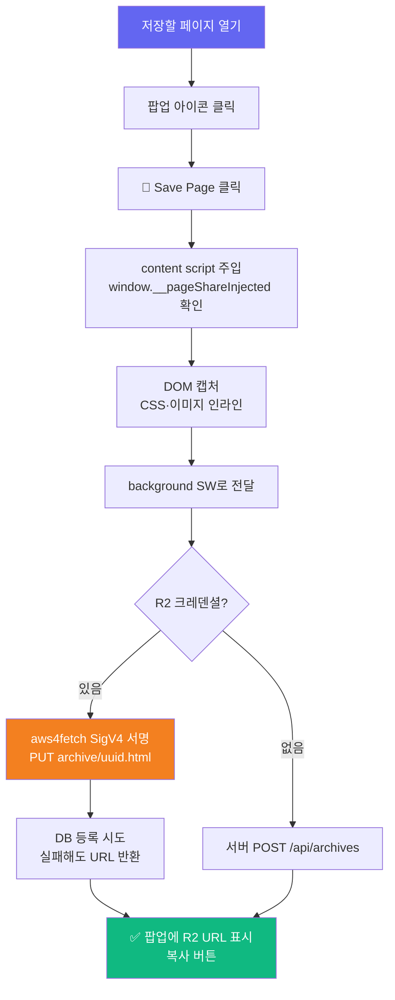
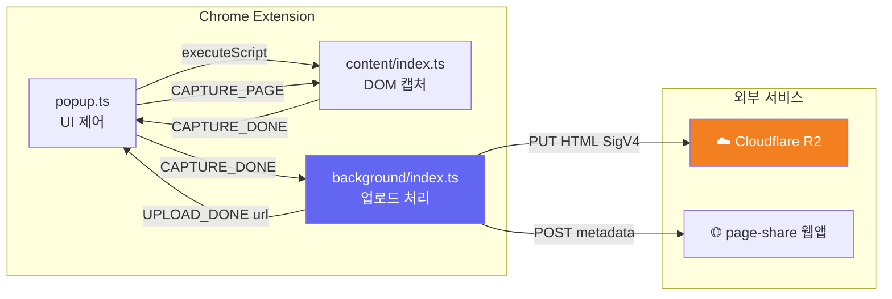

# 🔌 Page Share Extension - 웹 페이지 아카이브 Chrome 익스텐션

<div align="center">

[](https://developer.chrome.com/docs/extensions/mv3/)
[](https://www.typescriptlang.org/)
[](https://webpack.js.org/)
[](https://cloudflare.com/)

**팝업 하나 클릭으로 현재 페이지를 완전히 보존 — CSS·이미지 인라인 포함** ✨

[🎯 주요 기능](#-주요-기능) | [⚙️ 설치 방법](#-설치-방법) | [🔧 설정](#-설정) | [🏗️ 아키텍처](#-아키텍처)

> 🇺🇸 [English README](./README_EN.md)

</div>

---

## 🎯 프로젝트 소개

**Page Share Extension**은 [page-share](../page-share/) 웹앱과 함께 동작하는 Manifest V3 익스텐션입니다.  
**Chrome · Edge · Opera · Safari** 4개 브라우저를 하나의 `src/`로 지원합니다(크로스 브라우저 상세 → [docs/CROSS_BROWSER.md](./docs/CROSS_BROWSER.md), Safari 포팅 → [docs/SAFARI.md](./docs/SAFARI.md)).  
저장할 페이지에서 팝업을 열고 **💾 Save Page**를 클릭하면:

1. 현재 탭의 DOM, CSS, 이미지를 단일 HTML로 캡처 (스크립트 제거)
2. Cloudflare R2에 **직접 업로드** (SigV4 서명, 서버 불필요)
3. 공유 URL 즉시 반환 (`pub-xxx.r2.dev/archive/uuid.html`)

### ✨ 주요 기능

- 📄 **완전한 HTML 보존** — CSS 인라인 + 이미지 base64 변환 + `<base>` 태그 fallback
- ☁️ **R2 직접 업로드** — `aws4fetch` SigV4 서명, 서버 없이도 동작
- 🔑 **빌드 타임 크레덴셜** — `config.local.json` → webpack `DefinePlugin` → 런타임 팝업 입력 불필요
- 🛡️ **이중 주입 방지** — `window.__pageShareInjected` 플래그로 content script 중복 실행 방지
- 🔗 **즉시 공유** — 클립보드 복사 버튼으로 R2 URL 바로 공유

---

## 🎮 사용 방법



### 📝 단계별 가이드

#### 1️⃣ Save Page 클릭
팝업을 열고 **💾 Save Page** 버튼 클릭. 상태 표시줄이 "페이지 캡처 중..." → "R2 업로드 중..." → "저장 완료! 🎉" 순으로 바뀝니다.

> **🔒 비공개로 저장**: 체크하면 해당 아카이브는 관리자만 열람할 수 있습니다(기본값 공개). 비공개 저장 시 공유 URL은 접근 게이트가 적용된 `/archive/{id}` 웹 페이지로 반환됩니다. 단, R2 객체 자체는 UUID 난수 public URL에 저장되므로 그 URL을 직접 아는 사람은 접근할 수 있습니다(진짜 at-rest 비공개는 아님).

#### 2️⃣ URL 복사
완료 후 공유 URL이 표시됩니다. **복사** 버튼으로 클립보드에 복사하세요.

#### 3️⃣ 아카이브 확인
웹앱(`pagekeep.pages.dev`) 목록에서 저장된 페이지를 탐색할 수 있습니다.

---

## ⚙️ 설치 방법

### 사전 준비물

- Node.js 20+
- Cloudflare R2 버킷 (공개 액세스 활성화)
- R2 API Token (Object Read & Write 권한)

### 1단계: 프로젝트 클론 및 의존성 설치

```bash
git clone https://github.com/izowooi/crispy-web.git
cd crispy-web/page-share-ext
npm install
```

### 2단계: R2 크레덴셜 설정

```bash
cp config.local.example.json config.local.json
```

`config.local.json`을 실제 값으로 채웁니다 (이 파일은 절대 커밋하지 않습니다):

```json
{
  "apiBase": "https://pagekeep.pages.dev",
  "apiKey": "",
  "r2Endpoint": "https://<ACCOUNT_ID>.r2.cloudflarestorage.com",
  "r2Bucket": "page-share",
  "r2KeyId": "<R2 Access Key ID>",
  "r2Secret": "<R2 Secret Access Key>",
  "r2PublicUrl": "https://pub-<xxx>.r2.dev"
}
```

**Cloudflare Dashboard에서 값 찾는 방법:**

| 값 | 위치 |
|---|---|
| `ACCOUNT_ID` | Dashboard 우측 사이드바 → "Account ID" |
| `r2Bucket` | R2 → 버킷 목록 |
| `r2KeyId` + `r2Secret` | R2 → "Manage R2 API Tokens" → "Create API Token" |
| `r2PublicUrl` | R2 버킷 → Settings → Public Access → R2.dev subdomain URL |

### 3단계: 빌드

```bash
npm run build   # dist/ 폴더 생성
```

### 4단계: 브라우저에 로드

**Chrome / Edge / Opera** (동일한 `dist/`를 unpacked로 로드):

1. `chrome://extensions/` · `edge://extensions/` · `opera://extensions/` 접속
2. **개발자 모드** 활성화 (Opera는 먼저 켜야 로드 버튼이 나타남)
3. **"압축 해제된 확장 프로그램 로드"** → `dist/` 폴더 선택

브라우저별 단계와 최소 버전(Chrome 90 / Edge 90 / Opera 76)은 [docs/CROSS_BROWSER.md](./docs/CROSS_BROWSER.md) 참조.

**Safari** (macOS, Xcode 래퍼):

```bash
npm run safari:init   # safari/ 에 Xcode 프로젝트 스캐폴딩 (dist/ 참조 모드)
```

이후 Xcode 빌드 + "Allow unsigned extensions" 절차는 [docs/SAFARI.md](./docs/SAFARI.md) 참조. 유료 Apple Developer 계정은 불필요합니다.

### 스토어 제출 zip

```bash
npm run package   # → packages/page-share-ext-v<version>.zip (Chrome/Edge/Opera 공통)
```

`*.map`은 제외되며(시크릿 보호), R2 시크릿이 baked된 빌드는 공개 스토어에 올리지 마세요. 심사 권한 주의사항은 [docs/CROSS_BROWSER.md](./docs/CROSS_BROWSER.md) 참조.

---

## 🏗️ 아키텍처



### 컴포넌트 역할

| 파일 | 역할 |
|---|---|
| `src/popup/popup.ts` | UI 제어, content script 주입, 메시지 오케스트레이션 |
| `src/content/index.ts` | DOM 클론 → CSS/이미지 인라인 → 스크립트 제거 |
| `src/background/index.ts` | R2 업로드 또는 서버 전송, share URL 반환 |
| `src/lib/r2-upload.ts` | aws4fetch SigV4 서명 + R2 PUT |
| `src/shared/config.ts` | DefinePlugin 빌드 상수 노출 (`getR2Config()` 등) |
| `webpack.config.js` | `config.local.json` → DefinePlugin 상수 주입 |

---

## 📁 프로젝트 구조

```
page-share-ext/
├── 🔧 src/
│   ├── popup/
│   │   ├── popup.ts         # 팝업 UI 로직
│   │   ├── popup.html       # 팝업 마크업 (Save 버튼 + URL 결과)
│   │   └── popup.css        # 팝업 스타일
│   ├── content/
│   │   └── index.ts         # DOM 캡처 + CSS/이미지 인라인
│   ├── background/
│   │   └── index.ts         # 업로드 처리 service worker
│   ├── lib/
│   │   └── r2-upload.ts     # aws4fetch 기반 R2 업로드
│   ├── shared/
│   │   ├── config.ts        # DefinePlugin 상수 getter
│   │   ├── messaging.ts     # 크로스 브라우저 메시징 shim (Chromium/Safari idiom 분기)
│   │   └── types.ts         # Message 유니언 타입
│   └── __tests__/
│       ├── sanitize.test.ts  # HTML 정제 단위 테스트
│       ├── messaging.test.ts # 메시징 shim 분기 테스트 (5개)
│       └── r2-upload.test.ts # R2 업로드 단위 테스트 (9개)
├── 📋 manifest.json          # MV3 매니페스트 (Chrome/Edge/Opera/Safari 공통)
├── 🔑 config.local.example.json  # 크레덴셜 템플릿 (커밋 O)
├── 🔒 config.local.json      # 실제 크레덴셜 (gitignored — 절대 커밋 금지)
├── ⚙️ webpack.config.js      # DefinePlugin, ts-loader 설정
├── 📦 package.json
├── 🗂️ scripts/               # package.mjs (스토어 zip), safari-init.mjs (Safari 스캐폴딩)
├── 🍎 safari/                # Safari Web Extension Xcode 래퍼 (dist/ 참조 모드)
└── 📚 docs/                  # CROSS_BROWSER.md, SAFARI.md
```

---

## 🔧 설정 상세

### R2 모드 vs 서버 모드

| 항목 | R2 모드 (권장) | 서버 모드 (fallback) |
|---|---|---|
| 서버 필요 여부 | ❌ 불필요 | ✅ 필요 |
| 공유 URL 형식 | `pub-xxx.r2.dev/archive/uuid.html` | 웹앱 서버 URL |
| HTML 정제 | content script `removeScripts()` | 서버 `sanitizeHtml()` 추가 적용 |
| DB 기록 | 베스트에포트 (실패 허용) | 성공 필수 |

### DefinePlugin 빌드 상수

`webpack.config.js`가 `config.local.json`을 읽어 아래 상수를 번들에 주입합니다:

| 상수 | 출처 키 | 설명 |
|---|---|---|
| `__API_BASE__` | `apiBase` | 웹앱 서버 URL |
| `__API_KEY__` | `apiKey` | 업로드 API Key |
| `__R2_ENDPOINT__` | `r2Endpoint` | R2 S3-호환 엔드포인트 |
| `__R2_BUCKET__` | `r2Bucket` | R2 버킷 이름 |
| `__R2_KEY_ID__` | `r2KeyId` | R2 Access Key ID |
| `__R2_SECRET__` | `r2Secret` | R2 Secret Access Key |
| `__R2_PUBLIC_URL__` | `r2PublicUrl` | R2 공개 URL base |

### 에러 로그 확인 방법

| 컴포넌트 | 확인 방법 |
|---|---|
| content script | 저장할 페이지에서 F12 → Console 탭 |
| background service worker | `chrome://extensions/` → 익스텐션의 **"service worker"** 링크 |
| popup | 팝업 위에서 우클릭 → **검사(Inspect)** |

---

## 🧪 테스트

```bash
npm run test    # vitest run (jsdom 환경)
```

- `src/__tests__/sanitize.test.ts` — DOM 기반 스크립트/이벤트핸들러 제거 검증
- `src/__tests__/r2-upload.test.ts` — `isR2Configured`, `uploadHtmlToR2` 단위 테스트 (9개)
  - `customFetch` 파라미터로 mock fetch 주입 → 실제 네트워크 호출 없음

### ⚙️ 사용 가능한 명령어

| 명령어 | 설명 |
|---|---|
| `npm run build` | webpack 빌드 → `dist/` 생성 |
| `npm run watch` | watch 모드 (개발 중 자동 재빌드) |
| `npm run test` | Vitest 단위 테스트 실행 |
| `npm run typecheck` | `tsc --noEmit` 타입 체크 |
| `npm run package` | 빌드 후 스토어 제출 zip 생성 → `packages/` |
| `npm run safari:init` | Safari Web Extension Xcode 프로젝트 스캐폴딩 → `safari/` |

---

## 🔒 보안 유의사항

- `config.local.json`은 **절대** 커밋하지 않습니다. `.gitignore`에 등록되어 있습니다.
- R2 Secret은 빌드 번들에 포함됩니다. 본인 계정에서 발급한 키만 사용하고, 빌드된 `dist/`를 공개 배포하지 마세요.
- R2에 업로드된 HTML은 공개 URL로 누구나 접근 가능합니다 (UUID로만 보호). 민감한 내용이 있는 페이지는 저장 전 확인하세요.

---

## 🔗 관련 프로젝트

- **[page-share](../page-share/)** — 이 익스텐션이 업로드한 아카이브를 조회·관리하는 Next.js 웹앱.

---

## 📄 라이선스

MIT License

---

## 👨‍💻 만든 사람

**izowooi**

버그 제보나 기능 요청은 [GitHub Issues](https://github.com/izowooi/crispy-web/issues)에서 해주세요.

---

<div align="center">

**⭐ 이 프로젝트가 마음에 드셨다면 Star를 눌러주세요! ⭐**

Made with ❤️ using Chrome Extension MV3 + aws4fetch + Cloudflare R2

[🔌 익스텐션 설치하기](#-설치-방법)

</div>
