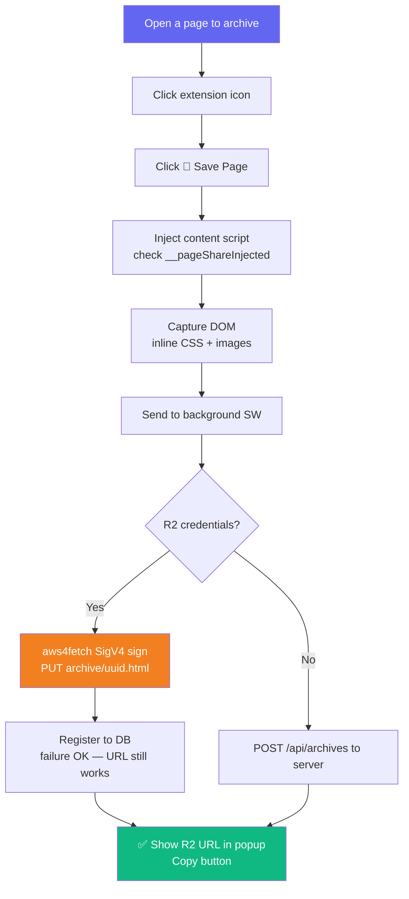
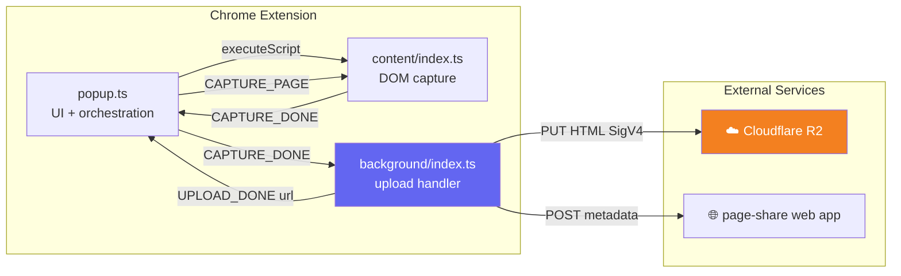

# 🔌 Page Share Extension - Web Page Archive Chrome Extension

<div align="center">

[](https://developer.chrome.com/docs/extensions/mv3/)
[](https://www.typescriptlang.org/)
[](https://webpack.js.org/)
[](https://cloudflare.com/)

**One popup click to archive any page — CSS, images, and layout fully preserved** ✨

[🎯 Features](#-features) | [⚙️ Installation](#-installation) | [🔧 Configuration](#-configuration) | [🏗️ Architecture](#-architecture)

> 🇰🇷 [한국어 README](./README.md)

</div>

---

## 🎯 About

**Page Share Extension** is a Manifest V3 extension that works with the [page-share](../page-share/) web app.  
It supports **Chrome · Edge · Opera · Safari** from a single `src/` (cross-browser details → [docs/CROSS_BROWSER.md](./docs/CROSS_BROWSER.md), Safari port → [docs/SAFARI.md](./docs/SAFARI.md)).  
Open the popup on any page, click **💾 Save Page**, and it:

1. Captures the current tab's DOM, CSS, and images into a single self-contained HTML (scripts stripped)
2. Uploads **directly to Cloudflare R2** using SigV4 signing (no server required)
3. Returns a permanent share URL (`pub-xxx.r2.dev/archive/uuid.html`)

### ✨ Features

- 📄 **Complete HTML preservation** — CSS inlined, images base64-encoded, `<base>` fallback for missed URLs
- ☁️ **Direct R2 upload** — `aws4fetch` SigV4 signing, works without a running server
- 🔑 **Build-time credentials** — `config.local.json` → webpack `DefinePlugin` → no popup input needed
- 🛡️ **Double-injection guard** — `window.__pageShareInjected` flag prevents duplicate content script listeners
- 🔗 **Instant share** — clipboard copy button to share the R2 URL right away

---

## 🎮 How It Works



### 📝 Step-by-step Guide

#### 1️⃣ Click Save Page
Open the popup and click **💾 Save Page**. The status bar progresses: "Capturing..." → "Uploading to R2..." → "Saved! 🎉"

#### 2️⃣ Copy the URL
The share URL appears when done. Hit **Copy** to copy it to the clipboard.

#### 3️⃣ Browse archives
All saved pages are listed in the [page-share web app](../page-share/).

---

## ⚙️ Installation

### Prerequisites

- Node.js 20+
- Cloudflare R2 bucket (public access enabled)
- R2 API Token (Object Read & Write permission)

### Step 1: Clone and install

```bash
git clone https://github.com/izowooi/crispy-web.git
cd crispy-web/page-share-ext
npm install
```

### Step 2: Set up R2 credentials

```bash
cp config.local.example.json config.local.json
```

Fill `config.local.json` with real values (this file must **never** be committed):

```json
{
  "apiBase": "https://pagekeep.pages.dev",
  "apiKey": "",
  "r2Endpoint": "https://<ACCOUNT_ID>.r2.cloudflarestorage.com",
  "r2Bucket": "page-share",
  "r2KeyId": "<R2 Access Key ID>",
  "r2Secret": "<R2 Secret Access Key>",
  "r2PublicUrl": "https://pub-<xxx>.r2.dev"
}
```

**Where to find each value in Cloudflare Dashboard:**

| Field | Location |
|---|---|
| `ACCOUNT_ID` | Right sidebar → "Account ID" |
| `r2Bucket` | R2 → bucket list |
| `r2KeyId` + `r2Secret` | R2 → "Manage R2 API Tokens" → "Create API Token" |
| `r2PublicUrl` | R2 bucket → Settings → Public Access → R2.dev subdomain URL |

### Step 3: Build

```bash
npm run build   # generates dist/
```

### Step 4: Load in a browser

**Chrome / Edge / Opera** (load the same `dist/` as unpacked):

1. Go to `chrome://extensions/` · `edge://extensions/` · `opera://extensions/`
2. Enable **Developer mode** (Opera: enable it first or the load button won't appear)
3. Click **"Load unpacked"** → select the `dist/` folder

Per-browser steps and minimum versions (Chrome 90 / Edge 90 / Opera 76) → [docs/CROSS_BROWSER.md](./docs/CROSS_BROWSER.md).

**Safari** (macOS, Xcode wrapper):

```bash
npm run safari:init   # scaffold the Xcode project under safari/ (references dist/)
```

Then build in Xcode and enable "Allow unsigned extensions" → [docs/SAFARI.md](./docs/SAFARI.md). No paid Apple Developer account required.

### Store-submission zip

```bash
npm run package   # → packages/page-share-ext-v<version>.zip (same file for Chrome/Edge/Opera)
```

`*.map` is excluded (protects baked secrets); never upload an R2-credential build to a public store. Permission review notes → [docs/CROSS_BROWSER.md](./docs/CROSS_BROWSER.md).

---

## 🏗️ Architecture



### Component Roles

| File | Role |
|---|---|
| `src/popup/popup.ts` | UI control, content script injection, message orchestration |
| `src/content/index.ts` | DOM clone → CSS/image inline → script removal |
| `src/background/index.ts` | R2 upload or server POST, returns share URL |
| `src/lib/r2-upload.ts` | aws4fetch SigV4 signing + R2 PUT |
| `src/shared/config.ts` | Exposes DefinePlugin build constants (`getR2Config()` etc.) |
| `webpack.config.js` | Reads `config.local.json` → injects DefinePlugin constants |

---

## 📁 Project Structure

```
page-share-ext/
├── 🔧 src/
│   ├── popup/
│   │   ├── popup.ts         # Popup UI logic
│   │   ├── popup.html       # Popup markup (Save button + URL result)
│   │   └── popup.css        # Popup styles
│   ├── content/
│   │   └── index.ts         # DOM capture + CSS/image inline
│   ├── background/
│   │   └── index.ts         # Upload handler service worker
│   ├── lib/
│   │   └── r2-upload.ts     # aws4fetch-based R2 uploader
│   ├── shared/
│   │   ├── config.ts        # DefinePlugin constant getters
│   │   ├── messaging.ts     # Cross-browser messaging shim (Chromium/Safari idioms)
│   │   └── types.ts         # Message union types
│   └── __tests__/
│       ├── sanitize.test.ts  # HTML sanitization tests
│       ├── messaging.test.ts # Messaging shim branch tests (5 cases)
│       └── r2-upload.test.ts # R2 upload unit tests (9 cases)
├── 📋 manifest.json          # MV3 manifest (Chrome/Edge/Opera/Safari)
├── 🔑 config.local.example.json  # Credential template (committed)
├── 🔒 config.local.json      # Real credentials (gitignored — never commit)
├── ⚙️ webpack.config.js      # DefinePlugin + ts-loader setup
├── 📦 package.json
├── 🗂️ scripts/               # package.mjs (store zip), safari-init.mjs (Safari scaffold)
├── 🍎 safari/                # Safari Web Extension Xcode wrapper (references dist/)
└── 📚 docs/                  # CROSS_BROWSER.md, SAFARI.md
```

---

## 🔧 Configuration Details

### R2 Mode vs Server Mode

| | R2 Mode (recommended) | Server Mode (fallback) |
|---|---|---|
| Server required | ❌ No | ✅ Yes |
| Share URL | `pub-xxx.r2.dev/archive/uuid.html` | Web app server URL |
| HTML sanitization | `removeScripts()` in content script | `sanitizeHtml()` on server |
| DB registration | Best-effort (failure OK) | Required for success |

### DefinePlugin Build Constants

`webpack.config.js` reads `config.local.json` and injects these constants at build time:

| Constant | Source key | Description |
|---|---|---|
| `__API_BASE__` | `apiBase` | Web app server URL |
| `__API_KEY__` | `apiKey` | Upload API key |
| `__R2_ENDPOINT__` | `r2Endpoint` | R2 S3-compatible endpoint |
| `__R2_BUCKET__` | `r2Bucket` | R2 bucket name |
| `__R2_KEY_ID__` | `r2KeyId` | R2 Access Key ID |
| `__R2_SECRET__` | `r2Secret` | R2 Secret Access Key |
| `__R2_PUBLIC_URL__` | `r2PublicUrl` | R2 public URL base |

### Debugging

| Component | How to inspect |
|---|---|
| Content script | F12 on the archived page → Console tab |
| Background service worker | `chrome://extensions/` → **"service worker"** link |
| Popup | Right-click popup → **Inspect** |

---

## 🧪 Testing

```bash
npm run test    # vitest (jsdom environment)
```

- `src/__tests__/sanitize.test.ts` — script and event-handler removal from DOM
- `src/__tests__/messaging.test.ts` — messaging shim branches (Chromium return-true vs Safari/FF promise-return) (5 tests)
- `src/__tests__/r2-upload.test.ts` — `isR2Configured` and `uploadHtmlToR2` (9 tests)
  - Uses `customFetch` parameter to inject mock fetch — no real network calls

### ⚙️ Available Commands

| Command | Description |
|---|---|
| `npm run build` | webpack build → generates `dist/` |
| `npm run watch` | Watch mode (auto-rebuild during development) |
| `npm run test` | Run Vitest unit tests |
| `npm run typecheck` | `tsc --noEmit` type check |
| `npm run package` | Build, then create store-submission zip → `packages/` |
| `npm run safari:init` | Scaffold the Safari Web Extension Xcode project → `safari/` |

---

## 🔒 Security Notes

- `config.local.json` is **never** committed — it's in `.gitignore`.
- The R2 Secret is baked into the build bundle. Use only keys from your own account and don't publish the built `dist/` publicly.
- Archived HTML is publicly accessible via the R2 URL (protected only by the UUID). Review sensitive pages before archiving.

---

## 🔗 Related Project

- **[page-share](../page-share/)** — The Next.js web app for browsing and managing archives uploaded by this extension.

---

## 📄 License

MIT License

---

## 👨‍💻 Author

**izowooi**

Bug reports and feature requests welcome at [GitHub Issues](https://github.com/izowooi/crispy-web/issues).

---

<div align="center">

**⭐ If you find this project useful, please give it a Star! ⭐**

Made with ❤️ using Chrome Extension MV3 + aws4fetch + Cloudflare R2

[🔌 Install the extension](#-installation)

</div>
