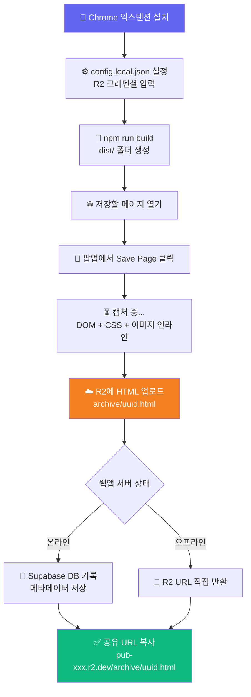
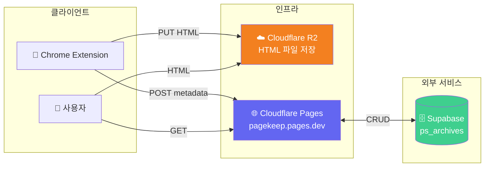

# 📄 Page Share - 개인 웹 아카이브 뷰어

<div align="center">

[](https://pagekeep.pages.dev)
[](https://nextjs.org/)
[](https://www.typescriptlang.org/)
[](https://supabase.com/)
[](https://cloudflare.com/)

**Chrome 익스텐션으로 캡처한 웹 페이지를 R2에 보관하고 언제 어디서든 공유하세요** ✨

[🎯 주요 기능](#-주요-기능) | [🎮 사용 방법](#-사용-방법) | [💻 로컬 실행](#-로컬에서-실행하기) | [🚀 배포하기](#-배포하기-cloudflare-pages)

> 🇺🇸 [English README](./README_EN.md)

</div>

---

## 🎯 프로젝트 소개

**Page Share**는 Chrome 익스텐션([page-share-ext](../page-share-ext/))과 함께 동작하는 웹 아카이브 뷰어입니다.  
익스텐션이 캡처한 페이지 HTML을 **Cloudflare R2**에 직접 저장하고, 이 웹앱은 메타데이터(제목·원본 URL·저장 위치)를 Supabase DB에 기록합니다.

`@cloudflare/next-on-pages`로 Cloudflare Pages에 배포하여 서버리스 엣지 환경에서 운영합니다.

### ✨ 주요 기능

- 📋 **아카이브 목록** — 저장된 페이지 목록 조회, 원본 URL 링크
- 📦 **R2 직접 서빙** — 저장된 HTML을 Cloudflare R2 CDN에서 직접 제공 (서버 다운 시에도 열람 가능)
- 🔒 **관리자 모드** — 비밀번호 인증 후 삭제·비공개 토글
- 🗑️ **소프트 삭제** — `deleted_at` 플래그로 복구 가능
- 👁️ **비공개 아카이브** — 목록에서 숨기기 (URL 직접 접근은 여전히 가능)
- 🔑 **API Key 인증** — 익스텐션에서 업로드 시 API Key로 보호

---

## 🎮 사용 방법



### 📝 단계별 가이드

#### 1️⃣ 아카이브 저장
1. Chrome 익스텐션 팝업에서 **💾 Save Page** 클릭
2. 자동으로 현재 페이지 HTML을 캡처하고 R2에 업로드
3. 팝업에 공유 URL 표시 (`https://pub-xxx.r2.dev/archive/uuid.html`)

#### 2️⃣ 아카이브 열람
- 공유 URL에 직접 접속하면 R2에서 HTML을 바로 서빙
- 웹앱 목록 페이지(`/`)에서 전체 아카이브 탐색

#### 3️⃣ 관리자 기능
1. 우측 상단 **👤 관리자** 버튼 → 비밀번호 입력
2. 각 아카이브 행에 🌐/🔒 토글, 🗑️ 삭제 버튼 표시

---

## 🏗️ 기술 스택

<div align="center">

| 카테고리 | 기술 | 용도 |
|:---:|:---:|:---|
| Framework | Next.js 15.5 App Router | 서버 컴포넌트, Route Handlers |
| Runtime | React 19 + TypeScript 5 | UI 및 타입 안전성 |
| Styling | Tailwind CSS v4 | 유틸리티 CSS |
| Database | Supabase (PostgreSQL) | 아카이브 메타데이터 저장 |
| Storage | Cloudflare R2 | HTML 파일 저장 및 CDN 서빙 |
| Deploy | Cloudflare Pages (Edge Runtime) | `@cloudflare/next-on-pages` |
| Testing | Vitest + jsdom | 단위 테스트 |

</div>

### 🎨 아키텍처



---

## 📁 프로젝트 구조

```
page-share/
├── 📄 src/
│   ├── app/
│   │   ├── layout.tsx              # 헤더 + AdminBarWrapper (클라이언트)
│   │   ├── page.tsx                # 아카이브 목록 (edge runtime)
│   │   ├── not-found.tsx           # 404 페이지 (정적)
│   │   ├── actions.ts              # Server Actions (deleteArchive, setPrivate)
│   │   ├── archive/[id]/page.tsx   # storage_path 조회 → R2 URL로 redirect
│   │   └── api/
│   │       ├── admin/              # 로그인/로그아웃/상태 (edge)
│   │       └── archives/           # REST API (GET 목록, POST 업로드, edge)
│   │           └── [id]/
│   │               └── route.ts    # GET/DELETE/PATCH (edge)
│   ├── components/
│   │   ├── admin-bar.tsx           # 관리자 로그인 UI (클라이언트)
│   │   ├── admin-bar-wrapper.tsx   # 관리자 상태 fetch 래퍼 (클라이언트)
│   │   └── archive-row-actions.tsx # 삭제·비공개 토글
│   ├── lib/
│   │   ├── admin.ts                # 세션 검증
│   │   ├── apikey.ts               # API Key 검증
│   │   ├── supabase.ts             # DB 클라이언트
│   │   └── storage/
│   │       └── types.ts            # StorageAdapter 인터페이스
│   └── types/archive.ts            # Archive 타입 정의
├── 📋 .env.example                 # 환경 변수 예시
├── ⚙️ wrangler.jsonc               # Cloudflare Pages 설정
└── 📦 package.json
```

---

## 💻 로컬에서 실행하기

### 📋 사전 준비물

- Node.js 20+
- Supabase 프로젝트 (무료 플랜 가능)
- Cloudflare R2 버킷 + 공개 액세스 활성화

### 🔧 환경 변수 설정

`.env.example`을 복사해 `.env.local` 생성:

```bash
cp .env.example .env.local
```

```env
# Supabase
NEXT_PUBLIC_SUPABASE_URL=https://<PROJECT>.supabase.co
NEXT_PUBLIC_SUPABASE_ANON_KEY=<anon-key>
SUPABASE_SERVICE_ROLE_KEY=<service-role-key>     # 서버 전용 — NEXT_PUBLIC_ 금지

# 공유 URL 생성 기준 (로컬 dev)
NEXT_PUBLIC_BASE_URL=http://localhost:52741

# 관리자 비밀번호 (서버 전용)
ADMIN_PASSWORD=<your-admin-password>

# 업로드 API 보호 키 (서버 전용, 미설정 시 dev 모드)
API_KEY=<your-api-key>
```

### 🗄️ Supabase 테이블 생성

Supabase Dashboard → SQL Editor에서 실행:

```sql
CREATE TABLE public.ps_archives (
  id           UUID  PRIMARY KEY DEFAULT gen_random_uuid(),
  title        TEXT  NOT NULL,
  original_url TEXT  NOT NULL,
  storage_path TEXT  NOT NULL,
  file_size    INT   DEFAULT 0,
  created_at   TIMESTAMPTZ DEFAULT now(),
  deleted_at   TIMESTAMPTZ DEFAULT NULL,
  is_private   BOOLEAN NOT NULL DEFAULT FALSE
);

ALTER TABLE public.ps_archives ENABLE ROW LEVEL SECURITY;
CREATE POLICY "anon_select" ON public.ps_archives FOR SELECT TO anon USING (true);
```

### 🚀 실행 방법

```bash
git clone https://github.com/izowooi/crispy-web.git
cd crispy-web/page-share
npm install
cp .env.example .env.local   # .env.local 값 채우기
npm run dev                  # http://localhost:52741
```

### ⚙️ 사용 가능한 명령어

| 명령어 | 설명 |
|---|---|
| `npm run dev` | 개발 서버 실행 (포트 52741) |
| `npm run build` | Next.js 프로덕션 빌드 |
| `npm run pages:build` | Cloudflare Pages 빌드 (`@cloudflare/next-on-pages`) |
| `npm run preview` | 로컬 Cloudflare Pages 미리보기 (`wrangler pages dev`) |
| `npm run test` | Vitest 단위 테스트 |
| `npm run lint` | ESLint 검사 |

---

## 🚀 배포하기 (Cloudflare Pages)

### 빌드 설정 (Cloudflare Pages Dashboard)

| 항목 | 값 |
|---|---|
| Framework preset | **None** |
| Build command | `npm run pages:build` |
| Build output directory | `.vercel/output/static` |
| Root directory | `page-share` |

> Cloudflare가 `npm install`을 자동 실행하므로 빌드 명령에 포함하지 않아도 됩니다.

### 환경 변수 (Dashboard → Settings → Environment variables)

| 변수명 | 비고 |
|---|---|
| `NEXT_PUBLIC_SUPABASE_URL` | Supabase 프로젝트 URL |
| `NEXT_PUBLIC_SUPABASE_ANON_KEY` | Supabase anon key |
| `SUPABASE_SERVICE_ROLE_KEY` | 🔒 Encrypted, 서버 전용 |
| `NEXT_PUBLIC_BASE_URL` | `https://pagekeep.pages.dev` |
| `ADMIN_PASSWORD` | 🔒 Encrypted, 서버 전용 |
| `API_KEY` | 🔒 Encrypted, 서버 전용 |

> ⚠️ **중요**: `NEXT_PUBLIC_*` 변수는 빌드 시 인라인되므로 빌드 전에 반드시 설정해야 합니다.

### nodejs_compat 활성화

`wrangler.jsonc`에 이미 설정되어 있지만, Cloudflare Pages Dashboard에서도 확인:  
**Settings → Functions → Compatibility flags** → Production 및 Preview 모두 `nodejs_compat` 추가

### 수동 배포

```bash
npm run pages:build
npx wrangler pages deploy .vercel/output/static --project-name pagekeep
```

---

## 🔗 관련 프로젝트

- **[page-share-ext](../page-share-ext/)** — 이 웹앱과 함께 사용하는 Chrome 익스텐션. R2 직접 업로드 + 자동 캡처.

---

## 📄 라이선스

MIT License

---

## 👨‍💻 만든 사람

**izowooi**

버그 제보나 기능 요청은 [GitHub Issues](https://github.com/izowooi/crispy-web/issues)에서 해주세요.

---

<div align="center">

**⭐ 이 프로젝트가 마음에 드셨다면 Star를 눌러주세요! ⭐**

Made with ❤️ using Next.js + Cloudflare Pages + R2 + Supabase

[📄 지금 사용하기](https://pagekeep.pages.dev)

</div>
