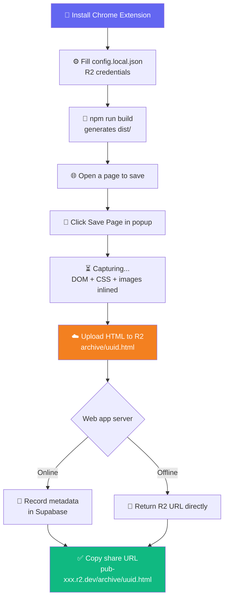
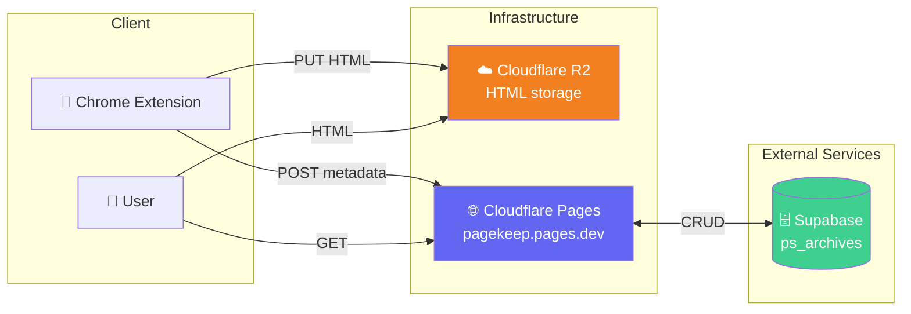

# 📄 Page Share - Personal Web Archive Viewer

<div align="center">

[](https://pagekeep.pages.dev)
[](https://nextjs.org/)
[](https://www.typescriptlang.org/)
[](https://supabase.com/)
[](https://cloudflare.com/)

**Archive web pages from any browser tab — stored directly in Cloudflare R2, accessible forever** ✨

[🎯 Features](#-about) | [🎮 How to Use](#-how-to-use) | [💻 Local Setup](#-local-setup) | [🚀 Deploy](#-deploying-to-cloudflare-pages)

> 🇰🇷 [한국어 README](./README.md)

</div>

---

## 🎯 About

**Page Share** is a web archive viewer that works alongside the [page-share-ext](../page-share-ext/) Chrome extension.  
The extension captures the current tab's HTML and uploads it **directly to Cloudflare R2**. This web app records the metadata (title, original URL, storage path) in Supabase.

Deployed on **Cloudflare Pages** via `@cloudflare/next-on-pages` — fully serverless, zero infrastructure to manage.

### ✨ Features

- 📋 **Archive list** — browse saved pages with original URL links
- 📦 **R2-direct serving** — archived HTML served from Cloudflare CDN (accessible even when the server is down)
- 🔒 **Admin mode** — password-protected delete / private toggle
- 🗑️ **Soft delete** — `deleted_at` flag keeps records recoverable
- 👁️ **Private archives** — hide from list view (direct URL still works)
- 🔑 **API Key protection** — uploads from the extension require a valid key

---

## 🎮 How to Use



### 📝 Step-by-step Guide

#### 1️⃣ Save a page
1. Click **💾 Save Page** in the extension popup
2. The extension captures the page HTML and uploads it to R2
3. Share URL appears in the popup (`https://pub-xxx.r2.dev/archive/uuid.html`)

#### 2️⃣ View archives
- Visit the share URL directly — R2 serves the HTML right away
- Browse all archives at the web app's root page (`/`)

#### 3️⃣ Admin functions
1. Click **👤 Admin** in the top-right → enter password
2. Each archive row shows 🌐/🔒 toggle and 🗑️ delete button

---

## 🏗️ Tech Stack

<div align="center">

| Category | Technology | Purpose |
|:---:|:---:|:---|
| Framework | Next.js 15.5 App Router | Server components, Route Handlers |
| Runtime | React 19 + TypeScript 5 | UI and type safety |
| Styling | Tailwind CSS v4 | Utility CSS |
| Database | Supabase (PostgreSQL) | Archive metadata storage |
| Storage | Cloudflare R2 | HTML file storage + CDN |
| Deploy | Cloudflare Pages (Edge Runtime) | `@cloudflare/next-on-pages` |
| Testing | Vitest + jsdom | Unit tests |

</div>

### 🎨 Architecture



---

## 📁 Project Structure

```
page-share/
├── 📄 src/
│   ├── app/
│   │   ├── layout.tsx              # Header + AdminBarWrapper (client)
│   │   ├── page.tsx                # Archive list (edge runtime)
│   │   ├── not-found.tsx           # 404 page (static)
│   │   ├── actions.ts              # Server Actions (deleteArchive, setPrivate)
│   │   ├── archive/[id]/page.tsx   # Fetch storage_path → redirect to R2 URL
│   │   └── api/
│   │       ├── admin/              # Login/logout/status (edge)
│   │       └── archives/           # REST API (GET list, POST upload, edge)
│   │           └── [id]/
│   │               └── route.ts    # GET/DELETE/PATCH (edge)
│   ├── components/
│   │   ├── admin-bar.tsx           # Admin login UI (client)
│   │   ├── admin-bar-wrapper.tsx   # Admin state fetch wrapper (client)
│   │   └── archive-row-actions.tsx # Delete + private toggle
│   ├── lib/
│   │   ├── admin.ts                # Session validation
│   │   ├── apikey.ts               # API Key validation
│   │   ├── supabase.ts             # DB client
│   │   └── storage/
│   │       └── types.ts            # StorageAdapter interface
│   └── types/archive.ts            # Archive type definition
├── 📋 .env.example                 # Environment variable template
├── ⚙️ wrangler.jsonc               # Cloudflare Pages config
└── 📦 package.json
```

---

## 💻 Local Setup

### 📋 Prerequisites

- Node.js 20+
- Supabase project (free tier works)
- Cloudflare R2 bucket with public access enabled

### 🔧 Environment Variables

Copy `.env.example` to `.env.local`:

```bash
cp .env.example .env.local
```

```env
# Supabase
NEXT_PUBLIC_SUPABASE_URL=https://<PROJECT>.supabase.co
NEXT_PUBLIC_SUPABASE_ANON_KEY=<anon-key>
SUPABASE_SERVICE_ROLE_KEY=<service-role-key>     # server-side only — never NEXT_PUBLIC_

# Base URL for share links (local dev)
NEXT_PUBLIC_BASE_URL=http://localhost:52741

# Admin password (server-side only)
ADMIN_PASSWORD=<your-admin-password>

# Upload API key (server-side only; omit for dev mode)
API_KEY=<your-api-key>
```

### 🗄️ Create Supabase Table

Run in Supabase Dashboard → SQL Editor:

```sql
CREATE TABLE public.ps_archives (
  id           UUID  PRIMARY KEY DEFAULT gen_random_uuid(),
  title        TEXT  NOT NULL,
  original_url TEXT  NOT NULL,
  storage_path TEXT  NOT NULL,
  file_size    INT   DEFAULT 0,
  created_at   TIMESTAMPTZ DEFAULT now(),
  deleted_at   TIMESTAMPTZ DEFAULT NULL,
  is_private   BOOLEAN NOT NULL DEFAULT FALSE
);

ALTER TABLE public.ps_archives ENABLE ROW LEVEL SECURITY;
CREATE POLICY "anon_select" ON public.ps_archives FOR SELECT TO anon USING (true);
```

### 🚀 Run Locally

```bash
git clone https://github.com/izowooi/crispy-web.git
cd crispy-web/page-share
npm install
cp .env.example .env.local   # fill in values
npm run dev                  # http://localhost:52741
```

### ⚙️ Available Commands

| Command | Description |
|---|---|
| `npm run dev` | Start dev server (port 52741) |
| `npm run build` | Next.js production build |
| `npm run pages:build` | Cloudflare Pages build (`@cloudflare/next-on-pages`) |
| `npm run preview` | Local Cloudflare Pages preview (`wrangler pages dev`) |
| `npm run test` | Run Vitest unit tests |
| `npm run lint` | ESLint check |

---

## 🚀 Deploying to Cloudflare Pages

### Build Settings (Cloudflare Pages Dashboard)

| Field | Value |
|---|---|
| Framework preset | **None** |
| Build command | `npm run pages:build` |
| Build output directory | `.vercel/output/static` |
| Root directory | `page-share` |

> Cloudflare auto-runs `npm install`, so you don't need to include it in the build command.

### Environment Variables (Dashboard → Settings → Environment variables)

| Variable | Notes |
|---|---|
| `NEXT_PUBLIC_SUPABASE_URL` | Supabase project URL |
| `NEXT_PUBLIC_SUPABASE_ANON_KEY` | Supabase anon key |
| `SUPABASE_SERVICE_ROLE_KEY` | 🔒 Encrypted, server-side only |
| `NEXT_PUBLIC_BASE_URL` | `https://pagekeep.pages.dev` |
| `ADMIN_PASSWORD` | 🔒 Encrypted, server-side only |
| `API_KEY` | 🔒 Encrypted, server-side only |

> ⚠️ **Important**: `NEXT_PUBLIC_*` vars are inlined at build time — set them before triggering a build.

### Enable nodejs_compat

Already in `wrangler.jsonc`, but verify in the Dashboard as well:  
**Settings → Functions → Compatibility flags** → Add `nodejs_compat` to both Production and Preview.

### Manual Deploy

```bash
npm run pages:build
npx wrangler pages deploy .vercel/output/static --project-name pagekeep
```

---

## 🔗 Related Project

- **[page-share-ext](../page-share-ext/)** — Chrome extension that captures pages and uploads directly to R2.

---

## 📄 License

MIT License

---

## 👨‍💻 Author

**izowooi**

Bug reports and feature requests welcome at [GitHub Issues](https://github.com/izowooi/crispy-web/issues).

---

<div align="center">

**⭐ If you find this project useful, please give it a Star! ⭐**

Made with ❤️ using Next.js + Cloudflare Pages + R2 + Supabase

[📄 Try it now](https://pagekeep.pages.dev)

</div>
