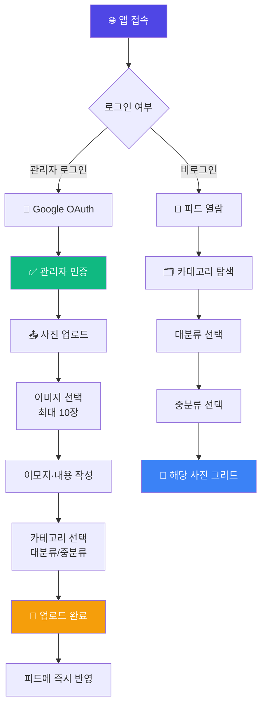
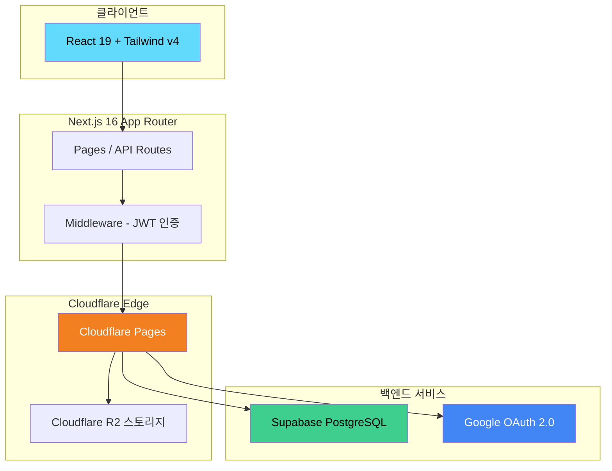
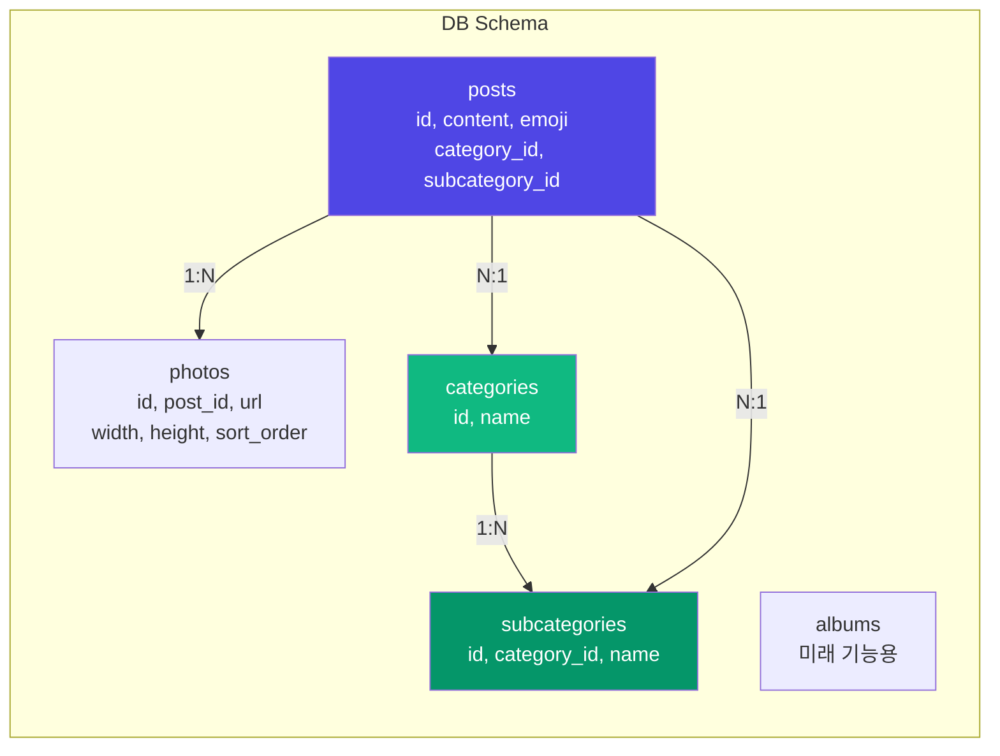

# 📸 PhotoKeep - 가족 사진 공유 프라이빗 갤러리

<div align="center">

> 🇺🇸 [English README](./README_EN.md)

[](https://photokeep.pages.dev)
[](https://nextjs.org)
[](https://react.dev)
[](https://tailwindcss.com)
[](https://pages.cloudflare.com)
[](https://supabase.com)

**엄마·아빠가 올리면 할머니·할아버지·이모가 바로 보는 — 우리 가족만의 프라이빗 포토 갤러리** ✨

[🎯 주요 기능](#-프로젝트-소개) | [💻 로컬 실행](#-로컬에서-실행하기) | [🚀 배포하기](#-배포하기)

</div>

---

## 🎯 프로젝트 소개

**PhotoKeep**은 가족 간 사진 공유를 위한 프라이빗 갤러리 웹앱입니다.
인스타그램과 유사한 UX이지만 SNS 기능(좋아요/팔로우) 없이 **순수 사진 열람 목적**으로 설계되었습니다.
관리자(엄마·아빠)가 사진을 업로드하면 가족 모두가 링크 하나로 바로 볼 수 있습니다.

### ✨ 주요 기능

- 📱 **인스타그램 스타일 피드** — 무한 스크롤, 캐러셀 (포스트당 최대 10장)
- 🗂️ **카테고리 탐색** — 대분류/중분류 계층 구조로 사진 정리 및 탐색
- 🕰️ **추억 보기** — 날짜·월·연도별 사진 모아보기 (개발 중)
- 🔒 **Google OAuth 로그인** — 관리자 인증, 7일 JWT 세션
- ☁️ **Cloudflare R2 스토리지** — 원본 + 썸네일 분리 저장
- 🎛️ **관리자 대시보드** — 업로드, 포스트 편집/삭제/정렬, 카테고리 관리
- 🌙 **다크모드** 지원
- 📲 **PWA 설치** 지원 (홈 화면 추가)
- 🔄 **Pull to Refresh** 지원

---

## 📸 스크린샷

<!-- TODO: docs/screenshots/ 에 스크린샷 추가 후 테이블로 교체 -->

| 피드 탭 | 카테고리 탭 | 업로드 화면 |
|---------|------------|------------|
| 인스타그램 스타일 피드 | 대분류/중분류 탐색 | 최대 10장 멀티 업로드 |

---

## 🎮 사용 방법



### 📝 단계별 가이드

#### 일반 사용자 (가족)
| 단계 | 설명 |
|------|------|
| 1 | 공유 링크로 앱 접속 |
| 2 | 피드 탭에서 최신 사진 확인 |
| 3 | 카테고리 탭에서 연도/인물별 탐색 |
| 4 | 사진 탭으로 넘기며 캐러셀 감상 |

#### 관리자 (엄마·아빠)
| 단계 | 설명 |
|------|------|
| 1 | `/admin` 접속 → Google 로그인 |
| 2 | 사진 선택 (최대 10장) |
| 3 | 이모지, 내용, 카테고리 설정 |
| 4 | 업로드 완료 → 피드 즉시 반영 |

---

## 🏗️ 기술 스택

<div align="center">

| 카테고리 | 기술 | 용도 |
|---------|------|------|
| **Frontend** | React 19, Tailwind CSS v4 | UI 컴포넌트, 스타일링 |
| **Framework** | Next.js 16 (App Router) | 풀스택 프레임워크, API Routes |
| **Runtime** | Cloudflare Pages (Edge) | 전 세계 엣지 배포 |
| **Database** | Supabase PostgreSQL | 포스트/카테고리 메타데이터 |
| **Storage** | Cloudflare R2 | 원본 사진 + 썸네일 |
| **Auth** | Google OAuth 2.0 + jose JWT | 관리자 인증 |
| **State** | React useState/useEffect | 클라이언트 상태 관리 |
| **DnD** | @dnd-kit | 포스트 드래그 정렬 |
| **Test** | Vitest + Testing Library | 유닛/컴포넌트 테스트 |

</div>

### 🎨 아키텍처





---

## 📁 프로젝트 구조

```
photokeep/
├── 📂 src/
│   ├── 📂 app/                     # Next.js App Router
│   │   ├── 📄 page.tsx             # 🏠 피드 메인 (무한 스크롤)
│   │   ├── 📂 category/            # 🗂️ 카테고리 탭
│   │   │   ├── 📄 page.tsx         # 대분류 목록
│   │   │   └── 📂 [categoryId]/    # 대분류 상세 + 피드 그리드
│   │   │       └── 📂 [subcategoryId]/  # 중분류별 피드 그리드
│   │   ├── 📂 memories/            # 🕰️ 추억 탭 (개발 중)
│   │   ├── 📂 admin/               # 🔐 관리자 전용
│   │   │   ├── 📄 page.tsx         # 대시보드
│   │   │   ├── 📂 upload/          # 사진 업로드
│   │   │   └── 📂 posts/           # 포스트 목록/편집
│   │   └── 📂 api/                 # API Routes
│   │       ├── 📂 auth/            # Google OAuth, JWT
│   │       ├── 📂 categories/      # 공개 카테고리 API
│   │       └── 📂 admin/           # 관리자 CRUD API
│   ├── 📂 components/
│   │   ├── 📂 feed/
│   │   │   └── 📄 PhotoCarousel.tsx    # 사진 캐러셀 + 라이트박스
│   │   └── 📂 ui/
│   │       ├── 📄 BottomTabBar.tsx     # 하단 탭 네비게이션
│   │       ├── 📄 CategorySelector.tsx # 카테고리 선택 컴포넌트
│   │       ├── 📄 Header.tsx           # 공통 헤더
│   │       └── 📄 PullToRefresh.tsx    # 당겨서 새로고침
│   ├── 📂 lib/
│   │   ├── 📂 auth/                # JWT, Google OAuth, 세션
│   │   ├── 📂 r2/                  # Cloudflare R2 Presigned URL
│   │   └── 📂 supabase/            # DB 클라이언트 (anon/admin)
│   ├── 📂 types/
│   │   └── 📄 database.ts          # TypeScript 인터페이스
│   └── 📄 middleware.ts            # 관리자 라우트 JWT 보호
├── 📂 docs/
│   └── 📄 prd.txt                  # 카테고리 기능 기획서
├── 📄 CLAUDE.md                    # AI 에이전트 작업 지침
└── 📄 package.json
```

---

## 💻 로컬에서 실행하기

### 📋 사전 준비물

- Node.js 20+
- Google Cloud Console 프로젝트 (OAuth 2.0 Client ID)
- Supabase 프로젝트 (PostgreSQL)
- Cloudflare 계정 + R2 버킷

### 🔧 환경 변수 설정

프로젝트 루트에 `.env.local` 파일 생성:

```env
# Google OAuth
NEXT_PUBLIC_GOOGLE_CLIENT_ID=your-google-client-id
GOOGLE_CLIENT_SECRET=your-google-client-secret

# JWT
JWT_SECRET=your-jwt-secret-32-chars-minimum

# Supabase
NEXT_PUBLIC_SUPABASE_URL=https://xxxxxx.supabase.co
NEXT_PUBLIC_SUPABASE_ANON_KEY=your-supabase-anon-key
SUPABASE_SERVICE_ROLE_KEY=your-supabase-service-role-key

# Cloudflare R2
NEXT_PUBLIC_R2_PUBLIC_URL=https://your-r2-bucket.r2.dev
R2_ACCOUNT_ID=your-account-id
R2_ACCESS_KEY_ID=your-r2-access-key
R2_SECRET_ACCESS_KEY=your-r2-secret-key
R2_BUCKET_NAME=your-bucket-name

# App
NEXT_PUBLIC_BASE_URL=http://localhost:3000
```

### 🚀 실행 방법

```bash
# 1. 저장소 클론
git clone https://github.com/izowooi/crispy-web.git
cd crispy-web/photokeep

# 2. 의존성 설치
npm install

# 3. 환경 변수 설정
cp .env.local.example .env.local
# .env.local 파일을 편집하여 실제 값으로 교체

# 4. 개발 서버 실행
npm run dev
# → http://localhost:3000 에서 확인
```

### ⚙️ 사용 가능한 명령어

| 명령어 | 설명 |
|--------|------|
| `npm run dev` | 개발 서버 실행 (포트 3000) |
| `npm run build` | 프로덕션 빌드 |
| `npm run start` | 프로덕션 서버 실행 |
| `npm run lint` | ESLint 코드 검사 |
| `npm run test` | Vitest 테스트 실행 |

---

## 🚀 배포하기

### Cloudflare Pages 배포

```bash
# 1. @cloudflare/next-on-pages 설치
npm install -D @cloudflare/next-on-pages

# 2. Cloudflare Pages 연결 (GitHub 저장소 연결)
# Dashboard → Pages → Create a project → Connect to Git

# 3. 빌드 설정
# Build command: npx @cloudflare/next-on-pages
# Build output directory: .vercel/output/static
# Root directory: photokeep

# 4. 환경 변수 등록
# Dashboard → Pages → Settings → Environment variables
```

> **⚠️ Worker 크기 제한**: 무료 플랜은 3 MiB, 유료 플랜($5/월)은 10 MiB까지 허용됩니다.

---

## 🗄️ 데이터베이스 스키마

Supabase Dashboard에서 아래 SQL을 실행하여 초기 스키마를 생성합니다:

```sql
-- 카테고리 (대분류)
CREATE TABLE categories (
  id UUID PRIMARY KEY DEFAULT gen_random_uuid(),
  name TEXT NOT NULL,
  created_at TIMESTAMPTZ DEFAULT now()
);

-- 중분류
CREATE TABLE subcategories (
  id UUID PRIMARY KEY DEFAULT gen_random_uuid(),
  category_id UUID REFERENCES categories(id) ON DELETE CASCADE,
  name TEXT NOT NULL,
  created_at TIMESTAMPTZ DEFAULT now()
);

-- 포스트
CREATE TABLE posts (
  id UUID PRIMARY KEY DEFAULT gen_random_uuid(),
  content TEXT,
  emoji TEXT DEFAULT '',
  is_private BOOLEAN DEFAULT false,
  author_name TEXT NOT NULL,
  sort_order INT DEFAULT 0,
  cover_photo_url TEXT,
  category_id UUID REFERENCES categories(id) ON DELETE SET NULL,
  subcategory_id UUID REFERENCES subcategories(id) ON DELETE SET NULL,
  created_at TIMESTAMPTZ DEFAULT now(),
  updated_at TIMESTAMPTZ DEFAULT now()
);

-- 사진
CREATE TABLE photos (
  id UUID PRIMARY KEY DEFAULT gen_random_uuid(),
  post_id UUID REFERENCES posts(id) ON DELETE CASCADE,
  url TEXT NOT NULL,
  thumbnail_url TEXT,
  width INT,
  height INT,
  sort_order INT DEFAULT 0,
  created_at TIMESTAMPTZ DEFAULT now()
);
```

---

## 🎯 향후 개선 사항

- [ ] 추억(Memories) 탭 구현 — 날짜·월·연도별 사진 모아보기
- [ ] 앨범 기능 — 이벤트별 수동 앨범 생성
- [ ] 썸네일 자동 생성 — Cloudflare Images 또는 Workers
- [ ] Blurhash 플레이스홀더 — 이미지 로딩 중 흐림 효과
- [ ] 무한 스크롤 — 현재는 전체 로드
- [ ] 관리자 카테고리 관리 UI — 대시보드 내 카테고리 CRUD 화면

---

## 🤝 기여하기

```bash
# 1. Fork 후 클론
git clone https://github.com/{your-username}/crispy-web.git

# 2. 피처 브랜치 생성
git checkout -b feat/your-feature

# 3. 변경 사항 커밋
git commit -m "feat: 기능 설명"

# 4. 브랜치 푸시
git push origin feat/your-feature

# 5. Pull Request 생성
```

---

## 📄 라이선스

MIT License © 2026 izowooi

---

## 👨‍💻 만든 사람

**izowooi**

버그 제보나 기능 요청은 [GitHub Issues](https://github.com/izowooi/crispy-web/issues)에 남겨주세요.

---

<div align="center">

**⭐ 이 프로젝트가 마음에 드셨다면 Star를 눌러주세요! ⭐**

Made with ❤️ using Next.js + Cloudflare Pages

[📸 지금 사용하기](https://photokeep.pages.dev)

</div>
