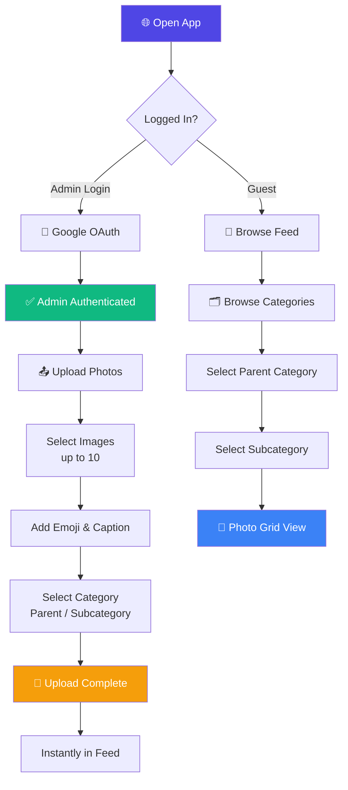
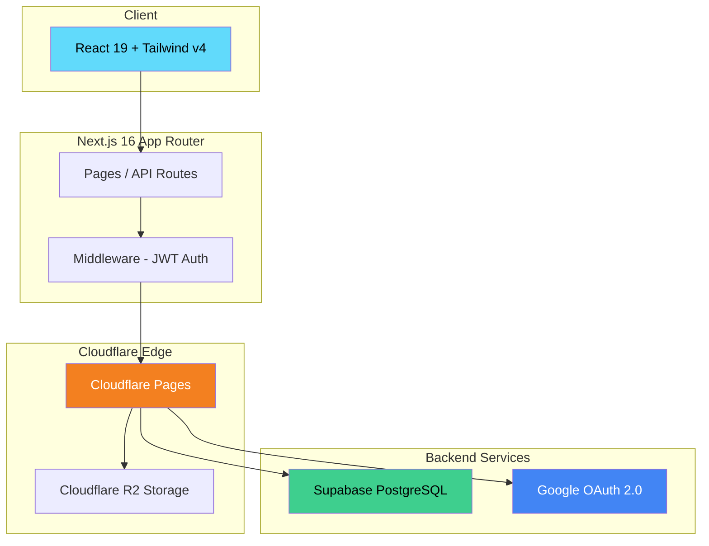
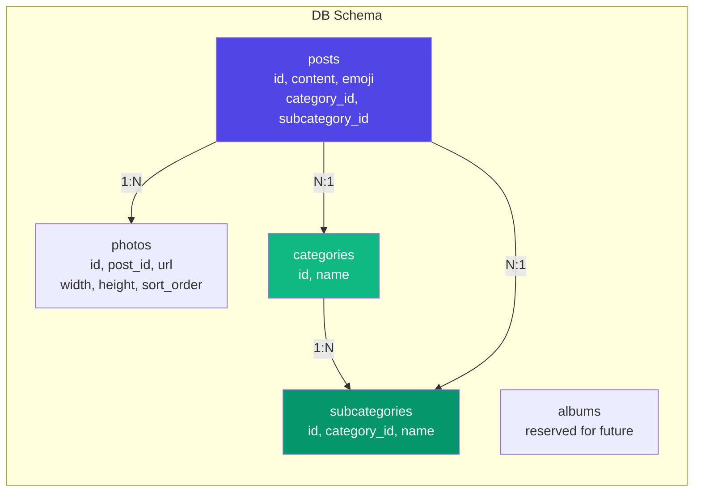

> 🇰🇷 [한국어 README](./README.md)

# 📸 PhotoKeep - Private Family Photo Gallery

<div align="center">

[](https://photokeep.pages.dev)
[](https://nextjs.org)
[](https://react.dev)
[](https://tailwindcss.com)
[](https://pages.cloudflare.com)
[](https://supabase.com)

**Mom & Dad upload. Grandparents and family instantly see — your family's private photo gallery.** ✨

[🎯 Features](#-project-overview) | [💻 Local Setup](#-running-locally) | [🚀 Deployment](#-deployment)

</div>

---

## 🎯 Project Overview

**PhotoKeep** is a private gallery web app for sharing family photos.
It offers an Instagram-like UX without social features (no likes/follows) — designed purely for **viewing and organizing family photos**.
When admins (parents) upload photos, the entire family can view them instantly through a single shared link.

### ✨ Key Features

- 📱 **Instagram-style Feed** — infinite scroll, carousel (up to 10 photos per post)
- 🗂️ **Category Browsing** — hierarchical parent/subcategory structure for organizing and finding photos
- 🕰️ **Memories View** — browse photos by date, month, or year (coming soon)
- 🔒 **Google OAuth Login** — admin authentication with 7-day JWT sessions
- ☁️ **Cloudflare R2 Storage** — separate original + thumbnail storage
- 🎛️ **Admin Dashboard** — upload, edit/delete/reorder posts, manage categories
- 🌙 **Dark Mode** support
- 📲 **PWA Install** support (add to home screen)
- 🔄 **Pull to Refresh** support

---

## 📸 Screenshots

<!-- TODO: Add screenshots to docs/screenshots/ and replace with a table -->

| Feed Tab | Category Tab | Upload Screen |
|----------|-------------|---------------|
| Instagram-style feed | Parent/subcategory browsing | Multi-photo upload (up to 10) |

---

## 🎮 How to Use



### 📝 Step-by-Step Guide

#### Family Members (Viewers)
| Step | Description |
|------|-------------|
| 1 | Open the app via shared link |
| 2 | Browse latest photos in the Feed tab |
| 3 | Navigate by year/person in the Category tab |
| 4 | Swipe through carousel photos |

#### Admins (Parents)
| Step | Description |
|------|-------------|
| 1 | Go to `/admin` → Sign in with Google |
| 2 | Select photos (up to 10) |
| 3 | Set emoji, caption, and category |
| 4 | Upload → Instantly appears in the feed |

---

## 🏗️ Tech Stack

<div align="center">

| Category | Technology | Purpose |
|----------|-----------|---------|
| **Frontend** | React 19, Tailwind CSS v4 | UI components, styling |
| **Framework** | Next.js 16 (App Router) | Full-stack framework, API Routes |
| **Runtime** | Cloudflare Pages (Edge) | Global edge deployment |
| **Database** | Supabase PostgreSQL | Post/category metadata |
| **Storage** | Cloudflare R2 | Original photos + thumbnails |
| **Auth** | Google OAuth 2.0 + jose JWT | Admin authentication |
| **State** | React useState/useEffect | Client-side state management |
| **DnD** | @dnd-kit | Drag-to-reorder posts |
| **Test** | Vitest + Testing Library | Unit/component testing |

</div>

### 🎨 Architecture





---

## 📁 Project Structure

```
photokeep/
├── 📂 src/
│   ├── 📂 app/                     # Next.js App Router
│   │   ├── 📄 page.tsx             # 🏠 Feed main (infinite scroll)
│   │   ├── 📂 category/            # 🗂️ Category tab
│   │   │   ├── 📄 page.tsx         # Parent category list
│   │   │   └── 📂 [categoryId]/    # Category detail + photo grid
│   │   │       └── 📂 [subcategoryId]/  # Subcategory photo grid
│   │   ├── 📂 memories/            # 🕰️ Memories tab (coming soon)
│   │   ├── 📂 admin/               # 🔐 Admin only
│   │   │   ├── 📄 page.tsx         # Dashboard
│   │   │   ├── 📂 upload/          # Photo upload
│   │   │   └── 📂 posts/           # Post list/edit
│   │   └── 📂 api/                 # API Routes
│   │       ├── 📂 auth/            # Google OAuth, JWT
│   │       ├── 📂 categories/      # Public categories API
│   │       └── 📂 admin/           # Admin CRUD API
│   ├── 📂 components/
│   │   ├── 📂 feed/
│   │   │   └── 📄 PhotoCarousel.tsx    # Photo carousel + lightbox
│   │   └── 📂 ui/
│   │       ├── 📄 BottomTabBar.tsx     # Bottom tab navigation
│   │       ├── 📄 CategorySelector.tsx # Category picker component
│   │       ├── 📄 Header.tsx           # Shared header
│   │       └── 📄 PullToRefresh.tsx    # Pull-to-refresh
│   ├── 📂 lib/
│   │   ├── 📂 auth/                # JWT, Google OAuth, sessions
│   │   ├── 📂 r2/                  # Cloudflare R2 presigned URLs
│   │   └── 📂 supabase/            # DB clients (anon/admin)
│   ├── 📂 types/
│   │   └── 📄 database.ts          # TypeScript interfaces
│   └── 📄 middleware.ts            # Admin route JWT protection
├── 📂 docs/
│   └── 📄 prd.txt                  # Category feature spec
└── 📄 package.json
```

---

## 💻 Running Locally

### 📋 Prerequisites

- Node.js 20+
- Google Cloud Console project (OAuth 2.0 Client ID)
- Supabase project (PostgreSQL)
- Cloudflare account + R2 bucket

### 🔧 Environment Variables

Create a `.env.local` file in the project root:

```env
# Google OAuth
NEXT_PUBLIC_GOOGLE_CLIENT_ID=your-google-client-id
GOOGLE_CLIENT_SECRET=your-google-client-secret

# JWT
JWT_SECRET=your-jwt-secret-32-chars-minimum

# Supabase
NEXT_PUBLIC_SUPABASE_URL=https://xxxxxx.supabase.co
NEXT_PUBLIC_SUPABASE_ANON_KEY=your-supabase-anon-key
SUPABASE_SERVICE_ROLE_KEY=your-supabase-service-role-key

# Cloudflare R2
NEXT_PUBLIC_R2_PUBLIC_URL=https://your-r2-bucket.r2.dev
R2_ACCOUNT_ID=your-account-id
R2_ACCESS_KEY_ID=your-r2-access-key
R2_SECRET_ACCESS_KEY=your-r2-secret-key
R2_BUCKET_NAME=your-bucket-name

# App
NEXT_PUBLIC_BASE_URL=http://localhost:3000
```

### 🚀 Getting Started

```bash
# 1. Clone the repository
git clone https://github.com/izowooi/crispy-web.git
cd crispy-web/photokeep

# 2. Install dependencies
npm install

# 3. Set up environment variables
cp .env.local.example .env.local
# Edit .env.local with your actual values

# 4. Start the development server
npm run dev
# → Open http://localhost:3000
```

### ⚙️ Available Commands

| Command | Description |
|---------|-------------|
| `npm run dev` | Start development server (port 3000) |
| `npm run build` | Create production build |
| `npm run start` | Start production server |
| `npm run lint` | Run ESLint |
| `npm run test` | Run Vitest tests |

---

## 🚀 Deployment

### Cloudflare Pages

```bash
# 1. Install @cloudflare/next-on-pages
npm install -D @cloudflare/next-on-pages

# 2. Connect to Cloudflare Pages (link your GitHub repo)
# Dashboard → Pages → Create a project → Connect to Git

# 3. Build settings
# Build command: npx @cloudflare/next-on-pages
# Build output directory: .vercel/output/static
# Root directory: photokeep

# 4. Add environment variables
# Dashboard → Pages → Settings → Environment variables
```

> **⚠️ Worker Size Limit**: Free plan allows 3 MiB, paid plan ($5/month) allows up to 10 MiB.

---

## 🗄️ Database Schema

Run the following SQL in your Supabase Dashboard to set up the initial schema:

```sql
-- Parent categories
CREATE TABLE categories (
  id UUID PRIMARY KEY DEFAULT gen_random_uuid(),
  name TEXT NOT NULL,
  created_at TIMESTAMPTZ DEFAULT now()
);

-- Subcategories
CREATE TABLE subcategories (
  id UUID PRIMARY KEY DEFAULT gen_random_uuid(),
  category_id UUID REFERENCES categories(id) ON DELETE CASCADE,
  name TEXT NOT NULL,
  created_at TIMESTAMPTZ DEFAULT now()
);

-- Posts
CREATE TABLE posts (
  id UUID PRIMARY KEY DEFAULT gen_random_uuid(),
  content TEXT,
  emoji TEXT DEFAULT '',
  is_private BOOLEAN DEFAULT false,
  author_name TEXT NOT NULL,
  sort_order INT DEFAULT 0,
  cover_photo_url TEXT,
  category_id UUID REFERENCES categories(id) ON DELETE SET NULL,
  subcategory_id UUID REFERENCES subcategories(id) ON DELETE SET NULL,
  created_at TIMESTAMPTZ DEFAULT now(),
  updated_at TIMESTAMPTZ DEFAULT now()
);

-- Photos
CREATE TABLE photos (
  id UUID PRIMARY KEY DEFAULT gen_random_uuid(),
  post_id UUID REFERENCES posts(id) ON DELETE CASCADE,
  url TEXT NOT NULL,
  thumbnail_url TEXT,
  width INT,
  height INT,
  sort_order INT DEFAULT 0,
  created_at TIMESTAMPTZ DEFAULT now()
);
```

---

## 🎯 Roadmap

- [ ] Memories tab — browse photos by date, month, or year
- [ ] Album feature — manually curated event-based albums
- [ ] Auto thumbnail generation — via Cloudflare Images or Workers
- [ ] Blurhash placeholders — blurred preview while loading
- [ ] Infinite scroll — currently loads all posts at once
- [ ] Admin category management UI — in-dashboard CRUD for categories

---

## 🤝 Contributing

```bash
# 1. Fork and clone
git clone https://github.com/{your-username}/crispy-web.git

# 2. Create a feature branch
git checkout -b feat/your-feature

# 3. Commit your changes
git commit -m "feat: describe your change"

# 4. Push the branch
git push origin feat/your-feature

# 5. Open a Pull Request
```

---

## 📄 License

MIT License © 2026 izowooi

---

## 👨‍💻 Author

**izowooi**

For bug reports or feature requests, please open a [GitHub Issue](https://github.com/izowooi/crispy-web/issues).

---

<div align="center">

**⭐ If you like this project, please give it a Star! ⭐**

Made with ❤️ using Next.js + Cloudflare Pages

[📸 Try It Now](https://photokeep.pages.dev)

</div>
