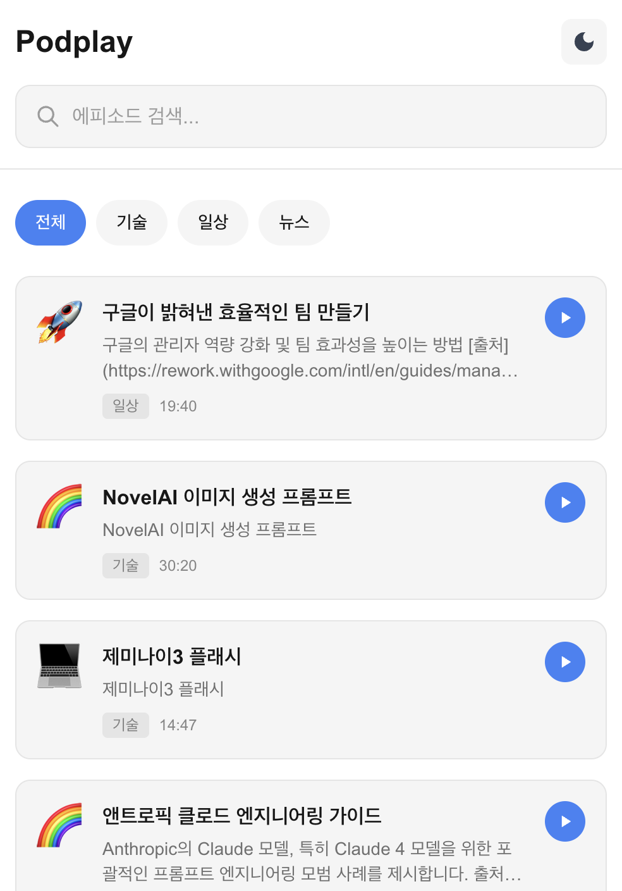
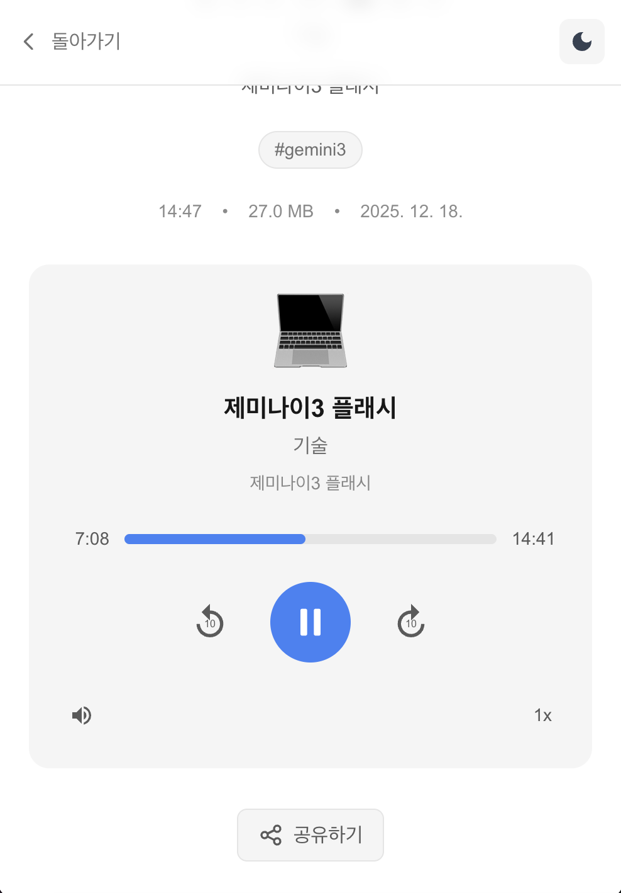
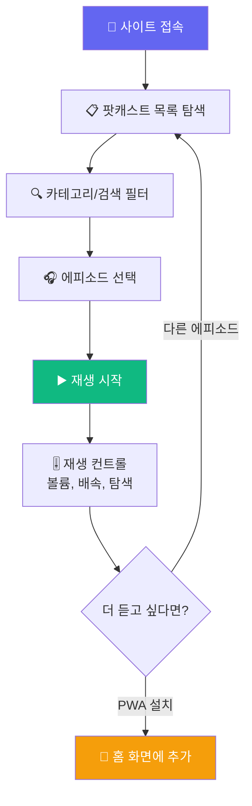
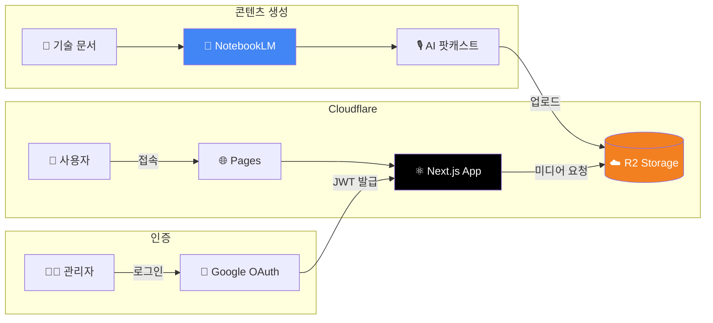
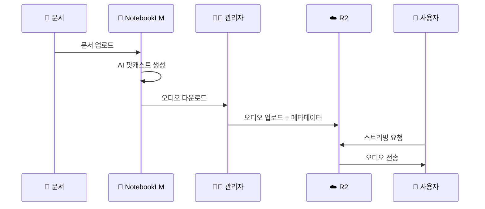
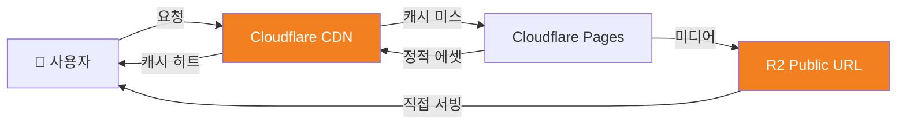

# 🎧 Podplay - AI 팟캐스트 스트리밍

<div align="center">

[](https://podplay.pages.dev/)
[](https://nextjs.org/)
[](https://react.dev/)
[](https://www.typescriptlang.org/)
[](https://tailwindcss.com/)
[](https://pages.cloudflare.com/)

**AI가 읽어주는 기술 문서 팟캐스트** ✨

[🎯 사용 방법](#-사용-방법) | [💻 로컬 실행](#-로컬에서-실행하기) | [🔐 보안 설계](#-보안--트래픽-고려사항)

</div>

---

## 🎯 프로젝트 소개

**Podplay**는 Google NotebookLM으로 생성된 AI 팟캐스트를 스트리밍하는 웹 애플리케이션입니다.

기술 문서, 가이드라인, 논문 등을 AI가 읽어주는 팟캐스트로 변환하여 이동 중에도 쉽게 학습할 수 있습니다! 🎙️

### ✨ 주요 기능

- 🤖 **AI 생성 콘텐츠** - NotebookLM이 생성한 자연스러운 팟캐스트
- 📱 **PWA 지원** - 앱처럼 설치하고 오프라인에서도 사용
- 🎨 **다크/라이트 테마** - 시스템 설정에 따른 자동 테마 전환
- 🔒 **보안 관리자 시스템** - Google OAuth 기반 안전한 콘텐츠 관리
- ⚡ **엣지 배포** - Cloudflare 글로벌 CDN으로 빠른 로딩
- 🎚️ **잠금화면 컨트롤** - Media Session API로 편리한 재생 조작

---

## 📸 스크린샷

<div align="center">

| 메인 화면 | 에피소드 상세 |
|:---:|:---:|
|  |  |

</div>

---

## 🎮 사용 방법



### 📝 단계별 가이드

1. **팟캐스트 탐색하기**
   - 메인 화면에서 카테고리별 필터링 (기술, 일상, 뉴스 등)
   - 검색창에서 키워드로 에피소드 찾기

2. **에피소드 재생**
   - 카드를 클릭하여 상세 페이지 이동
   - ▶️ 버튼으로 즉시 재생 시작
   - 하단 미니 플레이어로 다른 페이지에서도 계속 듣기

3. **재생 컨트롤**
   - 🔊 볼륨 조절
   - ⏩ 배속 조절 (0.5x ~ 2x)
   - 📍 진행 바로 원하는 위치 탐색
   - 잠금화면에서도 컨트롤 가능!

4. **PWA 설치** (선택)
   - 브라우저 메뉴 → "홈 화면에 추가"
   - 앱처럼 독립 실행 가능

---

## 🏗️ 기술 스택

<div align="center">

| 카테고리 | 기술 | 용도 |
|:---:|:---:|:---|
| **프레임워크** | Next.js 16.0.10 | App Router 기반 풀스택 애플리케이션 |
| **라이브러리** | React 19.2.1 | UI 컴포넌트 & 상태 관리 |
| **언어** | TypeScript 5 | 타입 안정성 보장 |
| **스타일링** | Tailwind CSS 4 | 유틸리티 기반 CSS |
| **호스팅** | Cloudflare Pages | 글로벌 엣지 배포 |
| **스토리지** | Cloudflare R2 | S3 호환 미디어 저장소 |
| **AI** | Google NotebookLM | 팟캐스트 오디오 생성 |
| **인증** | Google OAuth 2.0 | 관리자 로그인 |
| **JWT** | Jose | 세션 토큰 관리 |
| **테스트** | Vitest + Testing Library | 단위/컴포넌트 테스트 |

</div>

### 🎨 아키텍처



### 🔄 콘텐츠 플로우



---

## 📁 프로젝트 구조

```
podplay/
├── src/
│   ├── app/                      # Next.js App Router
│   │   ├── api/                  # API 라우트 (Edge Runtime)
│   │   │   ├── auth/             # OAuth & 세션 관리
│   │   │   └── admin/            # 관리자 전용 API
│   │   ├── admin/                # 관리자 페이지
│   │   ├── episode/[id]/         # 에피소드 상세 페이지
│   │   ├── layout.tsx            # 루트 레이아웃
│   │   └── page.tsx              # 메인 페이지
│   ├── components/               # React 컴포넌트
│   │   ├── player/               # 오디오 플레이어
│   │   ├── podcast/              # 팟캐스트 카드/리스트
│   │   └── ui/                   # 공통 UI 컴포넌트
│   ├── lib/                      # 유틸리티 라이브러리
│   │   ├── r2/                   # Cloudflare R2 클라이언트
│   │   ├── auth/                 # Google OAuth 로직
│   │   └── media/                # Media Session API
│   ├── context/                  # React Context
│   │   ├── AuthContext.tsx       # 인증 상태
│   │   └── PlayerContext.tsx     # 플레이어 상태
│   ├── hooks/                    # 커스텀 훅
│   └── types/                    # TypeScript 타입
├── public/                       # 정적 에셋
│   ├── manifest.json             # PWA 매니페스트
│   ├── sw.js                     # Service Worker
│   └── icons/                    # 앱 아이콘
├── __tests__/                    # 테스트 파일
├── wrangler.toml                 # Cloudflare 설정
└── package.json                  # 의존성 관리
```

---

## 🎵 주요 기능 상세

### 1️⃣ 팟캐스트 탐색 & 검색
- 카테고리 필터: 기술, 일상, 뉴스, 교양, 기타
- 실시간 검색: 제목, 설명, 태그에서 검색
- 반응형 그리드 레이아웃

### 2️⃣ 오디오 플레이어
- 🎛️ HTML5 네이티브 오디오 재생
- ⏩ 배속 조절 (0.5x ~ 2x)
- 🔊 볼륨 컨트롤 (설정 기억)
- 📍 프로그레스 바 탐색
- 🔁 미니 플레이어 (전역 재생)
- 📱 Media Session API (잠금화면 컨트롤)

### 3️⃣ PWA (Progressive Web App)
- 📲 홈 화면 설치 가능
- 🔌 오프라인 지원 (Service Worker)
- 🎨 독립 실행 모드 (standalone)
- 🔔 네트워크 상태 인식

### 4️⃣ 관리자 기능 (인증 필요)
- ⬆️ 오디오 파일 업로드 (최대 70MB)
- ✏️ 에피소드 정보 수정
- 🗑️ 에피소드 삭제
- 📊 메타데이터 관리

---

## 💻 로컬에서 실행하기

### 📋 사전 준비물

1. **Node.js** (버전 20 이상)
   - [Node.js 공식 사이트](https://nodejs.org/)에서 LTS 버전 다운로드
   - 설치 확인:
     ```bash
     node --version
     npm --version
     ```

2. **Git** (선택사항)
   - [Git 공식 사이트](https://git-scm.com/)

### 🚀 실행 방법

```bash
# 1️⃣ 프로젝트 다운로드
git clone https://github.com/izowooi/crispy-web.git

# 2️⃣ podplay 폴더로 이동
cd crispy-web/podplay

# 3️⃣ 패키지 설치 (처음 한 번만)
npm install

# 4️⃣ 환경변수 설정
cp .env.example .env.local
# .env.local 파일 편집 (아래 환경변수 섹션 참고)

# 5️⃣ 개발 서버 실행
npm run dev
```

### 🌐 브라우저에서 확인

```
http://localhost:3000
```

### ⚙️ 사용 가능한 명령어

| 명령어 | 설명 |
|-------|------|
| `npm run dev` | 개발 서버 실행 (포트 3000) |
| `npm run build` | 프로덕션 빌드 생성 |
| `npm run start` | 빌드된 앱 실행 |
| `npm run lint` | 코드 검사 |
| `npm run test` | 테스트 실행 |
| `npm run test:coverage` | 테스트 커버리지 리포트 |

### 🔧 환경 변수 설정

```bash
# Cloudflare R2 (필수)
R2_ACCOUNT_ID=your-cloudflare-account-id
R2_ACCESS_KEY_ID=your-r2-access-key
R2_SECRET_ACCESS_KEY=your-r2-secret-key
R2_BUCKET_NAME=your-bucket-name
NEXT_PUBLIC_R2_PUBLIC_URL=https://your-bucket.r2.dev

# Google OAuth (관리자 기능 사용 시 필수)
NEXT_PUBLIC_GOOGLE_CLIENT_ID=your-google-client-id
GOOGLE_CLIENT_SECRET=your-google-client-secret
NEXT_PUBLIC_BASE_URL=http://localhost:3000

# JWT (필수)
JWT_SECRET=your-jwt-secret-generate-with-openssl-rand-base64-32
```

> 💡 **팁**: JWT 시크릿 생성 명령어: `openssl rand -base64 32`

---

## 🚀 배포하기

### Cloudflare Pages 배포

1. [Cloudflare Dashboard](https://dash.cloudflare.com/)에 로그인
2. "Workers & Pages" → "Create Application" → "Pages"
3. GitHub 저장소 연결
4. 설정:
   - **Root directory**: `podplay`
   - **Build command**: `npm run build`
   - **Build output directory**: `.next`
5. 환경 변수 설정 (Settings → Environment Variables)
6. "Save and Deploy" 클릭!

### wrangler.toml 설정

```toml
name = "podplay"
compatibility_date = "2024-01-01"
compatibility_flags = ["nodejs_compat"]

[build]
command = "npm run build"
```

---

## 🔐 보안 & 트래픽 고려사항

### 🛡️ 보안 설계

```
✅ HttpOnly + Secure + SameSite 쿠키
   → XSS/CSRF 공격 방어

✅ JWT HS256 서명 (7일 만료)
   → 안전한 세션 관리

✅ 관리자 이메일 화이트리스트
   → 허가된 사용자만 관리 기능 접근

✅ 파일 업로드 검증
   → audio/* MIME 타입만 허용
   → 70MB 크기 제한

✅ Edge Runtime
   → 서버리스 환경에서 민감 정보 노출 최소화
```

### ⚡ 트래픽 최적화



| 전략 | 설명 |
|-----|------|
| **글로벌 CDN** | Cloudflare의 전 세계 300+ 엣지 서버에서 콘텐츠 제공 |
| **R2 직접 서빙** | 미디어 파일을 Public URL로 직접 제공, 서버 부하 제로 |
| **Service Worker** | Network-first 캐싱으로 빠른 응답 + 오프라인 지원 |
| **Metadata Revalidation** | 60초 간격으로 메타데이터 갱신, 최신 상태 유지 |
| **Edge Runtime** | 사용자와 가장 가까운 엣지에서 API 실행 |

---

## 🎯 향후 개선 사항

- [ ] 🕐 재생 기록 저장 (로컬 스토리지)
- [ ] 📋 플레이리스트 기능
- [ ] 🌍 다국어 지원 (영어, 일본어)
- [ ] 📊 청취 통계 대시보드
- [ ] 🔔 새 에피소드 알림
- [ ] 💬 댓글/리뷰 시스템

---

## 📄 라이선스

이 프로젝트는 MIT 라이선스를 따릅니다.
자유롭게 사용하셔도 됩니다.

---

## 👨‍💻 만든 사람

**izowooi**

궁금한 점이나 제안사항이 있으시면 Issue를 남겨주세요!

---

<div align="center">

**⭐ 이 프로젝트가 마음에 드셨다면 Star를 눌러주세요! ⭐**

Made with ❤️ using Next.js, Cloudflare & NotebookLM

[🎧 지금 듣기](https://podplay.pages.dev/)

</div>
