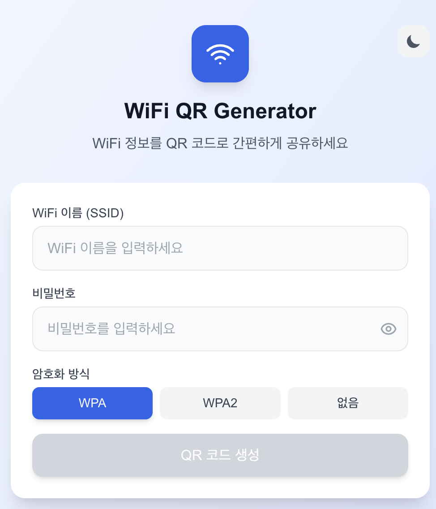
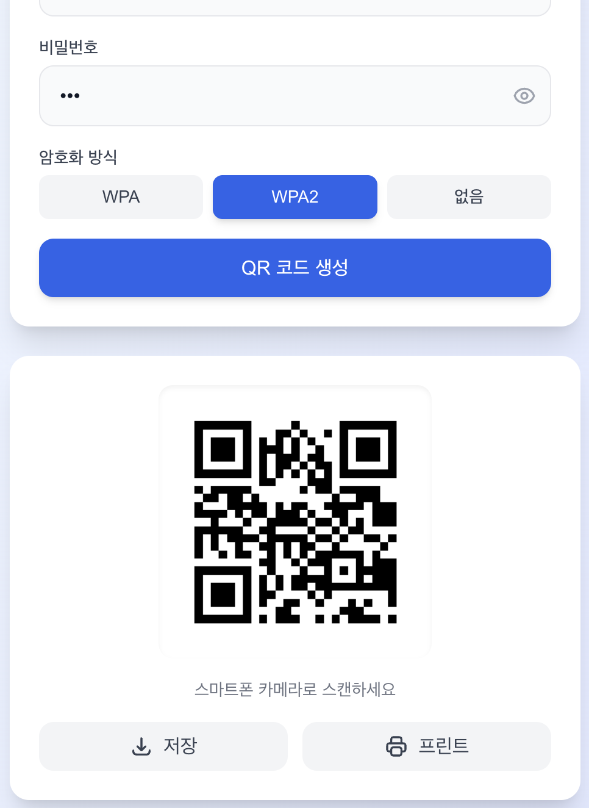
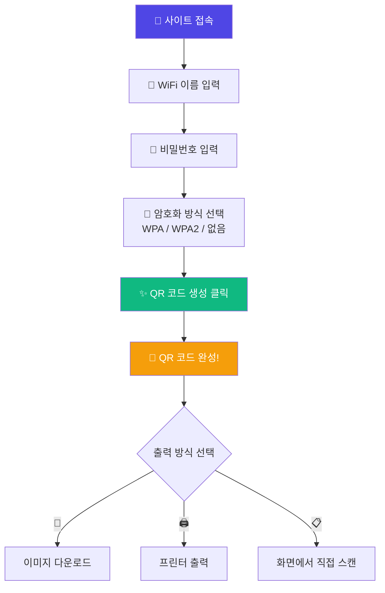
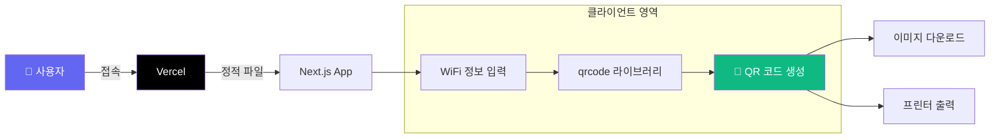

# 📶 WiFi QR Generator

<div align="center">

[](https://qrcodei.vercel.app/)
[](https://nextjs.org/)
[](https://react.dev/)
[](https://www.typescriptlang.org/)
[](https://tailwindcss.com/)

**WiFi 비밀번호를 QR 코드로 간편하게 공유하세요!** ✨

[🎯 사용 방법](#-사용-방법) | [💻 로컬 실행](#-로컬에서-실행하기) | [🚀 배포하기](#-배포하기)

</div>

---

## 🎯 프로젝트 소개

**WiFi QR Generator**는 WiFi 네트워크 정보를 QR 코드로 변환해주는 웹 애플리케이션입니다.

카페, 사무실, 집 등에서 손님에게 WiFi 비밀번호를 일일이 알려주는 대신, QR 코드를 스캔하면 자동으로 연결! 📱

### ✨ 주요 기능

- 🔐 **안전한 클라이언트 처리** - WiFi 비밀번호가 서버로 전송되지 않음
- 📱 **즉시 연결** - QR 코드 스캔만으로 WiFi 자동 연결
- 🖨️ **다양한 출력** - 이미지 다운로드 & 프린터 출력 지원
- 🎨 **모던 UI** - 다크모드 지원, 반응형 디자인
- 🔒 **암호화 지원** - WPA/WPA2/오픈 네트워크 모두 지원
- ⚡ **초고속** - 클라이언트 사이드 렌더링으로 빠른 생성

---

## 📸 스크린샷

<div align="center">

| 메인 화면 | QR 코드 생성 결과 |
|:---:|:---:|
|  |  |

</div>

---

## 🎮 사용 방법



### 📝 단계별 가이드

1. **WiFi 이름 (SSID) 입력**
   - 공유하려는 WiFi 네트워크 이름을 입력합니다
   - 예: `MyHomeWiFi`, `CafeNetwork`

2. **비밀번호 입력**
   - WiFi 비밀번호를 입력합니다
   - 👁️ 버튼으로 비밀번호 표시/숨김 전환 가능

3. **암호화 방식 선택**
   - **WPA/WPA2**: 대부분의 가정용/기업용 WiFi (기본값)
   - **없음**: 비밀번호가 없는 오픈 네트워크

4. **QR 코드 생성**
   - 파란색 "QR 코드 생성" 버튼 클릭
   - 즉시 QR 코드가 생성됩니다!

5. **공유하기**
   - 📥 **저장**: PNG 이미지로 다운로드
   - 🖨️ **프린트**: 바로 인쇄 (자동으로 인쇄 창 열림)

---

## 🏗️ 기술 스택

<div align="center">

| 카테고리 | 기술 | 용도 |
|:---:|:---:|:---|
| **프레임워크** | Next.js 15.5 | App Router 기반 웹 애플리케이션 |
| **라이브러리** | React 19 | UI 컴포넌트 |
| **언어** | TypeScript 5 | 타입 안정성 |
| **스타일링** | Tailwind CSS 4 | 유틸리티 기반 CSS |
| **QR 생성** | qrcode | 클라이언트 QR 이미지 생성 |
| **인증** | Supabase Auth | Google OAuth (관리자용) |
| **배포** | Vercel | 호스팅 & CI/CD |

</div>

### 🎨 아키텍처



### 🔒 보안 설계

```
✅ WiFi 비밀번호는 서버로 전송되지 않음
✅ 모든 QR 생성은 브라우저에서 처리
✅ 데이터베이스 저장 없음
✅ 프라이버시 완벽 보장
```

---

## 📁 프로젝트 구조

```
qrcode/
├── src/
│   ├── app/                      # Next.js App Router
│   │   ├── page.tsx             # 🏠 메인 페이지 (QR 생성)
│   │   ├── layout.tsx           # 루트 레이아웃
│   │   ├── globals.css          # 전역 스타일
│   │   ├── api/
│   │   │   └── health/route.ts  # 헬스 체크 API
│   │   └── test/                # 테스트 페이지들
│   │       ├── page.tsx         # 테스트 대시보드
│   │       ├── auth/page.tsx    # 인증 테스트
│   │       ├── qr/page.tsx      # QR 생성 테스트
│   │       └── print/page.tsx   # 출력 테스트
│   ├── lib/
│   │   ├── qr/
│   │   │   ├── generator.ts     # QR 이미지 생성 로직
│   │   │   └── wifi-format.ts   # WiFi 문자열 포맷
│   │   └── supabase/
│   │       └── client.ts        # Supabase 브라우저 클라이언트
│   └── types/
│       └── index.ts             # TypeScript 타입 정의
├── doc/
│   └── prd.txt                  # 프로젝트 요구사항 문서
├── package.json                 # 프로젝트 설정
└── README.md                    # 📖 이 문서!
```

---

## 💻 로컬에서 실행하기

코드를 잘 모르는 분들도 따라할 수 있도록 자세히 설명합니다!

### 📋 사전 준비물

1. **Node.js** (버전 20 이상)
   - [Node.js 공식 사이트](https://nodejs.org/)에서 LTS 버전 다운로드
   - 설치 확인:
     ```bash
     node --version
     npm --version
     ```

2. **Git** (선택사항)
   - [Git 공식 사이트](https://git-scm.com/)

### 🚀 실행 방법

```bash
# 1️⃣ 프로젝트 다운로드 (모노레포)
git clone https://github.com/izowooi/crispy-web.git

# 2️⃣ qrcode 폴더로 이동
cd crispy-web/qrcode

# 3️⃣ 패키지 설치 (처음 한 번만)
npm install

# 4️⃣ 환경변수 설정 (선택 - 인증 기능 사용 시)
cp .env.example .env.local
# .env.local 파일에 Supabase 정보 입력

# 5️⃣ 개발 서버 실행
npm run dev
```

### 🌐 브라우저에서 확인

```
http://localhost:3000
```

### ⚙️ 사용 가능한 명령어

| 명령어 | 설명 |
|-------|------|
| `npm run dev` | 개발 서버 실행 (포트 3000) |
| `npm run build` | 프로덕션 빌드 생성 |
| `npm run start` | 빌드된 앱 실행 |
| `npm run lint` | 코드 검사 |

---

## 🚀 배포하기

### Vercel 배포 (권장)

1. [Vercel](https://vercel.com)에 GitHub으로 가입
2. "New Project" → GitHub 저장소 연결
3. Root Directory: `qrcode` 입력 (모노레포이므로)
4. 환경변수 설정 (인증 기능 사용 시):
   - `NEXT_PUBLIC_SUPABASE_URL`
   - `NEXT_PUBLIC_SUPABASE_ANON_KEY`
5. "Deploy" 클릭!

[](https://vercel.com/new)

> 📖 자세한 배포 가이드는 [doc/prd.txt](./doc/prd.txt)의 Section 11을 참고하세요.

---

## 📱 WiFi QR 코드 포맷

생성되는 QR 코드는 국제 표준 WiFi 포맷을 따릅니다:

```
WIFI:T:<암호화>;S:<SSID>;P:<비밀번호>;;
```

| 필드 | 설명 | 예시 |
|------|------|------|
| `T` | 암호화 방식 | WPA, nopass |
| `S` | 네트워크 이름 | MyHomeWiFi |
| `P` | 비밀번호 | MyPassword123 |

**예시:**
```
WIFI:T:WPA;S:MyHomeWiFi;P:MyPassword123;;
```

---

## 🔧 환경변수 설정

인증 기능을 사용하려면 `.env.local` 파일을 생성하세요:

```bash
# Supabase (Google 로그인용)
NEXT_PUBLIC_SUPABASE_URL=https://your-project.supabase.co
NEXT_PUBLIC_SUPABASE_ANON_KEY=your-anon-key

# 관리자 이메일 (서버 전용, 선택)
ADMIN_EMAILS=admin@example.com
```

> ⚠️ QR 생성 기능은 환경변수 없이도 정상 작동합니다!

---

## 🎯 테스트 페이지

개발 및 디버깅을 위한 테스트 페이지들:

| 경로 | 기능 |
|------|------|
| `/test` | 📊 테스트 대시보드 |
| `/test/auth` | 🔐 Google 로그인 테스트 |
| `/test/qr` | 📱 QR 생성 테스트 |
| `/test/print` | 🖨️ 출력 기능 테스트 |

---

## 🤝 기여하기

버그 리포트나 기능 제안은 언제나 환영합니다!

1. 이 저장소를 Fork 하세요
2. 새로운 브랜치를 만드세요 (`git checkout -b feature/amazing-feature`)
3. 변경사항을 커밋하세요 (`git commit -m 'Add amazing feature'`)
4. 브랜치에 Push 하세요 (`git push origin feature/amazing-feature`)
5. Pull Request를 열어주세요

---

## 📄 라이선스

이 프로젝트는 MIT 라이선스를 따릅니다.
자유롭게 사용하셔도 됩니다.

---

## 👨‍💻 만든 사람

**izowooi**

궁금한 점이나 제안사항이 있으시면 Issue를 남겨주세요!

---

<div align="center">

**⭐ 이 프로젝트가 마음에 드셨다면 Star를 눌러주세요! ⭐**

Made with ❤️ using Next.js & TypeScript

[📶 지금 사용하기](https://qrcodei.vercel.app/)

</div>
