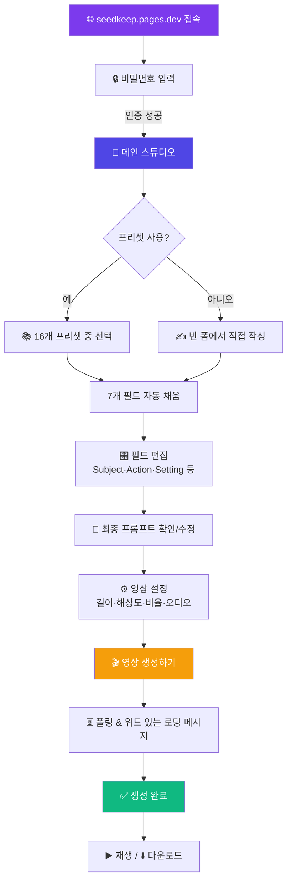
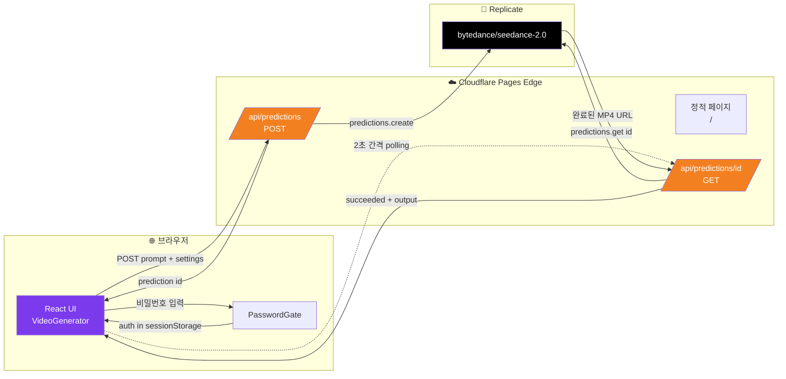

# 🎬 Seedance Studio - AI 비디오 생성 스튜디오

<div align="center">

> 🇺🇸 [English README](./README_EN.md)

[](https://seedkeep.pages.dev)
[](https://nextjs.org)
[](https://react.dev)
[](https://tailwindcss.com)
[](https://pages.cloudflare.com)
[](https://replicate.com/bytedance/seedance-2.0)

**프롬프트 한 줄로 만드는 시네마틱 AI 영상 — Seedance 2.0의 모든 기능을 친근한 한국어 UI로** ✨

[🎯 주요 기능](#-프로젝트-소개) | [💻 로컬 실행](#-로컬에서-실행하기) | [🚀 배포하기](#-배포하기)

</div>

---

## 🎯 프로젝트 소개

**Seedance Studio**는 ByteDance의 최신 영상 생성 모델 **Seedance 2.0**을 Replicate API로 호출해, 누구나 쉽게 AI 영상을 만들 수 있게 해주는 웹 스튜디오입니다. 프롬프트를 처음 써보는 사람도 부담없이 시작할 수 있도록 **16개의 프리셋**을 제공하고, 각 프리셋은 로드한 뒤 **자유롭게 편집**할 수 있습니다. 등장인물·행동·배경·카메라 샷·조명·분위기·스타일 7개 필드를 구조화해 최종 프롬프트를 자동으로 조립하며, 필요하면 텍스트 에디터에서 직접 고쳐 쓸 수도 있습니다.

### ✨ 주요 기능

- 🎞️ **Seedance 2.0 비디오 생성** — 5/7/8/10초, 480p/720p, 7종 화면 비율, 오디오 생성 옵션
- 🎨 **16개 프리셋** — 마블 영웅 대전, 벚꽃 만개, 사이버펑크 추격전 등 바로 쓰는 시나리오
- ✏️ **프리셋 로드 후 편집** — 선택한 프리셋을 폼에 불러와 원하는 요소만 바꿔 재생성
- 🎛️ **가이드 프롬프트 빌더** — 7개 필드(Subject / Action / Setting / Camera / Light / Mood / Style) 드롭다운 + 직접 입력 combo
- 📝 **최종 프롬프트 수동 편집** — 자동 조립된 프롬프트를 텍스트 에디터에서 직접 수정 가능
- 🔒 **비밀번호 게이트** — `NEXT_PUBLIC_ACCESS_PASSWORD`로 서비스 접근 제한
- 🌙 **라이트/다크 모드** — 시스템 선호도 반영 + 수동 토글, `localStorage` 유지
- 💬 **30종 로딩 메시지** — 영상 생성 대기 중 순환하는 위트 있는 문구
- 📱 **반응형 레이아웃** — 데스크탑 좌측 사이드바 / 모바일 하단 드로어

---

## 📸 스크린샷

<!-- TODO: docs/screenshots/ 에 스크린샷 추가 후 테이블로 교체 -->

| 프리셋 선택 & 편집 | 영상 생성 진행 중 | 결과 미리보기 |
|---------|------------|------------|
| 좌측 사이드바에서 프리셋 로드 | 30종 메시지가 순환 | 생성된 영상 재생 + 다운로드 |

---

## 🎮 사용 방법



### 📝 단계별 가이드

| 단계 | 설명 |
|------|------|
| 1️⃣ | **접속 & 인증** — 비밀번호 게이트를 통과하면 `sessionStorage`에 인증이 저장돼 재방문이 편해집니다. |
| 2️⃣ | **프리셋 로드** — 데스크탑은 좌측 사이드바, 모바일은 상단 "프리셋" 버튼을 누르면 하단 드로어가 열립니다. |
| 3️⃣ | **필드 편집** — 드롭다운에서 고르거나 `✏️ 직접 입력`을 선택해 자유 텍스트 입력. |
| 4️⃣ | **최종 프롬프트 확인** — 자동 조립된 프롬프트는 텍스트 에디터에서 직접 수정할 수 있어, 필드를 거치지 않고도 미세 조정 가능. |
| 5️⃣ | **영상 설정** — 길이(5/7/8/10초), 해상도(720p/480p), 비율(16:9/9:16/1:1/4:3/3:4/21:9/adaptive), 오디오 ON/OFF. |
| 6️⃣ | **생성 & 대기** — 클라이언트가 2초 간격으로 폴링. 로딩 중에는 30개 위트 메시지가 순환합니다. |
| 7️⃣ | **결과** — 영상 URL은 `<video>` 태그로 재생되며, 링크 복사/다운로드 모두 지원. |

---

## 🏗️ 기술 스택

<div align="center">

| 카테고리 | 기술 | 용도 |
|---------|------|------|
| **Framework** | Next.js 15.5.2 (App Router) | SSR + Edge API Routes |
| **UI** | React 19.2 + Tailwind CSS v4 | 반응형 UI, CSS variables 다크 테마 |
| **AI 모델** | Seedance 2.0 (ByteDance) via Replicate | 텍스트-투-비디오 생성 |
| **런타임** | Cloudflare Workers (Edge) | `runtime = "edge"` API 라우트 |
| **배포** | Cloudflare Pages + `@cloudflare/next-on-pages@1` | 글로벌 엣지 배포 |
| **SDK** | `replicate@^1.4` | Replicate API 클라이언트 |
| **언어** | TypeScript 5 | 엄격 타입 체크 |

</div>

### 🎨 아키텍처



---

## 📁 프로젝트 구조

```
seedance-studio/
├── 📄 next.config.ts               # Next.js 설정 (replicate.delivery 이미지 허용)
├── 🔧 wrangler.jsonc               # Cloudflare Pages 설정 (.vercel/output/static)
├── 📦 package.json                 # Next 15.5.2 + @cloudflare/next-on-pages@1
├── 📁 src/
│   ├── 📁 app/
│   │   ├── 🎨 globals.css          # Tailwind v4 + 라이트/다크 CSS 변수
│   │   ├── 📐 layout.tsx           # 루트 레이아웃 + 테마 초기화 스크립트
│   │   ├── 🏠 page.tsx             # PasswordGate + VideoGenerator 호스트
│   │   ├── 🖼️ opengraph-image.png # OG 이미지 (1200×630)
│   │   └── 📁 api/predictions/
│   │       ├── 📍 route.ts         # POST: 프리딕션 생성 (edge runtime)
│   │       └── 📁 [id]/
│   │           └── 📍 route.ts     # GET: 프리딕션 상태 조회
│   ├── 📁 components/
│   │   ├── 🎬 VideoGenerator.tsx   # 메인 화면: 사이드바 + 폼 + 결과
│   │   ├── 🔒 PasswordGate.tsx     # 비밀번호 입력 게이트
│   │   ├── 🎨 ThemeToggle.tsx      # ☀️/🌙 테마 토글
│   │   ├── 📚 PresetGrid.tsx       # 사이드바/드로어 프리셋 리스트
│   │   └── 🎛️ GuidedPromptBuilder.tsx # 7필드 ComboSelect 빌더
│   └── 📁 lib/
│       ├── 🎞️ replicate.ts         # lazy-init Replicate 클라이언트 (Workers 호환)
│       ├── 🧩 types.ts             # VideoSettings, Preset, Prediction 타입
│       ├── 📚 presets.ts           # 16개 프리셋 데이터
│       └── 🔤 prompt.ts            # buildPrompt: 7필드 → 단일 문자열
└── 📁 docs/
    └── 📄 llms-seedance.txt        # Seedance 2.0 모델 레퍼런스
```

---

## 💻 로컬에서 실행하기

### 📋 사전 준비물

- **Node.js** 20 이상
- **npm** (프로젝트 기본 패키저)
- **Replicate API 토큰** — [replicate.com/account/api-tokens](https://replicate.com/account/api-tokens)
- (선택) **Cloudflare Wrangler 계정** — 배포 시 필요

### 🔧 환경 변수 설정

`.env.local` 파일을 프로젝트 루트에 생성:

```bash
# Replicate API 토큰 (서버 사이드 전용)
REPLICATE_API_TOKEN=r8_xxxxxxxxxxxxxxxxxxxxxxxxxxxxxxxx

# 서비스 접근 비밀번호 (클라이언트 노출 — 민감 정보 아님)
NEXT_PUBLIC_ACCESS_PASSWORD=your_password_here
```

> ⚠️ `REPLICATE_API_TOKEN`은 반드시 **서버 사이드에서만** 사용되며, 클라이언트 번들에는 포함되지 않습니다. Cloudflare Pages 대시보드에서는 동일한 키로 환경변수를 등록하세요.

### 🚀 실행 방법

```bash
git clone https://github.com/izowooi/crispy-web.git
cd crispy-web/seedance-studio
npm install
npm run dev
# → http://localhost:3000
```

### ⚙️ 사용 가능한 명령어

| 명령어 | 설명 |
|--------|------|
| `npm run dev` | Next.js 개발 서버 (HMR) |
| `npm run build` | 프로덕션 빌드 (`.next/`) |
| `npm run start` | 프로덕션 서버 로컬 실행 |
| `npm run pages:build` | Cloudflare Pages용 Edge 번들 빌드 (`.vercel/output/static/`) |
| `npm run preview` | 빌드 후 `wrangler pages dev`로 엣지 환경 미리보기 |
| `npm run deploy` | Cloudflare Pages로 배포 (wrangler 필요) |

---

## 🚀 배포하기

### Cloudflare Pages

이 프로젝트는 `@cloudflare/next-on-pages@1` 어댑터를 사용해 **Cloudflare Workers Edge 런타임**에서 동작합니다.

#### 대시보드 설정 (Git 연동 기준)

| 항목 | 값 |
|------|-----|
| Build command | `npx @cloudflare/next-on-pages@1` |
| Build output directory | `.vercel/output/static` |
| Root directory | `seedance-studio` (모노레포인 경우) |
| Node version | `20` 이상 |

#### 환경 변수 (Production)

| 키 | 값 | 노출 범위 |
|----|-----|-----------|
| `REPLICATE_API_TOKEN` | Replicate 토큰 | 서버 전용 |
| `NEXT_PUBLIC_ACCESS_PASSWORD` | 서비스 비밀번호 | 클라이언트 (난독화 아님) |

#### 수동 배포 (CLI)

```bash
npm run deploy
```

> ℹ️ Wrangler 로그인(`npx wrangler login`)이 필요하며, 프로젝트명(`seedance-studio`)이 이미 있거나 생성 가능해야 합니다.

---

## 🤖 AI 모델 — Seedance 2.0

[**bytedance/seedance-2.0**](https://replicate.com/bytedance/seedance-2.0)은 ByteDance의 텍스트-투-비디오 생성 모델입니다.

| 파라미터 | 값 |
|----------|-----|
| `prompt` | 영상 설명 (영문 권장) |
| `duration` | `5`, `7`, `8`, `10` (초) — `-1`(auto) 허용 |
| `resolution` | `720p`, `480p` |
| `aspect_ratio` | `16:9`, `9:16`, `1:1`, `4:3`, `3:4`, `21:9`, `adaptive` |
| `generate_audio` | `true` / `false` |

서버에서 `predictions.create`로 요청을 보내면 폴링 가능한 ID가 반환되고, 클라이언트가 `/api/predictions/[id]`로 2초 간격 폴링하여 `succeeded` 상태가 되면 MP4 URL을 렌더링합니다.

---

## 🔒 보안 & 프라이버시

- **API 토큰**: `REPLICATE_API_TOKEN`은 Edge 런타임 서버 사이드에서만 `process.env`로 접근. `server-only` 패키지로 클라이언트 번들 유입 차단.
- **접근 제어**: `NEXT_PUBLIC_ACCESS_PASSWORD`는 클라이언트 측 가벼운 게이트(스크린 보호) 목적. 민감 데이터를 다루는 용도가 아닙니다. 실제 인증이 필요하다면 서버측 검증으로 교체하세요.
- **Workers 런타임 주의점**: Cloudflare Workers는 `RequestInit.cache` 필드를 지원하지 않으므로, 커스텀 fetch에서는 해당 필드를 반드시 제거합니다 (`src/lib/replicate.ts` 참고).

---

## 🎯 향후 개선 사항

- [ ] 생성 이력 로컬 저장 (최근 10개 재생 가능)
- [ ] 이미지-투-비디오 (Seedance img2vid 모델 지원)
- [ ] 프롬프트 번역 도우미 (한국어 → 영어 자동)
- [ ] OG 이미지 동적 생성 (Open Graph API)
- [ ] 진행률 세분화 (Replicate status 메시지 파싱)
- [ ] 실제 인증 서버 도입 (비밀번호 게이트 대체)

---

## 🤝 기여하기

1. 이 저장소를 Fork 합니다.
2. 기능 브랜치 생성: `git checkout -b feat/your-feature`
3. 변경 사항 커밋: `git commit -m "feat: add your feature"`
4. 브랜치 푸시: `git push origin feat/your-feature`
5. Pull Request 생성.

---

## 📄 라이선스

MIT License.

---

## 👨‍💻 만든 사람

**izowooi**

버그나 제안은 [Issue](https://github.com/izowooi/crispy-web/issues)로 남겨주세요.

---

<div align="center">

**⭐ 이 프로젝트가 마음에 드셨다면 Star를 눌러주세요! ⭐**

Made with ❤️ using Next.js · Cloudflare Pages · Seedance 2.0

[🎬 지금 영상 만들러 가기](https://seedkeep.pages.dev)

</div>
