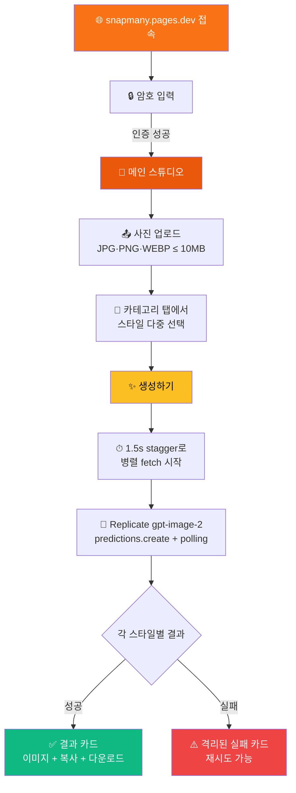
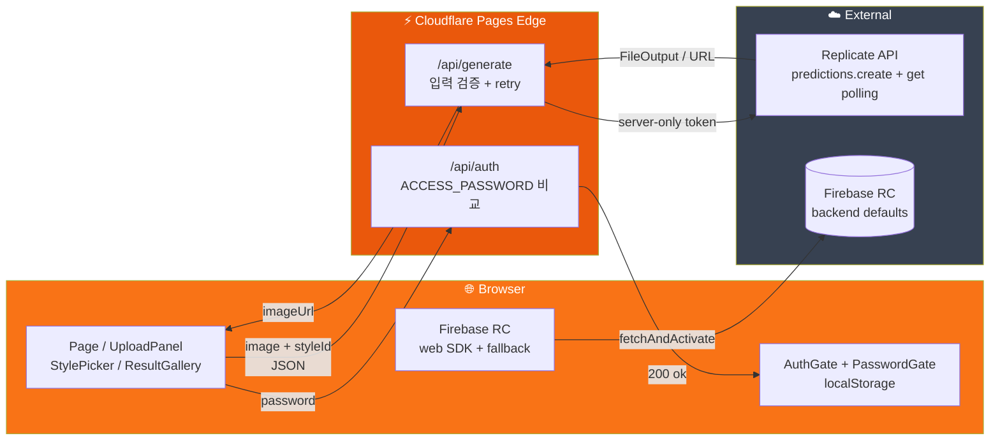

# 📸 SnapMany - AI 다중 스타일 사진 변환 스튜디오

<div align="center">

> 🇺🇸 [English README](./README_EN.md)

[](https://snapmany.pages.dev)
[](https://nextjs.org)
[](https://react.dev)
[](https://tailwindcss.com)
[](https://pages.cloudflare.com)
[](https://firebase.google.com/docs/remote-config)
[](https://replicate.com/openai/gpt-image-2)
[](https://vitest.dev)

**한 장의 사진으로 7카테고리 × 약 15가지 스타일을 한 번에 비교 — 어떤 내가 가장 어울릴까?** ✨

[🎯 주요 기능](#-프로젝트-소개) | [💻 로컬 실행](#-로컬에서-실행하기) | [🚀 배포하기](#-배포하기)

</div>

---

## 🎯 프로젝트 소개

**SnapMany**는 OpenAI의 최신 이미지 모델 **GPT Image 2**를 Replicate API로 호출해, 한 장의 사진을 다양한 스타일로 동시 변환하는 웹 스튜디오입니다. 증명사진·일러스트·캐릭터·애니메이션·흑백·뷰티·예술 7개 카테고리에서 마음에 드는 스타일을 다중 선택하면, 클라이언트가 burst-rate를 고려한 **stagger 호출**로 분산 요청하고 서버 프록시가 Replicate 폴링까지 안전하게 처리합니다. 결과는 한눈에 비교할 수 있는 갤러리로 표시되고, 실패한 스타일은 격리되어 성공한 다른 카드에 영향을 주지 않습니다.

### ✨ 주요 기능

- 🎨 **7카테고리 × ~15 스타일 프리셋** — 증명사진 / 일러스트·페인팅 / 캐릭터·피규어 / 애니메이션·만화 / 흑백·조각 / 글래머·뷰티 / 예술·실험
- 🚀 **다중 동시 생성** — 선택한 모든 스타일을 1.5초 간격 stagger로 병렬 요청, 결과는 한 번에 비교
- 🔒 **암호 게이트** — `ACCESS_PASSWORD` 환경변수로 진입 제어, `localStorage`로 재방문 시 자동 통과
- 🛡️ **얇은 서버 프록시** — Replicate 토큰은 edge runtime에서만 사용. 클라이언트에는 절대 노출 X
- ⚙️ **Firebase Remote Config** — 스타일 토글·점검 모드·UI 카피·업로드 한도를 재배포 없이 즉시 변경
- 🌗 **해/달 SVG 다크모드 토글** — OS·폰트 무관, 시인성 좋은 인라인 아이콘
- 📱 **모바일 친화** — sticky 하단 생성 버튼, 카테고리 탭, 큰 터치 영역
- ♻️ **카드별 재시도** — 실패한 스타일만 1클릭 재생성 (전체 재실행 불필요)
- 📥 **다운로드 / 클립보드 복사** — Blob fetch로 CORS 우회, ClipboardItem 지원
- 🧪 **TDD 147 테스트** — 풀 파이프라인 (typecheck / lint / test / build / pages:build) 게이트로 깨진 상태 커밋 차단

---

## 📸 스크린샷

<!-- TODO: docs/screenshots/ 에 실제 스크린샷 추가 후 테이블 교체 -->

| 1. 사진 업로드 | 2. 스타일 선택 | 3. 결과 갤러리 |
|---|---|---|
| 드래그&드롭 + EXIF 자동 제거 | 7카테고리 탭, 다중 선택 | 카드별 다운로드 / 복사 / 재시도 |

---

## 🎮 사용 방법



### 📝 단계별 가이드

| 단계 | 설명 |
|------|------|
| 1️⃣ | **접속 & 인증** — 첫 진입 시 암호 입력. 성공하면 `localStorage["snapmany-auth"]="1"`로 기억해 재방문 시 자동 통과 |
| 2️⃣ | **사진 업로드** — 드래그&드롭 또는 클릭. 클라이언트에서 EXIF 제거 + canvas 재인코딩으로 base64 dataURL 생성 |
| 3️⃣ | **스타일 선택** — 7개 카테고리 탭 중 하나를 선택 후 그리드에서 스타일 카드 클릭 (다중 선택 가능). "현재 탭 전체 선택" / "해제" 보조 버튼 제공 |
| 4️⃣ | **생성** — "생성하기" 버튼 (모바일은 sticky 하단). N개 스타일을 1.5초 간격으로 fetch 시작 → 응답은 병렬로 도착 |
| 5️⃣ | **결과 확인** — 결과 카드에 호버하면 다운로드/복사 버튼 표시. 실패한 카드는 "다시 생성" 버튼으로 단일 재시도 |
| 6️⃣ | **다운로드 / 복사** — 다운로드는 Blob fetch + `<a download>`, 복사는 `ClipboardItem`으로 OS 클립보드에 이미지 자체 저장 |

---

## 🏗️ 기술 스택

<div align="center">

| 카테고리 | 기술 | 용도 |
|---|---|---|
| Framework | **Next.js 15.5.2** (App Router) | 정적 페이지 + edge route handler |
| Language | **TypeScript 5** strict | paths alias `@/*` → `./src/*` |
| Styling | **Tailwind CSS v4** (`@import "tailwindcss"`) | utility-first, 다크모드 `class` 토글 |
| State | **React 19 useReducer** | 페이지 1개·갤러리 1개 규모, Zustand 불필요 |
| AI Backend | **Replicate SDK 1.4** / `openai/gpt-image-2` | `predictions.create` + polling (edge 친화) |
| Runtime Config | **Firebase Remote Config** (web SDK) | 스타일 enable, 점검 모드, UI 카피, 한도 |
| Auth | **PasswordGate** + `/api/auth` edge route | `ACCESS_PASSWORD` 비교, localStorage 캐시 |
| Test | **Vitest 2** + RTL + jsdom + Playwright MCP | **147 케이스**, smoke E2E 1회 |
| Build | `@cloudflare/next-on-pages` | `.vercel/output/static/` → Cloudflare Pages |
| Deploy | **Cloudflare Pages** (GitHub 연동) | `git push` → 자동 빌드 → edge 배포 |

</div>

### 🎨 아키텍처



핵심 설계 결정:
- **Replicate 호출은 `client.run()` 대신 `predictions.create` + `predictions.get` polling** — Cloudflare Workers edge runtime의 outbound stream lifecycle과 호환 (`client.run()`은 첫 production 배포에서 즉시 reject 사례 확인됨)
- **클라이언트 stagger 1.5초** — Replicate의 burst-1 rate-limit과 양립 (credit < $5 환경에서 동시 N 호출 시 안전)
- **wrapper 내부 429 retry_after-aware 재시도 1회** — 다른 프로젝트의 요청과 겹쳐도 자동 회복
- **clientside vs serverside 분리** — `src/config/styles.ts`는 메타데이터만 (id/label/category/thumb/description), `src/lib/stylePrompts.ts`는 서버 전용 prompt (클라이언트 번들에 prompt 누설 방지)

---

## 📁 프로젝트 구조

```
snapmany/
├── 📄 README.md / README_EN.md            # 본 문서
├── 📄 CLAUDE.md                           # 하네스 포인터 + 변경 이력
├── 📁 .claude/
│   ├── 📁 agents/                         # architect / frontend / backend / qa
│   └── 📁 skills/                         # snapmany-builder 외 5개
├── 📁 _workspace/                         # 빌드 의사결정·QA 산출물 (감사 추적)
│   ├── 00_architect_decisions.md
│   ├── 02_qa_gate.md / 03_R*_qa.md / 04_qa_integration.md
│   ├── 05_smoke.md / 06_cloudflare_502_fix.md / 07_429_rate_limit_fix.md
│   └── 05_smoke_screenshots/, 04_qa_screenshots/
├── 📁 docs/
│   ├── prd.md                             # PRD 원본 (스타일 트리·MVP 스코프 포함)
│   └── llms-gpt-image2.txt                # Replicate 모델 명세
└── 📁 src/
    ├── 📁 app/
    │   ├── layout.tsx                     # 다크모드 init, AuthGate, footer
    │   ├── page.tsx                       # 메인 — useReducer + stagger 병렬 fetch
    │   ├── globals.css                    # @import "tailwindcss"; 토큰 정의
    │   └── 📁 api/
    │       ├── auth/route.ts              # POST — ACCESS_PASSWORD 비교
    │       └── generate/route.ts          # POST — 검증 + wrapper 호출 + 502/504/500 분기
    ├── 📁 components/
    │   ├── AuthGate.tsx / PasswordGate.tsx
    │   ├── UploadPanel.tsx / uploadProcessor.ts (EXIF 제거)
    │   ├── StylePicker.tsx                # 7카테고리 탭 + 다중 선택
    │   ├── GenerationCard.tsx / ResultGallery.tsx
    │   └── ThemeToggle.tsx                # 해/달 SVG
    ├── 📁 config/
    │   └── styles.ts                      # 클라이언트 메타데이터 (15개)
    ├── 📁 lib/
    │   ├── replicate.ts                   # SDK wrapper — predictions.create + polling + 429 retry
    │   ├── stylePrompts.ts                # 서버 전용 prompt (클라이언트 import 금지)
    │   ├── firebase.ts                    # Firebase app init
    │   └── remoteConfig.ts                # RC wrapper + DEFAULT_CONFIG fallback
    └── 📁 __tests__/                      # 147 케이스 (Vitest)
```

---

## 💻 로컬에서 실행하기

### 📋 사전 준비물

- **Node.js 22.x** (또는 npm 호환 LTS)
- **Replicate API Token** — https://replicate.com/account/api-tokens
- **Firebase 프로젝트** — `crispy-web` Firebase 프로젝트에 `snapmany` web app 등록 (또는 자체 Firebase 프로젝트)
- **(선택) Playwright MCP** — E2E smoke를 자동으로 돌리고 싶을 때

### 🔧 환경 변수 설정

```bash
cp .env.example .env.local
```

`.env.local`에 다음 값을 채웁니다 (모두 필수):

```bash
# Replicate (server-only — NEXT_PUBLIC_* 절대 금지)
REPLICATE_API_TOKEN=<your-replicate-token>

# Firebase Web SDK (client-exposed)
NEXT_PUBLIC_FIREBASE_API_KEY=<your-firebase-api-key>
NEXT_PUBLIC_FIREBASE_AUTH_DOMAIN=<project>.firebaseapp.com
NEXT_PUBLIC_FIREBASE_PROJECT_ID=<your-project-id>
NEXT_PUBLIC_FIREBASE_APP_ID=<your-firebase-app-id>

# 진입 암호 (server-only — NEXT_PUBLIC_* 절대 금지)
ACCESS_PASSWORD=<your-password>

# (선택) 환경 분기
NEXT_PUBLIC_APP_ENV=development
```

> 🔒 `.env.local`은 `.gitignore`로 보호됩니다. 절대 커밋하지 마세요. `verify-and-commit` 절차가 매 커밋마다 시크릿 grep으로 차단합니다.

### 🚀 실행 방법

```bash
git clone https://github.com/izowooi/crispy-web.git
cd crispy-web/snapmany
npm install
npm run dev
# → http://localhost:3000
```

### ⚙️ 사용 가능한 명령어

| 명령어 | 설명 |
|---|---|
| `npm run dev` | 개발 서버 (HMR) |
| `npm run typecheck` | `tsc --noEmit` |
| `npm run lint` | ESLint (Next.js 권장 규칙 + FlatCompat) |
| `npm run test` | Vitest 1회 실행 (147 케이스) |
| `npm run test:watch` | Vitest watch 모드 |
| `npm run build` | Next 프로덕션 빌드 |
| `npm run pages:build` | `@cloudflare/next-on-pages` → `.vercel/output/static/` 생성 |
| `npm run preview` | `pages:build` 후 `wrangler pages dev`로 로컬 미리보기 |

---

## 🚀 배포하기

### Cloudflare Pages (자동, 권장)

본 프로젝트는 GitHub 연동을 통해 **`git push`만으로 자동 배포**됩니다.

1. Cloudflare Dashboard → **Workers & Pages** → Create application → **Pages** → **Connect to Git**
2. 저장소 `izowooi/crispy-web` 선택, 루트 디렉터리 `snapmany`, build command `npm run pages:build`, output `.vercel/output/static`
3. **Environment variables**에 5개 키 주입 (Production + Preview 양쪽):
   - `REPLICATE_API_TOKEN` (Encrypted 권장)
   - `NEXT_PUBLIC_FIREBASE_API_KEY` / `_AUTH_DOMAIN` / `_PROJECT_ID` / `_APP_ID`
   - `ACCESS_PASSWORD` (Encrypted 권장)
4. 커밋·푸시하면 자동 빌드 → `*.pages.dev` 도메인에 배포

### Cloudflare Pages (수동 업로드 대체)

GitHub 연동 없이 한 번씩 직접 올리고 싶을 때:

```bash
npm run pages:build
# → .vercel/output/static/ 폴더 전체를 Dashboard > Upload assets로 업로드
```

같은 위치에 환경변수 5개를 주입하고 Redeploy.

> 자동 배포에는 `CLOUDFLARE_ACCOUNT_ID` / `CLOUDFLARE_API_TOKEN`이 필요 없습니다 (Cloudflare가 GitHub OAuth로 처리).

---

## 🤖 AI 모델 — OpenAI GPT Image 2 via Replicate

| 항목 | 값 |
|---|---|
| 모델 ID | `openai/gpt-image-2` |
| 호출 패턴 | `client.predictions.create` + `client.predictions.get` polling |
| 입력 | `{ prompt, input_images: [base64 dataURL], aspect_ratio, output_format: "webp", output_compression: 90, quality: "auto", moderation: "auto", number_of_images: 1 }` |
| Timeout | 120s (1회 재시도 안 함 — 429만 retry_after 따라 1회 재시도) |
| 비용 | per-image 약 $0.05 (Replicate 청구, 2026년 초 기준) |
| 문서 | https://replicate.com/openai/gpt-image-2 |

> ⚠️ Replicate 계정 credit이 $5 미만이면 **burst=1, 6 RPM**으로 강하게 throttle. snapmany는 클라이언트 stagger + wrapper retry로 자동 회복하지만, **다중 동시 호출이 잦다면 credit 충전 권장**.

---

## 🔐 보안 원칙

- **토큰은 서버에서만** — `REPLICATE_API_TOKEN`은 `src/app/api/**` + `src/lib/replicate.ts`에서만 등장. `NEXT_PUBLIC_REPLICATE_*` 어떤 변형도 금지.
- **`use client` 파일에서 Replicate SDK import 금지** — qa grep으로 매 커밋마다 검증
- **서버측 입력 재검증** — mime (jpg/png/webp), 크기 (≤ 10MB), styleId (서버 화이트리스트)
- **`stylePrompts.ts` 분리** — 서버 전용 prompt를 클라이언트 번들에 노출하지 않음
- **사용자 사진은 어디에도 저장하지 않음** — Replicate API 통신용으로만 사용, 결과 이미지도 휘발성 (새로고침 시 사라짐)
- **`.env.local` 커밋 차단** — `.gitignore` + 매 커밋 grep (`r8_…`, `AIza…`, `sk_…` 패턴) + 명시적 staging

---

## 🎯 향후 개선 사항 (v1.1+)

- [ ] 스타일 50개로 확장 (RC `show_beta_styles` 토글로 점진적 공개)
- [ ] 검색·필터 ("증명사진", "애니메" 키워드)
- [ ] 즐겨찾기 (localStorage) + 즐겨찾기만 모드
- [ ] 랜덤 셔플 ("🎲 5개 무작위")
- [ ] 비교 슬라이더 (before/after)
- [ ] 콜라주 다운로드 (성공한 N개를 그리드 PNG로 합성)
- [ ] "오늘의 추천" 큐레이션 (RC + 주간 갱신)
- [ ] 강한 인증 (현재 PasswordGate는 가벼운 차단 — 필요 시 OAuth/SSO)

---

## 🤝 기여하기

1. Fork → 새 브랜치 (`git checkout -b feat/your-feature`)
2. 변경 후 `npm run typecheck && npm run lint && npm run test && npm run build`가 모두 0 에러여야 합니다
3. `git commit -m "snapmany: 변경 의도 한 줄"` 후 `git push`
4. Pull Request 작성

> 본 모노레포는 TDD를 강제합니다. 새 기능은 RED 테스트 → GREEN 구현 → REFACTOR(풀 파이프라인) 순서를 따라주세요. `.claude/skills/tdd-workflow/SKILL.md` 참조.

---

## 📄 라이선스

MIT License

---

## 👨‍💻 만든 사람

**izowooi**

이슈나 제안은 [GitHub Issues](https://github.com/izowooi/crispy-web/issues)에서 받습니다.

---

<div align="center">

**⭐ 이 프로젝트가 마음에 드셨다면 Star를 눌러주세요! ⭐**

Made with ❤️ using Next.js + Replicate + Cloudflare Pages

[📸 지금 사용하기](https://snapmany.pages.dev)

</div>
