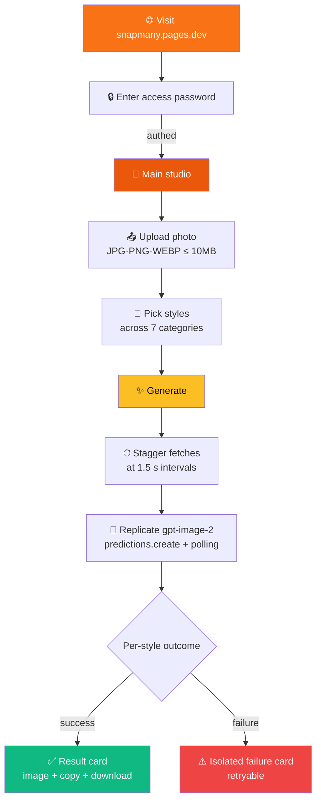
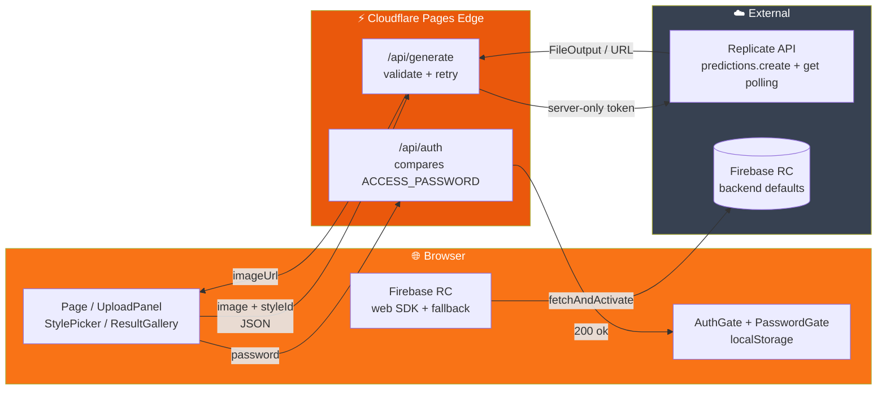

# 📸 SnapMany - AI Multi-Style Photo Transformation Studio

<div align="center">

> 🇰🇷 [한국어 README](./README.md)

[](https://snapmany.pages.dev)
[](https://nextjs.org)
[](https://react.dev)
[](https://tailwindcss.com)
[](https://pages.cloudflare.com)
[](https://firebase.google.com/docs/remote-config)
[](https://replicate.com/openai/gpt-image-2)
[](https://vitest.dev)

**One photo, 7 categories × ~15 styles, all generated and compared at once — discover the version of you that fits best.** ✨

[🎯 Features](#-overview) | [💻 Run Locally](#-run-locally) | [🚀 Deploy](#-deploy)

</div>

---

## 🎯 Overview

**SnapMany** is a web studio that calls OpenAI's latest image model **GPT Image 2** through the Replicate API to transform a single photo into many styles concurrently. Pick styles from seven categories — ID photo, illustration, character/figure, animation, black-and-white, beauty, art — and the client dispatches them with a **1.5 s stagger** to play nicely with Replicate's burst-rate limits, while the server proxy safely handles prediction polling. Results land in a side-by-side gallery; failed styles are isolated so successful cards keep their state.

### ✨ Features

- 🎨 **7 categories × ~15 style presets** — ID photo / Illustration & painting / Character & figure / Animation & manga / B&W & sculpture / Beauty / Experimental
- 🚀 **Concurrent multi-style generation** — All selected styles fire in parallel with a 1.5 s stagger; compare results in one glance
- 🔒 **Password gate** — `ACCESS_PASSWORD` env-based entry control; `localStorage` keeps the session warm
- 🛡️ **Thin server proxy** — Replicate token lives only in edge runtime; client code never touches it
- ⚙️ **Firebase Remote Config** — Toggle styles, maintenance mode, UI copy, upload limits without redeploy
- 🌗 **Sun/moon SVG theme toggle** — OS- and font-independent, crisp on both light & dark
- 📱 **Mobile-first** — Sticky bottom generate button, category tabs, comfortable touch targets
- ♻️ **Per-card retry** — Re-run only the failed styles in one click (no full re-run)
- 📥 **Download & clipboard copy** — Blob fetch bypasses CORS, `ClipboardItem` writes the image directly
- 🧪 **TDD with 147 tests** — Full pipeline gate (typecheck / lint / test / build / pages:build) blocks broken-state commits

---

## 📸 Screenshots

<!-- TODO: drop screenshots into docs/screenshots/ and replace the table below -->

| 1. Upload | 2. Style picker | 3. Result gallery |
|---|---|---|
| Drag & drop + auto EXIF strip | 7 category tabs, multi-select | Per-card download / copy / retry |

---

## 🎮 How It Works



### 📝 Step-by-Step

| Step | Detail |
|---|---|
| 1️⃣ | **Open & authenticate** — first visit asks for a password; once correct, `localStorage["snapmany-auth"]="1"` skips it on return |
| 2️⃣ | **Upload photo** — drag & drop or click; client strips EXIF via canvas re-encoding and produces a base64 dataURL |
| 3️⃣ | **Pick styles** — choose a category tab, then click multiple style cards. "Select all in tab" / "Clear" shortcuts available |
| 4️⃣ | **Generate** — desktop button on the right, sticky bottom button on mobile. N requests fire with a 1.5 s gap each, responses arrive in parallel |
| 5️⃣ | **Inspect results** — hover a card to reveal download/copy. Failed cards show a "retry" button to re-run just that one style |
| 6️⃣ | **Download / Copy** — download = Blob fetch + `<a download>`; copy = `ClipboardItem` writes the actual image bytes to the OS clipboard |

---

## 🏗️ Tech Stack

<div align="center">

| Category | Tech | Purpose |
|---|---|---|
| Framework | **Next.js 15.5.2** (App Router) | Static pages + edge route handlers |
| Language | **TypeScript 5** strict | paths alias `@/*` → `./src/*` |
| Styling | **Tailwind CSS v4** (`@import "tailwindcss"`) | utility-first, dark via `class` toggle |
| State | **React 19 useReducer** | one page, one gallery — no Zustand needed |
| AI Backend | **Replicate SDK 1.4** / `openai/gpt-image-2` | `predictions.create` + polling (edge-friendly) |
| Runtime Config | **Firebase Remote Config** (web SDK) | style enable, maintenance, UI copy, limits |
| Auth | **PasswordGate** + `/api/auth` edge route | compares `ACCESS_PASSWORD`, localStorage cache |
| Test | **Vitest 2** + RTL + jsdom + Playwright MCP | **147 cases**, 1 live smoke |
| Build | `@cloudflare/next-on-pages` | `.vercel/output/static/` → Cloudflare Pages |
| Deploy | **Cloudflare Pages** (GitHub integration) | `git push` → auto build → edge deploy |

</div>

### 🎨 Architecture



Key design decisions:
- **Replicate is called via `predictions.create` + `predictions.get` polling, not `client.run()`** — `client.run()` was found to reject immediately on Cloudflare Workers edge runtime in our first production deploy. The polling pattern is the same one used by sibling projects (ductcanvas/seedance-studio).
- **Client-side 1.5 s stagger** — Replicate enforces burst-1 / 6 RPM when account credit is under $5. Staggering keeps multi-style generation working without credit top-up.
- **Wrapper-level 429 retry honoring `retry_after`** — Single requests recover automatically when other workloads share the same token.
- **Client vs server prompt separation** — `src/config/styles.ts` only carries client-visible metadata (id, label, category, thumb, description); `src/lib/stylePrompts.ts` holds the actual server-only prompts so they never ship to the browser bundle.

---

## 📁 Project Structure

```
snapmany/
├── 📄 README.md / README_EN.md            # this doc
├── 📄 CLAUDE.md                           # harness pointer + change log
├── 📁 .claude/
│   ├── 📁 agents/                         # architect / frontend / backend / qa
│   └── 📁 skills/                         # snapmany-builder + 5 more
├── 📁 _workspace/                         # build decisions & QA artifacts (audit trail)
│   ├── 00_architect_decisions.md
│   ├── 02_qa_gate.md / 03_R*_qa.md / 04_qa_integration.md
│   ├── 05_smoke.md / 06_cloudflare_502_fix.md / 07_429_rate_limit_fix.md
│   └── 05_smoke_screenshots/, 04_qa_screenshots/
├── 📁 docs/
│   ├── prd.md                             # PRD (style tree + MVP scope)
│   └── llms-gpt-image2.txt                # Replicate model spec
└── 📁 src/
    ├── 📁 app/
    │   ├── layout.tsx                     # dark-mode init, AuthGate, footer
    │   ├── page.tsx                       # main — useReducer + staggered parallel fetch
    │   ├── globals.css                    # @import "tailwindcss"; tokens
    │   └── 📁 api/
    │       ├── auth/route.ts              # POST — ACCESS_PASSWORD comparison
    │       └── generate/route.ts          # POST — validate + wrapper + 502/504/500 branch
    ├── 📁 components/
    │   ├── AuthGate.tsx / PasswordGate.tsx
    │   ├── UploadPanel.tsx / uploadProcessor.ts (EXIF strip)
    │   ├── StylePicker.tsx                # 7 category tabs + multi-select
    │   ├── GenerationCard.tsx / ResultGallery.tsx
    │   └── ThemeToggle.tsx                # sun / moon SVG
    ├── 📁 config/
    │   └── styles.ts                      # client metadata (15 styles)
    ├── 📁 lib/
    │   ├── replicate.ts                   # SDK wrapper — predictions.create + polling + 429 retry
    │   ├── stylePrompts.ts                # server-only prompts (no client import)
    │   ├── firebase.ts                    # Firebase app init
    │   └── remoteConfig.ts                # RC wrapper + DEFAULT_CONFIG fallback
    └── 📁 __tests__/                      # 147 cases (Vitest)
```

---

## 💻 Run Locally

### 📋 Prerequisites

- **Node.js 22.x** (or a recent LTS that npm supports)
- **Replicate API Token** — https://replicate.com/account/api-tokens
- **Firebase project** — register a `snapmany` web app under the `crispy-web` project (or your own)
- **(optional) Playwright MCP** — to automate the smoke E2E

### 🔧 Environment Variables

```bash
cp .env.example .env.local
```

Fill in `.env.local` (all required):

```bash
# Replicate (server-only — never NEXT_PUBLIC_*)
REPLICATE_API_TOKEN=<your-replicate-token>

# Firebase Web SDK (client-exposed)
NEXT_PUBLIC_FIREBASE_API_KEY=<your-firebase-api-key>
NEXT_PUBLIC_FIREBASE_AUTH_DOMAIN=<project>.firebaseapp.com
NEXT_PUBLIC_FIREBASE_PROJECT_ID=<your-project-id>
NEXT_PUBLIC_FIREBASE_APP_ID=<your-firebase-app-id>

# Entry password (server-only — never NEXT_PUBLIC_*)
ACCESS_PASSWORD=<your-password>

# (optional) environment hint
NEXT_PUBLIC_APP_ENV=development
```

> 🔒 `.env.local` is gitignored. Never commit it. The `verify-and-commit` flow runs a secret grep before every commit.

### 🚀 Run

```bash
git clone https://github.com/izowooi/crispy-web.git
cd crispy-web/snapmany
npm install
npm run dev
# → http://localhost:3000
```

### ⚙️ Scripts

| Command | Description |
|---|---|
| `npm run dev` | Dev server (HMR) |
| `npm run typecheck` | `tsc --noEmit` |
| `npm run lint` | ESLint (Next.js preset + FlatCompat) |
| `npm run test` | Vitest one-shot (147 cases) |
| `npm run test:watch` | Vitest watch mode |
| `npm run build` | Next production build |
| `npm run pages:build` | `@cloudflare/next-on-pages` → `.vercel/output/static/` |
| `npm run preview` | `pages:build` then `wrangler pages dev` locally |

---

## 🚀 Deploy

### Cloudflare Pages (auto, recommended)

The project ships with GitHub-integrated deploys — **`git push` is the deploy step**.

1. Cloudflare Dashboard → **Workers & Pages** → Create application → **Pages** → **Connect to Git**
2. Pick repo `izowooi/crispy-web`, root directory `snapmany`, build command `npm run pages:build`, output `.vercel/output/static`
3. Set Environment variables (Production + Preview):
   - `REPLICATE_API_TOKEN` (encrypted)
   - `NEXT_PUBLIC_FIREBASE_API_KEY` / `_AUTH_DOMAIN` / `_PROJECT_ID` / `_APP_ID`
   - `ACCESS_PASSWORD` (encrypted)
4. Push → Cloudflare builds → site is live on `*.pages.dev`

### Cloudflare Pages (manual upload alternative)

If you'd rather upload by hand:

```bash
npm run pages:build
# → upload the .vercel/output/static/ folder via Dashboard > Upload assets
```

Inject the same five env vars and redeploy.

> Auto deploys do **not** need `CLOUDFLARE_ACCOUNT_ID` / `CLOUDFLARE_API_TOKEN` — the GitHub OAuth integration handles auth.

---

## 🤖 AI Model — OpenAI GPT Image 2 via Replicate

| Item | Value |
|---|---|
| Model ID | `openai/gpt-image-2` |
| Call pattern | `client.predictions.create` + `client.predictions.get` polling |
| Input | `{ prompt, input_images: [base64 dataURL], aspect_ratio, output_format: "webp", output_compression: 90, quality: "auto", moderation: "auto", number_of_images: 1 }` |
| Timeout | 120 s (no general retry — only 429 retries once with `retry_after`) |
| Cost | ≈ $0.05 per image (Replicate billing, early-2026 rates) |
| Docs | https://replicate.com/openai/gpt-image-2 |

> ⚠️ Replicate throttles to **burst 1 / 6 RPM** when account credit is below $5. SnapMany compensates with client-side stagger + server-side retry, but if you generate often you may want to top up credit.

---

## 🔐 Security Principles

- **Token stays server-side** — `REPLICATE_API_TOKEN` is only referenced from `src/app/api/**` + `src/lib/replicate.ts`. No `NEXT_PUBLIC_REPLICATE_*` variant is allowed.
- **No Replicate SDK import in `'use client'` files** — enforced by qa grep on every commit.
- **Server-side input revalidation** — mime (jpg/png/webp), size (≤ 10 MB), styleId (server whitelist).
- **`stylePrompts.ts` is server-only** — keeps generation prompts out of the client bundle.
- **No photo persistence anywhere** — images flow through to Replicate and back; the gallery is in-memory only (refresh wipes it).
- **`.env.local` is never staged** — `.gitignore` + per-commit secret grep for `r8_…`, `AIza…`, `sk_…` patterns.

---

## 🎯 Roadmap (v1.1+)

- [ ] Expand to 50 styles (gated by RC `show_beta_styles` for staged rollout)
- [ ] Search / filter ("ID photo", "anime" keywords)
- [ ] Favorites (localStorage) + favorites-only view
- [ ] Random shuffle ("🎲 pick 5 randomly")
- [ ] Before / after comparison slider
- [ ] Collage download (compose successful results into one PNG)
- [ ] "Style of the day" curation (RC + weekly refresh)
- [ ] Stronger auth (current PasswordGate is light gating — swap in OAuth/SSO if needed)

---

## 🤝 Contributing

1. Fork → new branch (`git checkout -b feat/your-feature`)
2. Make changes — `npm run typecheck && npm run lint && npm run test && npm run build` must all be 0 errors
3. `git commit -m "snapmany: one-line intent"` then `git push`
4. Open a Pull Request

> The monorepo enforces TDD. New features should follow RED test → GREEN implementation → REFACTOR (full pipeline). See `.claude/skills/tdd-workflow/SKILL.md`.

---

## 📄 License

MIT License

---

## 👨‍💻 Author

**izowooi**

Issues and ideas welcome at [GitHub Issues](https://github.com/izowooi/crispy-web/issues).

---

<div align="center">

**⭐ If you find this project useful, please give it a Star! ⭐**

Made with ❤️ using Next.js + Replicate + Cloudflare Pages

[📸 Try it now](https://snapmany.pages.dev)

</div>
